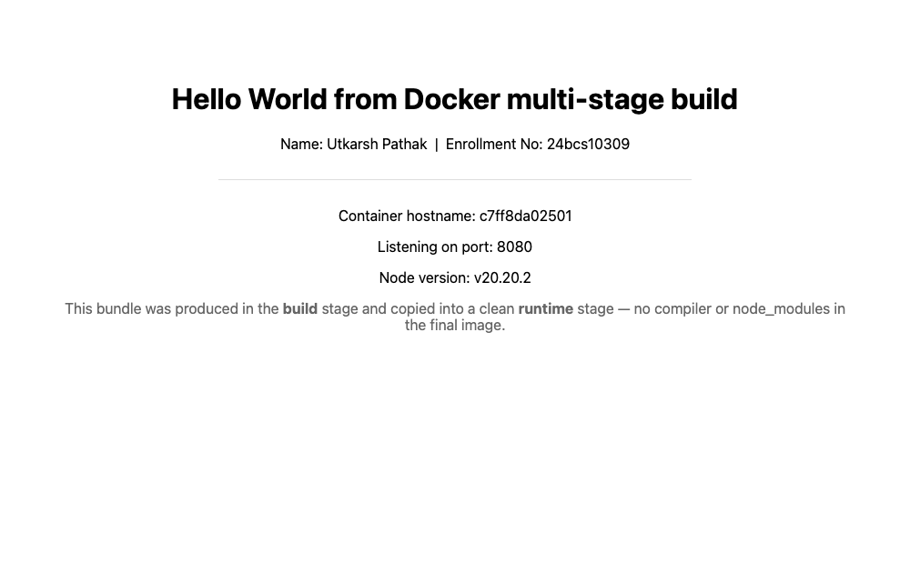
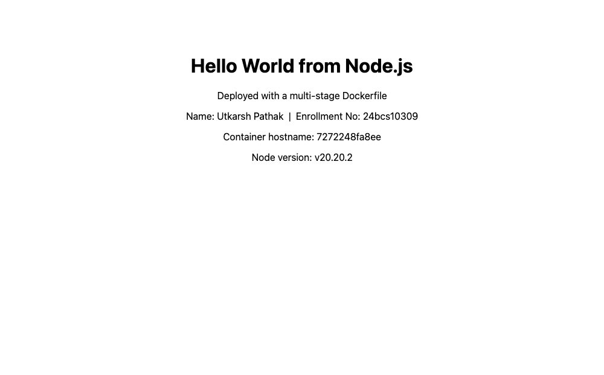
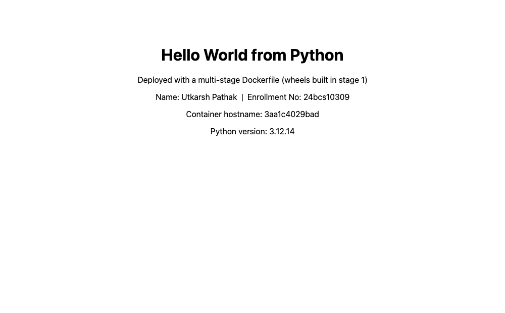
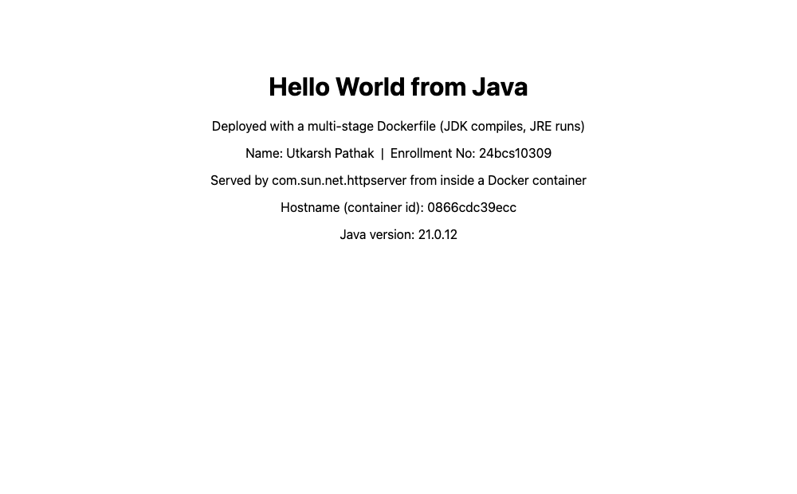

# DockerFiles & Images — Multi-Stage Builds

**Name:** Utkarsh Pathak
**Enrollment No:** 24bcs10309

---

## Task 1: Run Multi-Stage Dockerfile

- Clone the repository containing the multi-stage Dockerfile.
- Build the Docker image using the multi-stage Dockerfile.
- Run a container from the image.
- Access the application running inside the container.
- Verify that the application displays **Hello World from Docker multi-stage build**.
- Verify the running container using `docker ps`.
- Confirm that the application is running on port 8080.

### A note on the source repository

The task says to clone the repo containing the multi-stage Dockerfile. I cloned the class repo:

```bash
git clone https://github.com/aryen1101/devops-heros
```

It contains only session PDFs and a networking cheat sheet — no multi-stage Dockerfile:

```
devops-heros/
├── devops-session/
│   ├── ad-linux.pdf
│   ├── basic-linux.pdf
│   ├── Linux Networking Cheat Sheet.pdf
│   └── session2.md
├── devops-session1-11-08-2026/
│   ├── devops1-83.pdf
│   └── session1.md
├── LICENSE
└── README.md
```

So I **wrote the multi-stage Dockerfile myself**, in [`multi-stage-dockerfile/`](multi-stage-dockerfile), meeting the stated requirements: it must serve *Hello World from Docker multi-stage build* on **port 8080**.

### What a multi-stage build is, and the problem it solves

A normal Dockerfile has one `FROM`, so everything you need to *build* the app is still sitting in the image you *ship*: compilers, dev dependencies, build caches, source code. None of it is needed at run time. It bloats the image and enlarges the attack surface.

A multi-stage build uses **several `FROM` instructions in one Dockerfile**. Each `FROM` starts a fresh stage. You build in an early stage, then copy just the finished artifact forward with `COPY --from=<stage>`. Everything not copied is discarded.

### Files

```
multi-stage-dockerfile/
├── server.js       # HTTP server on port 8080
├── package.json    # esbuild as a devDependency
└── Dockerfile      # two stages: build -> production
```

### server.js

```javascript
const http = require('http');
const os = require('os');

const PORT = process.env.PORT || 8080;

const server = http.createServer((req, res) => {
  res.writeHead(200, { 'Content-Type': 'text/html; charset=utf-8' });
  res.end(`<!doctype html>
<html>
  <head><title>Docker Multi-Stage Build</title></head>
  <body style="font-family: system-ui, sans-serif; text-align: center; padding: 60px;">
    <h1>Hello World from Docker multi-stage build</h1>
    <p>Name: Utkarsh Pathak &nbsp;|&nbsp; Enrollment No: 24bcs10309</p>
    <hr style="max-width:520px; margin:30px auto; border:none; border-top:1px solid #ddd;">
    <p>Container hostname: ${os.hostname()}</p>
    <p>Listening on port: ${PORT}</p>
    <p>Node version: ${process.version}</p>
  </body>
</html>`);
});

server.listen(PORT, '0.0.0.0', () => {
  console.log(`Multi-stage app listening on port ${PORT}`);
});
```

### package.json

```json
{
  "name": "docker-multi-stage-demo",
  "version": "1.0.0",
  "private": true,
  "main": "server.js",
  "scripts": {
    "build": "esbuild server.js --bundle --platform=node --target=node20 --minify --outfile=dist/server.js",
    "start": "node dist/server.js"
  },
  "devDependencies": {
    "esbuild": "^0.24.0"
  }
}
```

`esbuild` is a **devDependency** — needed to build, useless at run time. That is precisely the kind of thing multi-stage exists to leave behind.

### Dockerfile

```dockerfile
# =========================================================
#  Stage 1: BUILD
#  Full Node image. Installs devDependencies (esbuild) and
#  bundles the app into a single minified file in /app/dist.
#  Everything heavy stays in this stage.
# =========================================================
FROM node:20 AS build

WORKDIR /app

# Copy the manifest first so this layer caches independently of the source
COPY package.json ./

# devDependencies are needed to BUILD, but must not ship to production
RUN npm install

# Copy source and produce the bundle
COPY server.js ./
RUN npm run build

# Show what the build stage produced (visible in the build log)
RUN echo "--- build stage output ---" && ls -lh /app/dist


# =========================================================
#  Stage 2: PRODUCTION
#  Small Alpine runtime. Copies ONLY the built bundle from
#  stage 1. No npm install, no node_modules, no esbuild.
# =========================================================
FROM node:20-alpine AS production

WORKDIR /app

ENV NODE_ENV=production
ENV PORT=8080

# The one line that makes this a multi-stage build:
# pull an artifact out of the previous stage by name.
COPY --from=build /app/dist/server.js ./server.js

# Run as a non-root user, which the alpine image already provides
USER node

# The app listens on 8080 as required by the task
EXPOSE 8080

CMD ["node", "server.js"]
```

The mechanics, in three points:

- **`FROM node:20 AS build`** names the stage `build` so it can be referenced later.
- **`FROM node:20-alpine AS production`** discards stage 1 entirely and starts fresh.
- **`COPY --from=build /app/dist/server.js ./server.js`** is the whole trick — reach into the finished stage and take one file. `node_modules`, `esbuild`, and the original source never cross the boundary.

`USER node` is a security habit worth forming: containers run as root by default, and dropping to an unprivileged user limits the damage if the app is compromised.

### Build

```bash
cd multi-stage-dockerfile
docker build -t multi-stage-app .
```

### Run a container on port 8080

```bash
docker run -d --name multistage-app -p 8080:8080 multi-stage-app
```

```
c7ff8da02501ab6c0ecd53ee03257fac0364d94cc68419a113442aa4dc88f4df
```

### Verify the running container using `docker ps`, on port 8080

```bash
docker ps --filter name=multistage-app --format 'table {{.Names}}\t{{.Image}}\t{{.Status}}\t{{.Ports}}'
```

```
NAMES            IMAGE             STATUS         PORTS
multistage-app   multi-stage-app   Up 3 seconds   0.0.0.0:8080->8080/tcp, [::]:8080->8080/tcp
```

Full `docker ps` output, showing it alongside everything else running:

```
CONTAINER ID   IMAGE             COMMAND                  CREATED         STATUS         PORTS                                         NAMES
c7ff8da02501   multi-stage-app   "docker-entrypoint.s…"   3 seconds ago   Up 3 seconds   0.0.0.0:8080->8080/tcp, [::]:8080->8080/tcp   multistage-app
67a0749ed6e9   java-hello        "/__cacert_entrypoin…"   2 minutes ago   Up 2 minutes   0.0.0.0:3003->8080/tcp, [::]:3003->8080/tcp   hello-java
d0f97839bc8b   node-hello        "docker-entrypoint.s…"   3 minutes ago   Up 3 minutes   0.0.0.0:3007->3000/tcp, [::]:3007->3000/tcp   hello-node
0d91e8a11463   nginx-hello       "/docker-entrypoint.…"   4 minutes ago   Up 4 minutes   0.0.0.0:3006->80/tcp, [::]:3006->80/tcp       hello-nginx
47e07edd71a7   react-hello       "/docker-entrypoint.…"   4 minutes ago   Up 4 minutes   0.0.0.0:3005->80/tcp, [::]:3005->80/tcp       hello-react
d14535318c7e   apache-hello      "httpd-foreground"       4 minutes ago   Up 4 minutes   0.0.0.0:3004->80/tcp, [::]:3004->80/tcp       hello-apache
4c9b17614ceb   python-hello      "python app.py"          4 minutes ago   Up 4 minutes   0.0.0.0:3002->5000/tcp, [::]:3002->5000/tcp   hello-python
```

**Confirmed: `0.0.0.0:8080->8080/tcp`** — the application is running on port 8080 as the task requires.

### Access the application and verify the message

```bash
curl -s http://localhost:8080 | grep -oE '<h1>[^<]*</h1>'
curl -s -o /dev/null -w 'HTTP %{http_code} | %{size_download} bytes\n' http://localhost:8080
```

```
<h1>Hello World from Docker multi-stage build</h1>

HTTP 200 | 698 bytes
```

Full response body:

```html
<!doctype html>
<html>
  <head><title>Docker Multi-Stage Build</title></head>
  <body style="font-family: system-ui, sans-serif; text-align: center; padding: 60px;">
    <h1>Hello World from Docker multi-stage build</h1>
    <p>Name: Utkarsh Pathak &nbsp;|&nbsp; Enrollment No: 24bcs10309</p>
    <hr style="max-width:520px; margin:30px auto; border:none; border-top:1px solid #ddd;">
    <p>Container hostname: c7ff8da02501</p>
    <p>Listening on port: 8080</p>
    <p>Node version: v20.20.2</p>
  </body>
</html>
```

```bash
docker logs multistage-app
```

```
Multi-stage app listening on port 8080
```

The `Container hostname: c7ff8da02501` on the page matches the container ID from `docker run`, and `Listening on port: 8080` is reported by the app itself.

### Proof the build stage really was discarded

This is the part that shows multi-stage actually did something:

```bash
docker exec multistage-app ls -la /app
```

```
total 12
drwxr-xr-x    1 root     root          4096 Sep  3 16:19 .
drwxr-xr-x    1 root     root          4096 Sep  3 16:19 ..
-rw-r--r--    1 root     root           958 Sep  3 16:19 server.js
```

**One file, 958 bytes.** That is the entire application in the final image.

```bash
docker exec multistage-app sh -c 'ls /app/node_modules || echo "no node_modules in the final image"'
docker exec multistage-app sh -c 'which esbuild || echo "esbuild is NOT in the final image"'
docker exec multistage-app whoami
```

```
ls: /app/node_modules: No such file or directory
no node_modules in the final image

esbuild is NOT in the final image

node
```

No `node_modules`, no `esbuild`, and the process runs as the unprivileged `node` user.

### Measuring the benefit

To quantify it, I built the **same application** with an otherwise identical single-stage Dockerfile:

```dockerfile
# Deliberately NOT multi-stage, purely to compare final image size.
FROM node:20
WORKDIR /app
COPY package.json ./
RUN npm install
COPY server.js ./
RUN npm run build
ENV PORT=8080
EXPOSE 8080
CMD ["node", "dist/server.js"]
```

```bash
docker images --format 'table {{.Repository}}\t{{.Tag}}\t{{.Size}}' | grep -E "multi-stage-app|single-stage-app"
```

```
REPOSITORY         TAG       SIZE
multi-stage-app    latest    194MB
single-stage-app   latest    1.6GB
```

| | Single-stage | Multi-stage | Difference |
|---|---|---|---|
| Final image size | **1.6GB** | **194MB** | **~8x smaller** |
| Contains `node_modules` | Yes | No | |
| Contains `esbuild` | Yes | No | |
| Contains source | Yes | No, only the bundle | |
| Runs as | `root` | `node` | |

Same application, same behaviour, same port — **8x smaller**, from adding a second `FROM` and one `COPY --from`.

---

## Task 2: Documentation

Create an `.md` file containing your name, your enrollment number, a screenshot/output showing the application running successfully, and a screenshot/output of `docker ps` showing the running container on port 8080.

### Name and Enrollment Number

| | |
|---|---|
| **Name** | Utkarsh Pathak |
| **Enrollment No** | 24bcs10309 |

### Application running successfully



Captured from a real browser against my own running container. The page shows the required message **Hello World from Docker multi-stage build**, my name and enrollment number, the container hostname `c7ff8da02501`, and `Listening on port: 8080`.

### `docker ps` showing the running container on port 8080

```bash
docker ps --filter name=multistage-app --format 'table {{.Names}}\t{{.Image}}\t{{.Status}}\t{{.Ports}}'
```

```
NAMES            IMAGE             STATUS         PORTS
multistage-app   multi-stage-app   Up 3 seconds   0.0.0.0:8080->8080/tcp, [::]:8080->8080/tcp
```

```bash
curl -s -o /dev/null -w 'HTTP %{http_code}\n' http://localhost:8080
```

```
HTTP 200
```

---

## Task 3: Docker Application Deployment

Deploy at least **3 different types of applications** using Docker: Node.js, Python, Java.

Since this assignment is about Dockerfiles and images, I made **all three multi-stage**, each demonstrating a different flavour of the technique rather than repeating the same pattern.

| App | Stage 1 (build) | Stage 2 (runtime) | What it demonstrates | Port | Size |
|---|---|---|---|---|---|
| [`nodejs-app`](nodejs-app) | `node:20` | `node:20-alpine` | Bundle, then drop `node_modules` | 8081 | 194MB |
| [`python-app`](python-app) | `python:3.12` | `python:3.12-slim` | Compile wheels, then drop the toolchain | 8082 | 239MB |
| [`java-app`](java-app) | `eclipse-temurin:21-jdk-alpine` | `eclipse-temurin:21-jre-alpine` | **Compile with JDK, run on JRE** | 8083 | 286MB |

All three verified:

```
port 8081 -> HTTP 200 | 395 bytes | <h1>Hello World from Node.js</h1>
port 8082 -> HTTP 200 | 420 bytes | <h1>Hello World from Python</h1>
port 8083 -> HTTP 200 | 514 bytes | <h1>Hello World from Java</h1>
```

---

### 1. nodejs-app — bundle, then discard dependencies

```dockerfile
# ---------- Stage 1: build ----------
FROM node:20 AS build
WORKDIR /app
COPY package.json ./
RUN npm install
COPY app.js ./
RUN npm run build

# ---------- Stage 2: runtime ----------
FROM node:20-alpine
WORKDIR /app
ENV NODE_ENV=production
ENV PORT=3000
# only the bundled output crosses the stage boundary
COPY --from=build /app/dist/app.js ./app.js
USER node
EXPOSE 3000
CMD ["node", "app.js"]
```

```bash
docker build -t deploy-node-img nodejs-app
docker run -d --name deploy-node -p 8081:3000 deploy-node-img
```

```
$ docker ps --filter name=deploy-node --format 'table {{.Names}}\t{{.Image}}\t{{.Status}}\t{{.Ports}}'
NAMES         IMAGE             STATUS        PORTS
deploy-node   deploy-node-img   Up 4 seconds  0.0.0.0:8081->3000/tcp, [::]:8081->3000/tcp

$ curl -s -o /dev/null -w 'HTTP %{http_code} | %{size_download} bytes\n' http://localhost:8081
HTTP 200 | 395 bytes

$ curl -s http://localhost:8081 | grep -oE '<h1>[^<]*</h1>'
<h1>Hello World from Node.js</h1>
```



---

### 2. python-app — build wheels, then discard the compiler

```dockerfile
# ---------- Stage 1: build the dependency wheels ----------
FROM python:3.12 AS build
WORKDIR /app
COPY requirements.txt ./
# compile dependencies to .whl files; build toolchain stays in this stage
RUN pip wheel --no-cache-dir --wheel-dir /wheels -r requirements.txt

# ---------- Stage 2: slim runtime ----------
FROM python:3.12-slim
WORKDIR /app
# install from the prebuilt wheels, no compiler needed here
COPY --from=build /wheels /wheels
COPY requirements.txt ./
RUN pip install --no-cache-dir --no-index --find-links=/wheels -r requirements.txt \
    && rm -rf /wheels
COPY app.py ./
ENV PORT=5000
EXPOSE 5000
# gunicorn is the production WSGI server, rather than Flask's dev server
CMD ["gunicorn", "--bind", "0.0.0.0:5000", "--workers", "2", "app:app"]
```

This is the idiomatic Python version of the pattern. Some Python packages contain C extensions that need `gcc` and header files to compile. Installing them directly in a `slim` image either fails or forces you to install a whole build toolchain you then ship.

Instead: stage 1 uses the **full** `python:3.12` image (which has the toolchain) and runs `pip wheel` to compile everything into `.whl` files. Stage 2 uses `python:3.12-slim` and installs **from those wheels** with `--no-index`, so pip never needs a compiler or the network. Then `rm -rf /wheels` in the same `RUN` layer, so the wheels do not persist in the image.

I also switched from Flask's development server to **gunicorn** — the dev server prints a warning that it is unsuitable for production, and this assignment is about deployment.

```bash
docker build -t deploy-python-img python-app
docker run -d --name deploy-python -p 8082:5000 deploy-python-img
```

```
$ docker ps --filter name=deploy-python --format 'table {{.Names}}\t{{.Status}}\t{{.Ports}}'
NAMES           STATUS        PORTS
deploy-python   Up 4 seconds  0.0.0.0:8082->5000/tcp, [::]:8082->5000/tcp

$ curl -s -o /dev/null -w 'HTTP %{http_code} | %{size_download} bytes\n' http://localhost:8082
HTTP 200 | 420 bytes

$ curl -s http://localhost:8082 | grep -oE '<h1>[^<]*</h1>'
<h1>Hello World from Python</h1>
```



---

### 3. java-app — compile with the JDK, run on the JRE

```dockerfile
# ---------- Stage 1: compile with the full JDK ----------
FROM eclipse-temurin:21-jdk-alpine AS build
WORKDIR /app
COPY Main.java ./
RUN javac -d out Main.java

# ---------- Stage 2: run on the smaller JRE ----------
# The JRE cannot compile, only run. Since compilation already
# happened in stage 1, the final image does not need javac.
FROM eclipse-temurin:21-jre-alpine
WORKDIR /app
COPY --from=build /app/out ./
ENV PORT=8080
EXPOSE 8080
CMD ["java", "Main"]
```

This is the clearest example of the three, because the JDK/JRE split makes the point by itself:

- A **JDK** (Java *Development* Kit) contains `javac`, the compiler, plus debugging and profiling tools.
- A **JRE** (Java *Runtime* Environment) can only *run* compiled bytecode.

Once `javac` has produced `Main.class` in stage 1, the compiler is dead weight. Stage 2 starts from the JRE and copies only the compiled output.

```bash
docker build -t deploy-java-img java-app
docker run -d --name deploy-java -p 8083:8080 deploy-java-img
```

```
$ docker ps --filter name=deploy-java --format 'table {{.Names}}\t{{.Status}}\t{{.Ports}}'
NAMES         STATUS        PORTS
deploy-java   Up 4 seconds  0.0.0.0:8083->8080/tcp, [::]:8083->8080/tcp

$ curl -s -o /dev/null -w 'HTTP %{http_code} | %{size_download} bytes\n' http://localhost:8083
HTTP 200 | 514 bytes

$ curl -s http://localhost:8083 | grep -oE '<h1>[^<]*</h1>'
<h1>Hello World from Java</h1>
```

### Measured saving

Comparing against the single-stage JDK image built for the [Docker Fundamentals](../Docker_Fundamental) assignment, running the same Java application:

```bash
docker images --format 'table {{.Repository}}\t{{.Size}}' | grep -E "deploy-java-img|java-hello"
```

```
REPOSITORY        SIZE
deploy-java-img   286MB
java-hello        555MB
```

| | Image | Size |
|---|---|---|
| Single-stage, JDK runtime | `java-hello` | **555MB** |
| Multi-stage, JRE runtime | `deploy-java-img` | **286MB** |
| | **Saving** | **269MB, ~48% smaller** |



---

## Reproducing everything

```bash
# from Class_Assignments/DockerFiles_&_Images

# Task 1 — multi-stage app on port 8080
docker build -t multi-stage-app multi-stage-dockerfile
docker run -d --name multistage-app -p 8080:8080 multi-stage-app
docker ps
curl http://localhost:8080

# Task 3 — three multi-stage deployments
docker build -t deploy-node-img   nodejs-app && docker run -d --name deploy-node   -p 8081:3000 deploy-node-img
docker build -t deploy-python-img python-app && docker run -d --name deploy-python -p 8082:5000 deploy-python-img
docker build -t deploy-java-img   java-app   && docker run -d --name deploy-java   -p 8083:8080 deploy-java-img
```

Cleanup:

```bash
docker rm -f multistage-app deploy-node deploy-python deploy-java
```

---

## What I took away

**The pattern is always the same**, whatever the language:

1. Stage 1 starts from a **fat** image that has the build tooling, and produces an artifact.
2. Stage 2 starts from a **slim** image and `COPY --from=` only that artifact.
3. Anything not copied is thrown away.

What the artifact *is* differs by ecosystem, and that is the interesting part:

| Language | Build stage produces | Runtime does not need |
|---|---|---|
| Node.js | A bundled `.js` file | `node_modules`, bundler |
| Python | Compiled `.whl` files | `gcc`, headers, build deps |
| Java | Compiled `.class` files | `javac`, the whole JDK |
| React | Static HTML/CSS/JS | Node, npm, Vite |
| Go / Rust | A single static binary | The entire compiler |

**Measured results from this assignment**, all on the same machine:

- Node bundle: **1.6GB → 194MB** (~8x)
- Java JDK → JRE: **555MB → 286MB** (~48%)

**Why it matters beyond size:**

- **Faster deploys.** Pulling 194MB instead of 1.6GB on every node, every rollout.
- **Smaller attack surface.** No compiler, no shell utilities, no source code in the shipped image. A vulnerability in a build tool cannot be exploited in an image that does not contain it.
- **Cleaner separation.** Build-time and run-time dependencies are stated explicitly in the Dockerfile, instead of being tangled together.
- **Secrets do not leak.** A private token used in stage 1 is not in the final image at all — whereas deleting a file in a later `RUN` of a single-stage build leaves it in the earlier **layer**, still recoverable from the image history. This is the subtle one, and probably the strongest argument for multi-stage.

**Practical details I had to get right:**

- Name stages with `AS <name>` and reference them as `COPY --from=<name>`; a bare index like `--from=0` works but is fragile.
- `COPY --from` reads from the **stage's filesystem**, so the path must be where that stage actually wrote it (`/app/dist/...`, `/wheels`, `/app/out`).
- Delete intermediates in the **same `RUN`** that created them (`&& rm -rf /wheels`), because each `RUN` is its own layer and a later deletion does not shrink an earlier one.
- Copy the dependency manifest before the source in every stage, so editing code does not invalidate the dependency-install cache.
- `openjdk:*` base images are deprecated and no longer resolve — `eclipse-temurin` is the current official OpenJDK.
