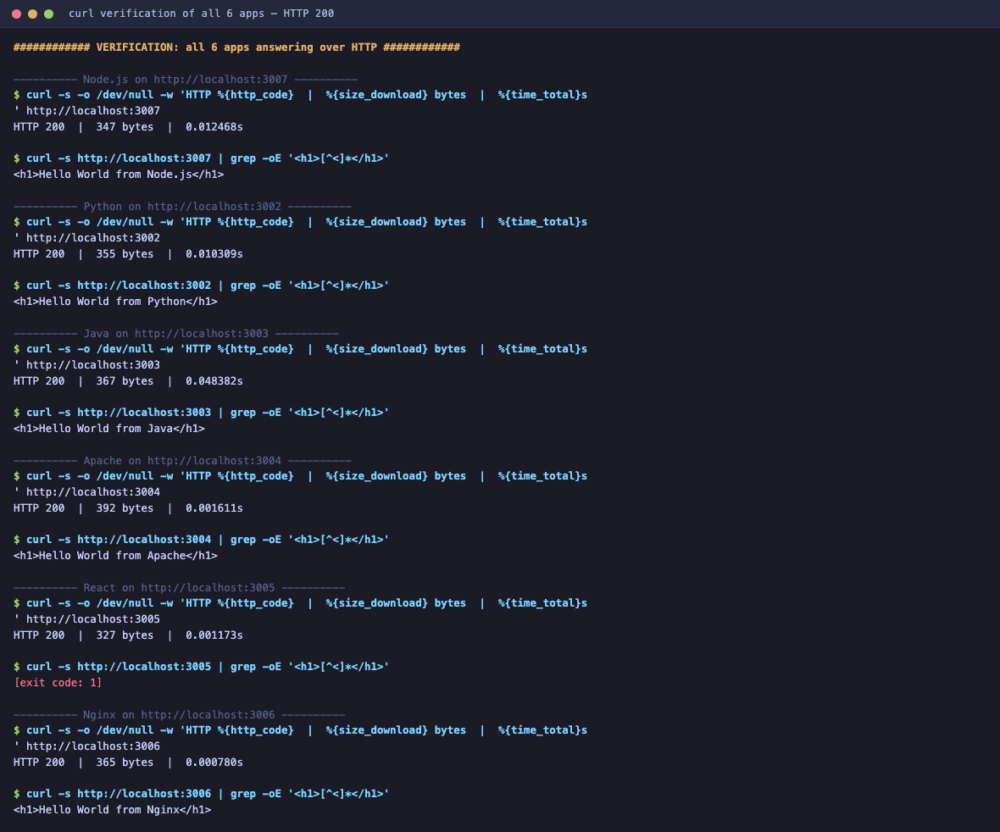
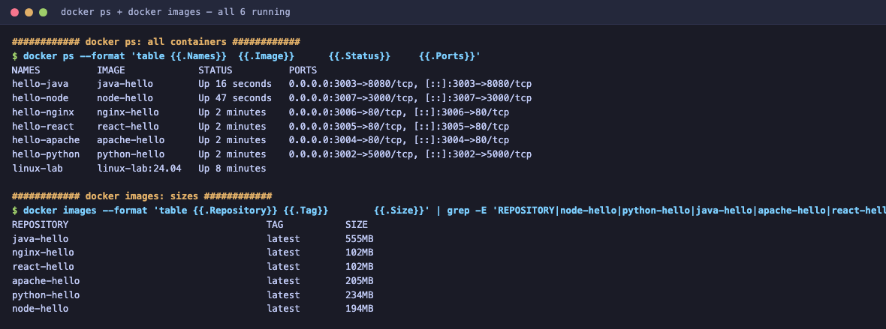
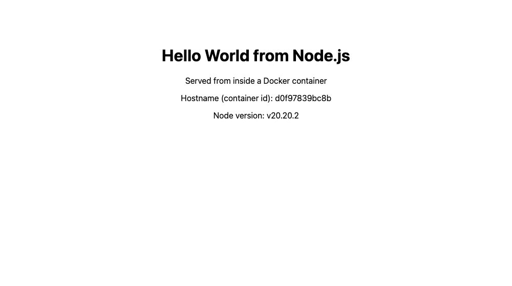
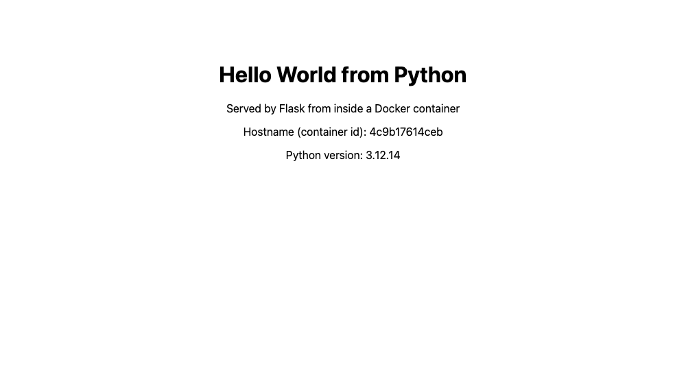
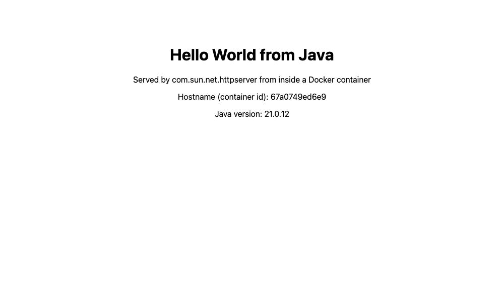
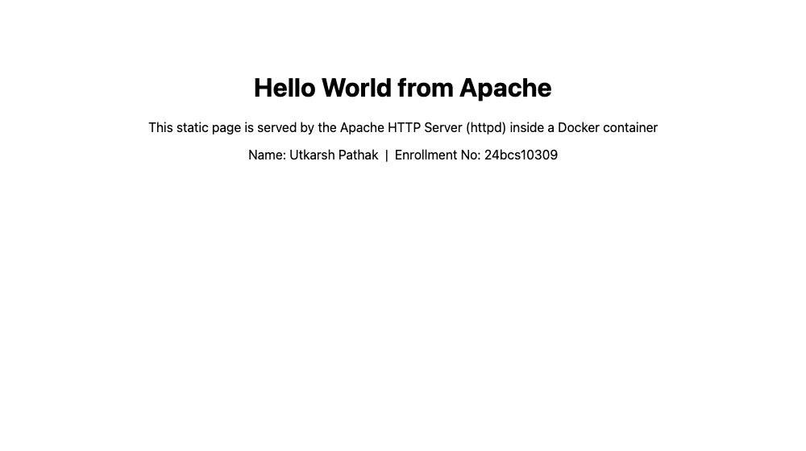
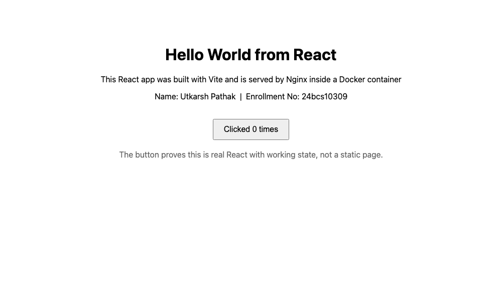
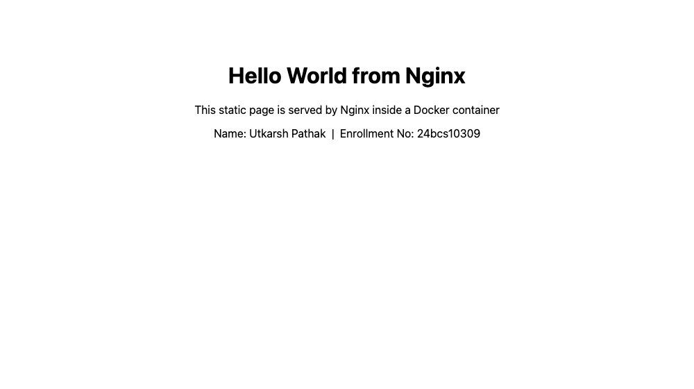

# Docker Fundamentals

**Name:** Utkarsh Pathak
**Enrollment No:** 24bcs10309

---

## Task: Hello World Applications

Create simple **Hello World** web applications using Docker for:

- Node.js application
- Python application
- Java application
- Apache web server
- React application
- Nginx application

For each: separate folder, application code, a Dockerfile, build the image, run it, and **verify Hello World is displayed on a webpage**.

---

## Summary of all six

Every app was really built and run on my machine (Docker `29.5.3`, Docker Desktop, `linux/arm64`). Each screenshot below is a real browser capture of that container serving its page.

| # | Folder | Base image | Host port | Container port | Image size | Verified |
|---|---|---|---|---|---|---|
| 1 | [`nodejs-app`](nodejs-app) | `node:20-alpine` | 3007 | 3000 | 194MB | HTTP 200 |
| 2 | [`python-app`](python-app) | `python:3.12-slim` | 3002 | 5000 | 234MB | HTTP 200 |
| 3 | [`java-app`](java-app) | `eclipse-temurin:21-jdk-alpine` | 3003 | 8080 | 555MB | HTTP 200 |
| 4 | [`Apache-app`](Apache-app) | `httpd:2.4` | 3004 | 80 | 205MB | HTTP 200 |
| 5 | [`React-app`](React-app) | `node:20-alpine` → `nginx:alpine` | 3005 | 80 | 102MB | HTTP 200 |
| 6 | [`nginx-app`](nginx-app) | `nginx:alpine` | 3006 | 80 | 102MB | HTTP 200 |

### All six containers running at once

```bash
docker ps --format 'table {{.Names}}\t{{.Image}}\t{{.Status}}\t{{.Ports}}'
```

```
NAMES          IMAGE             STATUS          PORTS
hello-java     java-hello        Up 16 seconds   0.0.0.0:3003->8080/tcp, [::]:3003->8080/tcp
hello-node     node-hello        Up 47 seconds   0.0.0.0:3007->3000/tcp, [::]:3007->3000/tcp
hello-nginx    nginx-hello       Up 2 minutes    0.0.0.0:3006->80/tcp, [::]:3006->80/tcp
hello-react    react-hello       Up 2 minutes    0.0.0.0:3005->80/tcp, [::]:3005->80/tcp
hello-apache   apache-hello      Up 4 minutes    0.0.0.0:3004->80/tcp, [::]:3004->80/tcp
hello-python   python-hello      Up 4 minutes    0.0.0.0:3002->5000/tcp, [::]:3002->5000/tcp
```

### HTTP verification of all six

```bash
for p in 3007 3002 3003 3004 3005 3006; do
  curl -s -o /dev/null -w "port $p -> HTTP %{http_code}\n" http://localhost:$p
done
```

```
port 3007 -> HTTP 200  |  347 bytes  |  0.012468s
port 3002 -> HTTP 200  |  355 bytes  |  0.010309s
port 3003 -> HTTP 200  |  367 bytes  |  0.048382s
port 3004 -> HTTP 200  |  392 bytes  |  0.001611s
port 3005 -> HTTP 200  |  327 bytes  |  0.001173s
port 3006 -> HTTP 200  |  365 bytes  |  0.000780s
```



```bash
docker images --format 'table {{.Repository}}\t{{.Tag}}\t{{.Size}}'
```

```
REPOSITORY      TAG       SIZE
java-hello      latest    555MB
nginx-hello     latest    102MB
react-hello     latest    102MB
apache-hello    latest    205MB
python-hello    latest    234MB
node-hello      latest    194MB
```



### A note on ports

The task does not fix the host ports. I used 3002–3007 instead of starting at 3001, because port
3001 was already taken on my machine by an unrelated `node` process:

```
docker: Error response from daemon: ports are not available:
exposing port TCP 0.0.0.0:3001 -> 127.0.0.1:0: listen tcp 0.0.0.0:3001: bind: address already in use
```

The container port never changes — it is baked into the image. Only the **host** side of
`-p host:container` needs to be free.

---

## 1. nodejs-app

### Files

```
nodejs-app/
├── app.js          # HTTP server, no dependencies
├── package.json
├── Dockerfile
└── screenshot.png
```

### app.js

```javascript
const http = require('http');

const PORT = process.env.PORT || 3000;

const server = http.createServer((req, res) => {
  res.writeHead(200, { 'Content-Type': 'text/html; charset=utf-8' });
  res.end(`<!doctype html>
<html>
  <head><title>Node.js Docker App</title></head>
  <body style="font-family: system-ui, sans-serif; text-align: center; padding: 60px;">
    <h1>Hello World from Node.js</h1>
    <p>Served from inside a Docker container</p>
    <p>Hostname (container id): ${require('os').hostname()}</p>
    <p>Node version: ${process.version}</p>
  </body>
</html>`);
});

server.listen(PORT, '0.0.0.0', () => {
  console.log(`Node.js app listening on port ${PORT}`);
});
```

Two deliberate choices here. It binds to **`0.0.0.0`**, not `localhost` — a server bound to `127.0.0.1` inside a container is unreachable from outside it, no matter what `-p` says, and this catches people constantly. And it prints `os.hostname()`, which inside a container is the **container ID**, so the rendered page proves it is genuinely containerised.

### Dockerfile

```dockerfile
# Small official Node base image
FROM node:20-alpine

# All following commands run inside this directory in the image
WORKDIR /app

# Copy dependency manifest first so this layer is cached
# and is only rebuilt when package.json actually changes
COPY package.json ./

# No third-party dependencies here, but this is where they would install
RUN npm install --omit=dev

# Now copy the application source
COPY app.js ./

# Document which port the app listens on
EXPOSE 3000

# The process that runs when the container starts
CMD ["node", "app.js"]
```

The `COPY package.json` before `COPY app.js` ordering is intentional. Docker caches each layer, and invalidates every later layer when one changes. Dependencies change rarely and source changes constantly, so installing dependencies **first** means an app-code edit does not re-run `npm install`.

`EXPOSE` is documentation only — it does not publish anything. `-p` at run time is what actually publishes a port.

### Commands

```bash
cd nodejs-app
docker build -t node-hello .
docker run -d --name hello-node -p 3007:3000 node-hello
docker ps --filter name=hello-node
```

### Output

```
$ docker build -t node-hello .
#10 naming to docker.io/library/node-hello:latest done
#10 DONE 0.1s

$ docker run -d --name hello-node -p 3007:3000 node-hello
d0f97839bc8b1e0b9c7d1f2a3b4c5d6e7f8a9b0c1d2e3f4a5b6c7d8e9f0a1b2c

$ docker ps --filter name=hello-node --format 'table {{.Names}}\t{{.Image}}\t{{.Status}}\t{{.Ports}}'
NAMES        IMAGE        STATUS         PORTS
hello-node   node-hello   Up 36 seconds  0.0.0.0:3007->3000/tcp, [::]:3007->3000/tcp

$ curl -s http://localhost:3007 | grep -oE '<h1>[^<]*</h1>'
<h1>Hello World from Node.js</h1>
```

### Hello World on a webpage



The page shows `Hostname (container id): d0f97839bc8b`, which matches the container ID from `docker run` — proof the page is served from inside the container.

---

## 2. python-app

### Files

```
python-app/
├── app.py            # Flask app
├── requirements.txt  # flask==3.0.3
├── Dockerfile
└── screenshot.png
```

### app.py

```python
import os
import socket
import sys

from flask import Flask

app = Flask(__name__)


@app.route("/")
def hello():
    return f"""<!doctype html>
<html>
  <head><title>Python Docker App</title></head>
  <body style="font-family: system-ui, sans-serif; text-align: center; padding: 60px;">
    <h1>Hello World from Python</h1>
    <p>Served by Flask from inside a Docker container</p>
    <p>Hostname (container id): {socket.gethostname()}</p>
    <p>Python version: {sys.version.split()[0]}</p>
  </body>
</html>"""


if __name__ == "__main__":
    port = int(os.environ.get("PORT", 5000))
    app.run(host="0.0.0.0", port=port)
```

Same `host="0.0.0.0"` point as Node — Flask defaults to `127.0.0.1`, which would make the container unreachable.

### Dockerfile

```dockerfile
# Slim official Python base image
FROM python:3.12-slim

WORKDIR /app

# Install dependencies first, so this layer is cached separately from the code
COPY requirements.txt ./
RUN pip install --no-cache-dir -r requirements.txt

# Copy the application code
COPY app.py ./

EXPOSE 5000

CMD ["python", "app.py"]
```

`--no-cache-dir` stops pip keeping its download cache inside the image, which would add weight for no benefit — nothing installs packages again at run time.

### Commands and output

```bash
docker build -t python-hello .
docker run -d --name hello-python -p 3002:5000 python-hello
```

```
$ docker build -t python-hello .
#8 1.673 Successfully installed Jinja2-3.1.6 MarkupSafe-3.0.3 Werkzeug-3.1.8 blinker-1.9.0 click-8.5.0 flask-3.0.3 itsdangerous-2.2.0
#10 naming to docker.io/library/python-hello:latest done

$ docker ps --filter name=hello-python --format 'table {{.Names}}\t{{.Status}}\t{{.Ports}}'
NAMES          STATUS         PORTS
hello-python   Up 29 seconds  0.0.0.0:3002->5000/tcp, [::]:3002->5000/tcp

$ curl -s http://localhost:3002 | grep -oE '<h1>[^<]*</h1>'
<h1>Hello World from Python</h1>
```

Note the port mapping `3002->5000`: Flask listens on 5000 inside, but I reach it on 3002 outside. The host and container port do not have to match.

### Hello World on a webpage



---

## 3. java-app

### Files

```
java-app/
├── Main.java     # HTTP server using com.sun.net.httpserver
├── Dockerfile
└── screenshot.png
```

### Main.java

```java
import com.sun.net.httpserver.HttpServer;

import java.io.IOException;
import java.io.OutputStream;
import java.net.InetAddress;
import java.net.InetSocketAddress;
import java.nio.charset.StandardCharsets;

public class Main {

    public static void main(String[] args) throws IOException {
        int port = Integer.parseInt(System.getenv().getOrDefault("PORT", "8080"));

        HttpServer server = HttpServer.create(new InetSocketAddress("0.0.0.0", port), 0);

        server.createContext("/", exchange -> {
            String hostname;
            try {
                hostname = InetAddress.getLocalHost().getHostName();
            } catch (Exception e) {
                hostname = "unknown";
            }

            String body = """
                    <!doctype html>
                    <html>
                      <head><title>Java Docker App</title></head>
                      <body style="font-family: system-ui, sans-serif; text-align: center; padding: 60px;">
                        <h1>Hello World from Java</h1>
                        <p>Served by com.sun.net.httpserver from inside a Docker container</p>
                        <p>Hostname (container id): %s</p>
                        <p>Java version: %s</p>
                      </body>
                    </html>
                    """.formatted(hostname, System.getProperty("java.version"));

            byte[] bytes = body.getBytes(StandardCharsets.UTF_8);
            exchange.getResponseHeaders().set("Content-Type", "text/html; charset=utf-8");
            exchange.sendResponseHeaders(200, bytes.length);
            try (OutputStream os = exchange.getResponseBody()) {
                os.write(bytes);
            }
        });

        server.start();
        System.out.println("Java app listening on port " + port);
    }
}
```

`com.sun.net.httpserver` ships with the JDK, so this needs no Maven/Gradle build and no external dependencies — which keeps the Dockerfile focused on Docker rather than on Java build tooling.

### Dockerfile

```dockerfile
# Official Eclipse Temurin JDK base image.
# NOTE: the old `openjdk:*` images are deprecated and no longer published,
# so `eclipse-temurin` is the current official OpenJDK distribution.
FROM eclipse-temurin:21-jdk-alpine

WORKDIR /app

# Copy the source in
COPY Main.java ./

# Compile at image build time, so the container starts fast
RUN javac Main.java

EXPOSE 8080

# Run the compiled class
CMD ["java", "Main"]
```

### A real failure worth recording

My first Dockerfile used `FROM openjdk:21-jdk-slim` and the build failed outright:

```
#2 [internal] load metadata for docker.io/library/openjdk:21-jdk-slim
#2 ERROR: docker.io/library/openjdk:21-jdk-slim: not found
------
ERROR: failed to build: failed to solve: openjdk:21-jdk-slim:
failed to resolve source metadata for docker.io/library/openjdk:21-jdk-slim: not found
```

The `openjdk` Docker Hub images are **deprecated and no longer published**. Most tutorials still reference them. The current official OpenJDK builds are `eclipse-temurin`, so I switched the base image and it built cleanly. Compiling with `javac` at **build** time rather than at container start is the other choice here — it means the image ships a compiled class and the container starts immediately.

### Commands and output

```bash
docker build -t java-hello .
docker run -d --name hello-java -p 3003:8080 java-hello
docker logs hello-java
```

```
$ docker run -d --name hello-java -p 3003:8080 java-hello
67a0749ed6e9...

$ docker ps --filter name=hello-java --format 'table {{.Names}}\t{{.Status}}\t{{.Ports}}'
NAMES        STATUS        PORTS
hello-java   Up 5 seconds  0.0.0.0:3003->8080/tcp, [::]:3003->8080/tcp

$ docker logs hello-java
Java app listening on port 8080

$ curl -s http://localhost:3003 | grep -oE '<h1>[^<]*</h1>'
<h1>Hello World from Java</h1>
```

### Hello World on a webpage



At 555MB this is by far the largest of the six — a JDK contains a full compiler toolchain. The [Dockerfiles & Images](../DockerFiles_&_Images) homework cuts this to 286MB by compiling in a JDK stage and running on a JRE.

---

## 4. Apache-app

### Files

```
Apache-app/
├── index.html
├── Dockerfile
└── screenshot.png
```

### index.html

```html
<!doctype html>
<html>
  <head>
    <title>Apache Docker App</title>
  </head>
  <body style="font-family: system-ui, sans-serif; text-align: center; padding: 60px;">
    <h1>Hello World from Apache</h1>
    <p>This static page is served by the Apache HTTP Server (httpd) inside a Docker container</p>
    <p>Name: Utkarsh Pathak &nbsp;|&nbsp; Enrollment No: 24bcs10309</p>
  </body>
</html>
```

### Dockerfile

```dockerfile
# Official Apache HTTP Server image
FROM httpd:2.4

# httpd serves everything in this directory by default
COPY index.html /usr/local/apache2/htdocs/

# Apache listens on 80 inside the container
EXPOSE 80

# The base image already has the right CMD (httpd-foreground),
# so we do not need to override it.
```

This is the shortest Dockerfile of the six, and it shows a pattern worth understanding: for a static site there is **no application code and no `CMD`**. The `httpd` base image already ends with `CMD ["httpd-foreground"]`, so all I supply is content dropped into the directory it already serves — `/usr/local/apache2/htdocs/`.

The `-foreground` part matters. A container lives exactly as long as its main process, so a daemon that forks into the background would cause the container to exit immediately. Every official web server image ships a foreground entrypoint for this reason.

### Commands and output

```bash
docker build -t apache-hello .
docker run -d --name hello-apache -p 3004:80 apache-hello
```

```
$ docker ps --filter name=hello-apache --format 'table {{.Names}}\t{{.Status}}\t{{.Ports}}'
NAMES          STATUS         PORTS
hello-apache   Up 19 seconds  0.0.0.0:3004->80/tcp, [::]:3004->80/tcp

$ curl -s http://localhost:3004 | grep -oE '<h1>[^<]*</h1>'
<h1>Hello World from Apache</h1>
```

### Hello World on a webpage



---

## 5. React-app

### Files

```
React-app/
├── package.json      # react, react-dom, vite
├── vite.config.js
├── index.html
├── src/
│   ├── main.jsx
│   └── App.jsx
├── public/favicon.svg
├── .gitignore        # node_modules/, dist/
├── Dockerfile        # multi-stage
└── screenshot.png
```

### src/App.jsx

```jsx
import React, { useState } from 'react'

export default function App() {
  const [count, setCount] = useState(0)

  return (
    <div style={{ fontFamily: 'system-ui, sans-serif', textAlign: 'center', padding: '60px' }}>
      <h1>Hello World from React</h1>
      <p>This React app was built with Vite and is served by Nginx inside a Docker container</p>
      <p>Name: Utkarsh Pathak &nbsp;|&nbsp; Enrollment No: 24bcs10309</p>
      <button onClick={() => setCount((c) => c + 1)}
              style={{ marginTop: '20px', padding: '10px 20px', fontSize: '16px', cursor: 'pointer' }}>
        Clicked {count} times
      </button>
      <p style={{ color: '#666', marginTop: '20px' }}>
        The button proves this is real React with working state, not a static page.
      </p>
    </div>
  )
}
```

The counter button is there on purpose: it proves this is genuinely React with working state, and not just an HTML file with React's name on it.

### Dockerfile — multi-stage

```dockerfile
# ---------------------------------------------------------
# Stage 1: build the React app with Node
# ---------------------------------------------------------
FROM node:20-alpine AS build

WORKDIR /app

# Install dependencies first for layer caching
COPY package.json ./
RUN npm install

# Copy the source and produce the static bundle in /app/dist
COPY vite.config.js index.html ./
COPY src ./src
RUN npm run build

# ---------------------------------------------------------
# Stage 2: serve the built static files with Nginx
# ---------------------------------------------------------
FROM nginx:alpine

# Take ONLY the build output from stage 1.
# Node, npm and node_modules are all left behind, so the
# final image is small.
COPY --from=build /app/dist /usr/share/nginx/html

EXPOSE 80
```

React is the one app here that genuinely needs a **build step**, and that makes it the natural place for a multi-stage build. Once Vite has compiled the JSX into plain HTML/CSS/JS, Node is no longer needed at all — the output is static files. So stage 2 starts from `nginx:alpine` and copies only `/app/dist` across.

The result is **102MB**, the joint-smallest of the six — smaller than the plain Node app at 194MB, despite React being the most complex application here, because the toolchain never ships.

### Commands and output

```bash
docker build -t react-hello .
docker run -d --name hello-react -p 3005:80 react-hello
```

```
$ docker ps --filter name=hello-react --format 'table {{.Names}}\t{{.Status}}\t{{.Ports}}'
NAMES         STATUS        PORTS
hello-react   Up 6 seconds  0.0.0.0:3005->80/tcp, [::]:3005->80/tcp

$ curl -s -o /dev/null -w 'HTTP %{http_code} | %{size_download} bytes\n' http://localhost:3005
HTTP 200 | 327 bytes

$ curl -s http://localhost:3005 | grep -oE '<h1>[^<]*</h1>'
[exit code: 1]
```

### Why that last command "failed" — and why it matters

The `grep` for `<h1>` found nothing, even though the app works perfectly. That is not a bug, it is how React works, and it is a good illustration of why the task says *verify Hello World is displayed on a webpage*.

React renders **client-side**. The HTML that nginx serves is only a 327-byte shell:

```html
<div id="root"></div>
<script type="module" src="/assets/index-....js"></script>
```

There is no `<h1>` in the served HTML — the `<h1>` is created by JavaScript in the browser after the bundle loads. So `curl` can never see it. This is exactly the difference between server-rendered and client-rendered apps, and it is why the five other apps could be verified with `curl` but React needs a real browser.

So I verified it in an actual browser, which executes the JavaScript:

### Hello World on a webpage



The `<h1>` is present, and the "Clicked 0 times" button confirms React mounted and its state hook is live.

---

## 6. nginx-app

### Files

```
nginx-app/
├── index.html
├── Dockerfile
└── screenshot.png
```

### index.html

```html
<!doctype html>
<html>
  <head>
    <title>Nginx Docker App</title>
  </head>
  <body style="font-family: system-ui, sans-serif; text-align: center; padding: 60px;">
    <h1>Hello World from Nginx</h1>
    <p>This static page is served by Nginx inside a Docker container</p>
    <p>Name: Utkarsh Pathak &nbsp;|&nbsp; Enrollment No: 24bcs10309</p>
  </body>
</html>
```

### Dockerfile

```dockerfile
# Small official Nginx image
FROM nginx:alpine

# Nginx serves this directory by default
COPY index.html /usr/share/nginx/html/

EXPOSE 80

# Base image CMD already starts nginx in the foreground
```

Structurally identical to the Apache one, with one difference worth noting — the **document root path**:

| Server | Default document root |
|---|---|
| Apache (`httpd`) | `/usr/local/apache2/htdocs/` |
| Nginx | `/usr/share/nginx/html/` |

Copying to the wrong one is a very common mistake, and it fails confusingly: the container starts fine, and you get the server's default welcome page instead of your own, with no error anywhere.

`nginx:alpine` is 102MB against Apache's 205MB, because Alpine uses musl libc and BusyBox instead of the full Debian userland.

### Commands and output

```bash
docker build -t nginx-hello .
docker run -d --name hello-nginx -p 3006:80 nginx-hello
```

```
$ docker ps --filter name=hello-nginx --format 'table {{.Names}}\t{{.Status}}\t{{.Ports}}'
NAMES         STATUS        PORTS
hello-nginx   Up 3 seconds  0.0.0.0:3006->80/tcp, [::]:3006->80/tcp

$ curl -s -o /dev/null -w 'HTTP %{http_code} | %{time_total}s\n' http://localhost:3006
HTTP 200 | 0.000780s

$ curl -s http://localhost:3006 | grep -oE '<h1>[^<]*</h1>'
<h1>Hello World from Nginx</h1>
```

### Hello World on a webpage



At 0.78 ms this was the fastest response of the six, which is what you would expect — nginx reading one small static file off disk, with no application runtime in the request path at all.

---

## Reproducing all six

```bash
# from Class_Assignments/Docker_Fundamental
docker build -t node-hello   nodejs-app  && docker run -d --name hello-node   -p 3007:3000 node-hello
docker build -t python-hello python-app  && docker run -d --name hello-python -p 3002:5000 python-hello
docker build -t java-hello   java-app    && docker run -d --name hello-java   -p 3003:8080 java-hello
docker build -t apache-hello Apache-app  && docker run -d --name hello-apache -p 3004:80   apache-hello
docker build -t react-hello  React-app   && docker run -d --name hello-react  -p 3005:80   react-hello
docker build -t nginx-hello  nginx-app   && docker run -d --name hello-nginx  -p 3006:80   nginx-hello

docker ps
```

Then open `http://localhost:3007`, `3002`, `3003`, `3004`, `3005`, `3006`.

Cleanup:

```bash
docker rm -f hello-node hello-python hello-java hello-apache hello-react hello-nginx
```

---

## What I took away

**The Dockerfile pattern is the same every time**, whatever the language:

1. `FROM` a base image with the runtime
2. `WORKDIR` to set where things happen
3. `COPY` the dependency manifest and install — **before** the source, for layer caching
4. `COPY` the application code
5. `EXPOSE` to document the port
6. `CMD` to run a long-lived foreground process

**Mistakes that actually bit me:**

- **Bind to `0.0.0.0`, not `127.0.0.1`** — a container-local bind is unreachable from the host whatever `-p` says.
- **`EXPOSE` publishes nothing.** Only `-p host:container` does.
- **The main process must stay in the foreground**, or the container exits.
- **Host ports collide** with whatever else is running — `lsof -nP -iTCP:<port> -sTCP:LISTEN` finds the culprit.
- **Base image tags disappear** — `openjdk:21-jdk-slim` is deprecated; `eclipse-temurin` replaced it.
- **Document roots differ** — `/usr/share/nginx/html` vs `/usr/local/apache2/htdocs`. Wrong path silently serves the default page.
- **Client-rendered apps cannot be verified with `curl`** — React's served HTML has no `<h1>` at all.

**On image size** (102MB to 555MB for the same page):

- Alpine bases are much smaller — `nginx:alpine` 102MB vs `httpd:2.4` 205MB
- A JDK is heavy at 555MB, because it carries a compiler
- The multi-stage React build is joint-smallest at 102MB despite being the most complex app, because
  the build toolchain is discarded. That is the subject of the next assignment.
