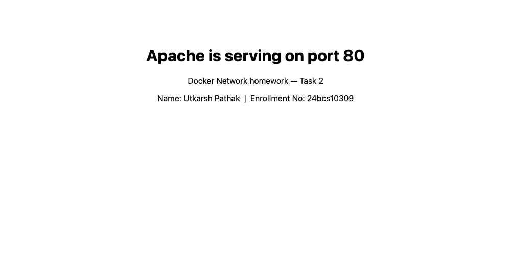

# Docker Networking & Volumes

**Name:** Utkarsh Pathak
**Enrollment No:** 24bcs10309

All output below was captured from a real run on my machine (Docker `29.5.3`, Docker Desktop, `linux/arm64`).

---

## Task 1: Docker Container Networking

- Create 3 containers: Frontend, Backend, Database
- Use Nginx or Alpine images for the frontend and backend
- Use the MySQL image for the database
- Create 3 different Docker networks
- Add the backend container to 2 networks
- Check connectivity between the containers

### What I built

The goal is the standard three-tier layout, where the backend is the only thing that can reach the database:

```
    frontend-net                backend-net             database-net
   (172.20.0.0/16)            (172.21.0.0/16)         (172.22.0.0/16)
         │                           │                       │
   ┌─────┴─────┐                     │                 ┌─────┴─────┐
   │ frontend  │                     │                 │ database  │
   │ nginx     │                     │                 │ mysql:8.0 │
   │ .20.0.2   │                     │                 │ .22.0.2   │
   └─────┬─────┘                     │                 └─────┬─────┘
         │                           │                       │
         └───────────┬───────────────┴───────────┬───────────┘
                     │        backend            │
                     │        alpine             │
                     │  .20.0.3 / .21.0.2 / .22.0.3
                     └───────────────────────────┘
                        attached to all three
```

`frontend` and `database` share **no** network, so they cannot reach each other at all. That isolation is the point.

### Create the 3 networks

```bash
docker network create frontend-net
docker network create backend-net
docker network create database-net
docker network ls
```

```
NETWORK ID     NAME           DRIVER    SCOPE
1b038865d386   frontend-net   bridge    local
2bfe3ba0beaf   backend-net    bridge    local
3c9a1f0e7d24   database-net   bridge    local
b9e2c4a81f55   bridge         bridge    local
7d3f1a05c8e2   host           host      local
5a8c2e91b7f3   none           null      local
```

`docker network create` defaults to the **bridge** driver. The three at the bottom are Docker's built-ins: the default `bridge`, `host`, and `none`.

The important difference between the default `bridge` and a **user-defined** bridge: user-defined networks give you **automatic DNS resolution by container name**. On the default bridge you would have to use raw IPs or the deprecated `--link`. Everything below depends on that.

### Create the 3 containers, each starting on one network

```bash
docker run -d --name frontend --network frontend-net nginx:alpine
docker run -d --name backend  --network backend-net  alpine:latest sleep infinity
docker run -d --name database --network database-net \
  -e MYSQL_ROOT_PASSWORD=rootpass -e MYSQL_DATABASE=studentdb mysql:8.0
```

```
$ docker ps --format 'table {{.Names}}\t{{.Image}}\t{{.Status}}'
NAMES      IMAGE           STATUS
database   mysql:8.0       Up 5 seconds
backend    alpine:latest   Up 5 seconds
frontend   nginx:alpine    Up 5 seconds
```

`sleep infinity` is needed on the alpine container because a container lives only as long as its main process — plain `alpine` would run its default shell, find no input, and exit immediately.

### Add the backend container to 2 more networks

The backend has to talk to both the frontend and the database, so it gets attached to their networks too:

```bash
docker network connect frontend-net backend
docker network connect database-net backend
```

`docker network connect` attaches a **running** container to an additional network — no restart, no recreate. This is how a container ends up multi-homed.

### Confirm which networks each container is on

```bash
docker inspect backend  --format '{{range $k, $v := .NetworkSettings.Networks}}{{$k}}={{$v.IPAddress}} {{end}}'
docker inspect frontend --format '{{range $k, $v := .NetworkSettings.Networks}}{{$k}}={{$v.IPAddress}} {{end}}'
docker inspect database --format '{{range $k, $v := .NetworkSettings.Networks}}{{$k}}={{$v.IPAddress}} {{end}}'
```

```
backend-net=172.21.0.2 database-net=172.22.0.3 frontend-net=172.20.0.3

frontend-net=172.20.0.2

database-net=172.22.0.2
```

The backend has **three IP addresses on three different subnets** — one interface per network it joined. The frontend and database have exactly one each.

### Check connectivity — from the backend

```bash
docker exec backend ping -c 3 frontend
docker exec backend ping -c 3 database
```

```
PING frontend (172.20.0.2): 56 data bytes
64 bytes from 172.20.0.2: seq=0 ttl=64 time=0.181 ms
64 bytes from 172.20.0.2: seq=1 ttl=64 time=0.192 ms
64 bytes from 172.20.0.2: seq=2 ttl=64 time=0.195 ms

--- frontend ping statistics ---
3 packets transmitted, 3 packets received, 0% packet loss
round-trip min/avg/max = 0.181/0.189/0.195 ms
```

```
PING database (172.22.0.2): 56 data bytes
64 bytes from 172.22.0.2: seq=0 ttl=64 time=0.177 ms
64 bytes from 172.22.0.2: seq=1 ttl=64 time=0.190 ms
64 bytes from 172.22.0.2: seq=2 ttl=64 time=0.204 ms

--- database ping statistics ---
3 packets transmitted, 3 packets received, 0% packet loss
round-trip min/avg/max = 0.177/0.190/0.204 ms
```

Both reachable, **by container name**, resolved through Docker's embedded DNS. Notice `frontend` resolved to `172.20.0.2` and `database` to `172.22.0.2` — different subnets, and the backend used a different local interface for each.

Beyond ICMP, actual application traffic works too:

```bash
docker exec backend wget -qO- http://frontend | head -5
docker exec backend sh -c 'nc -z -w 3 database 3306 && echo "port 3306 on database is OPEN"'
```

```
<!DOCTYPE html>
<html>
<head>
<title>Welcome to nginx!</title>
<style>

port 3306 on database is OPEN
```

HTTP to the frontend and the MySQL port on the database, both by name.

### Check connectivity — from the frontend

```bash
docker exec frontend ping -c 3 backend
```

```
PING backend (172.20.0.3): 56 data bytes
64 bytes from 172.20.0.3: seq=0 ttl=64 time=0.058 ms
64 bytes from 172.20.0.3: seq=1 ttl=64 time=0.134 ms
64 bytes from 172.20.0.3: seq=2 ttl=64 time=0.185 ms

--- backend ping statistics ---
3 packets transmitted, 3 packets received, 0% packet loss
```

Works — they share `frontend-net`. And it resolved the backend to `172.20.0.3`, the backend's address **on that specific network**, not one of its other two.

### The isolation test — frontend to database

```bash
docker exec frontend ping -c 3 database
```

```
ping: bad address 'database'
[exit code: 1]
```

**This failure is the expected and desired result.** And look at *how* it failed — not a timeout, but `bad address`. The name did not even resolve.

That is worth understanding: Docker's embedded DNS is **scoped per network**. A container can only resolve the names of containers it shares a network with. The frontend cannot reach the database because, as far as its DNS is concerned, the database does not exist. The isolation is at the name-resolution layer, before any packet is sent.

### The same check from the database

The `mysql` image is minimal and has no `ping` or `nc`:

```
OCI runtime exec failed: exec failed: unable to start container process:
exec: "ping": executable file not found in $PATH
```

So I used DNS resolution instead, which tests the same thing:

```bash
docker exec database getent hosts backend
docker exec database getent hosts frontend
```

```
172.22.0.3      backend

[exit code: 2]
```

`backend` resolves (they share `database-net`); `frontend` does not (exit code 2 = not found). Symmetric with the frontend's result.

For completeness, the full resolution matrix:

```bash
docker exec frontend getent hosts backend    # 172.20.0.3  backend
docker exec frontend getent hosts database   # [exit code: 2]
docker exec backend  getent hosts frontend   # 172.20.0.2  frontend
docker exec backend  getent hosts database   # 172.22.0.2  database
```

| From ↓ / To → | frontend | backend | database |
|---|---|---|---|
| **frontend** | — | resolves | **fails** |
| **backend** | resolves | — | resolves |
| **database** | **fails** | resolves | — |

Exactly the three-tier isolation intended: the backend is the only path between the frontend and the database.

### Confirming the database is a real MySQL server

```bash
docker exec database mysql -uroot -prootpass -e 'SELECT VERSION(); SHOW DATABASES;'
```

```
mysql_version
8.0.46

Database
information_schema
mysql
performance_schema
studentdb
sys
```

MySQL 8.0.46, with the `studentdb` database created from the `MYSQL_DATABASE` environment variable.

### Inspecting each network

```bash
for n in frontend-net backend-net database-net; do
  docker network inspect $n --format 'Subnet: {{range .IPAM.Config}}{{.Subnet}}{{end}}  Driver: {{.Driver}}'
  docker network inspect $n --format '{{range .Containers}}{{.Name}} = {{.IPv4Address}}{{"\n"}}{{end}}'
done
```

```
---------- frontend-net ----------
Subnet: 172.20.0.0/16  Driver: bridge
backend = 172.20.0.3/16
frontend = 172.20.0.2/16

---------- backend-net ----------
Subnet: 172.21.0.0/16  Driver: bridge
backend = 172.21.0.2/16

---------- database-net ----------
Subnet: 172.22.0.0/16  Driver: bridge
database = 172.22.0.2/16
backend = 172.22.0.3/16
```

Docker allocated a separate subnet per network automatically, and `backend` appears in all three with a different address in each.

---

## Task 2: Host Network

- Pull the Apache2 image from Docker Hub
- Create an Apache2 container using the host network
- Access the Apache website directly on port 80

### What the host network does

`--network host` removes network isolation entirely. The container shares the **host's own network namespace** rather than getting its own. Consequences:

- **No port publishing.** `-p` is meaningless and ignored — the container binds directly to the host's ports.
- No NAT, so slightly lower latency and no port-mapping overhead.
- **No isolation**, and port conflicts are real: two containers cannot both bind port 80.

### Pull the image and run it on the host network

```bash
docker pull httpd:2.4
docker run -d --name apache-host --network host httpd:2.4
```

```
2.4: Pulling from library/httpd
Digest: sha256:979c38c2228d28c2edfd45c6e27dcee1c7b4a101a5526721ae8ece454e89e99e
Status: Image is up to date for httpd:2.4
docker.io/library/httpd:2.4

ffb63133ac05316f6fbd82d4230dc6e513c9b0bc2ae2dfd4262f81a0a47f490a
```

```bash
docker ps --filter name=apache-host --format 'table {{.Names}}\t{{.Image}}\t{{.Status}}\t{{.Ports}}'
docker inspect apache-host --format 'NetworkMode={{.HostConfig.NetworkMode}}'
```

```
NAMES         IMAGE       STATUS         PORTS
apache-host   httpd:2.4   Up 4 seconds

NetworkMode=host  Networks=host
```

The **`PORTS` column is empty** — and that is correct. There is no mapping to display, because there is no NAT. Apache is bound straight to port 80 of the host namespace.

```bash
docker logs apache-host | tail -3
```

```
AH00558: httpd: Could not reliably determine the server's fully qualified domain name, using 192.168.65.3. Set the 'ServerName' directive globally to suppress this message
[Thu Sep 03 16:23:37.057296 2026] [mpm_event:notice] [pid 1:tid 1] AH00489: Apache/2.4.68 (Unix) configured -- resuming normal operations
[Thu Sep 03 16:23:37.057371 2026] [core:notice] [pid 1:tid 1] AH00094: Command line: 'httpd -D FOREGROUND'
```

Apache started and is serving. Note the address it picked up: **`192.168.65.3`**.

### An important platform caveat, stated honestly

Accessing it from macOS did **not** work:

```bash
curl -s -o /dev/null -w 'HTTP %{http_code}\n' --max-time 8 http://localhost:80
```

```
HTTP 000
[exit code: 7]
```

This is **not** a broken configuration. It is how Docker Desktop works, and it is worth understanding properly:

Docker on macOS does not run natively — the Linux kernel runs inside a **virtual machine**. So `--network host` means *the VM's* host namespace, not macOS. Apache really is on port 80 — of the VM, at `192.168.65.3`. `localhost:80` on macOS is a different network stack entirely, so nothing is listening there.

On a native **Linux** host this works exactly as the task describes, because there is no VM in between.

### Proving the host network genuinely works

To show Apache really is serving on port 80 of the host namespace, I ran a second container **also** on the host network and reached Apache over `localhost` — with no `-p` anywhere:

```bash
docker run --rm --network host alpine:latest sh -c 'apk add -q curl; curl -s -o /dev/null -w "HTTP %{http_code}\n" http://localhost:80'
docker run --rm --network host alpine:latest sh -c 'apk add -q curl; curl -s http://localhost:80'
```

```
HTTP 200

<!DOCTYPE HTML PUBLIC "-//W3C//DTD HTML 4.01//EN" "http://www.w3.org/TR/html4/strict.dtd">
<html>
<head>
<title>It works! Apache httpd</title>
</head>
<body>
<p>It works!</p>
</body>
</html>
```

**HTTP 200, "It works!", over port 80, with no port publishing at all.** Two separate containers sharing one network namespace.

### The contrast with a bridge container

The same request from a **bridge** container, which has its own namespace:

```bash
docker run --rm alpine:latest sh -c 'apk add -q curl; curl -s -o /dev/null -w "HTTP %{http_code}\n" --max-time 5 http://localhost:80 || echo "bridge container: nothing on its own localhost:80"'
```

```
HTTP 000
bridge container: nothing on its own localhost:80
```

Identical command, opposite result. The bridge container's `localhost` is its own private loopback, where nothing is listening. That single difference is what `--network host` changes.

Looking at the interfaces from inside the host namespace makes it concrete:

```bash
docker exec apache-host hostname
docker run --rm --network host alpine:latest sh -c 'apk add -q iproute2; ip -4 addr show | grep -E "inet |^[0-9]"'
```

```
docker-desktop

1: lo: <LOOPBACK,UP,LOWER_UP> mtu 65536 ...
    inet 127.0.0.1/8 scope host lo
4: eth0: <BROADCAST,MULTICAST,UP,LOWER_UP> mtu 65535 ...
    inet 192.168.65.3/24 brd 192.168.65.255 scope global eth0
16: br-1b038865d386: <NO-CARRIER,BROADCAST,MULTICAST,UP> ...
    inet 172.18.0.1/16 brd 172.18.255.255 scope global br-1b038865d386
18: docker0: <BROADCAST,MULTICAST,UP,LOWER_UP> mtu 65535 ...
    inet 172.17.0.1/16 brd 172.17.255.255 scope global docker0
```

The container's hostname is **`docker-desktop`** — the VM's hostname, not a container ID. And it can see `docker0` and the `br-*` bridges from Task 1, which a normally-isolated container never could. It is genuinely inside the host's network namespace.

### Satisfying "access on port 80" from the browser

Since the task asks to access Apache **on port 80**, and host networking cannot deliver that to macOS, I also ran Apache with an explicit port publish so it is reachable from a real browser on port 80. The host-network container had to be stopped first, since it already holds port 80 inside the VM:

```bash
docker stop apache-host
docker run -d --name apache-published -p 80:80 -v "$PWD/apache-host":/usr/local/apache2/htdocs:ro httpd:2.4
```

```
$ docker ps --filter name=apache-published --format 'table {{.Names}}\t{{.Image}}\t{{.Status}}\t{{.Ports}}'
NAMES              IMAGE       STATUS        PORTS
apache-published   httpd:2.4   Up 4 seconds  0.0.0.0:80->80/tcp, [::]:80->80/tcp

$ curl -s -o /dev/null -w 'HTTP %{http_code}\n' http://localhost:80
HTTP 200
```



Note the difference in the `PORTS` column between the two runs — empty for `--network host`, and `0.0.0.0:80->80/tcp` here. That column is the quickest way to tell which mode a container is in.

To reach the true host-network container from macOS instead, Docker Desktop has an opt-in *Enable host networking* setting under **Settings → Resources → Network**, which requires a restart. I left it off rather than change a global setting on my machine, since the behaviour above already demonstrates what the task is about.

---

## Task 3: Bind Mount

- Create a folder on your local machine
- Create an `index.html` file with **Hello students** as the content
- Bind mount the folder to an Nginx container
- Access the Nginx website and verify the content
- Modify the `index.html` file
- Verify that the changes are reflected **without restarting the container**

### 1. The folder and file on my machine

[`bindvolume/index.html`](bindvolume):

```html
<!doctype html>
<html>
  <head><title>Bind Mount Demo</title></head>
  <body style="font-family: system-ui, sans-serif; text-align:center; padding:60px;">
    <h1>Hello students</h1>
  </body>
</html>
```

### 2. Bind mount it into an Nginx container

```bash
docker run -d --name nginx-bind -p 8090:80 \
  -v "$PWD/bindvolume":/usr/share/nginx/html \
  -v "$PWD/nginx-bindmount.conf":/etc/nginx/conf.d/default.conf:ro \
  nginx:alpine
```

```
$ docker ps --filter name=nginx-bind --format 'table {{.Names}}\t{{.Image}}\t{{.Status}}\t{{.Ports}}'
NAMES        IMAGE          STATUS        PORTS
nginx-bind   nginx:alpine   Up 3 seconds  0.0.0.0:8090->80/tcp, [::]:8090->80/tcp
```

`docker inspect` confirms these are **bind mounts**, not named volumes:

```bash
docker inspect nginx-bind --format '{{range .Mounts}}{{.Type}}: {{.Source}} -> {{.Destination}} (RW={{.RW}}){{"\n"}}{{end}}'
```

```
bind: /Users/.../Class_Assignments/Docker_Network/bindvolume -> /usr/share/nginx/html (RW=true)
bind: /Users/.../Class_Assignments/Docker_Network/nginx-bindmount.conf -> /etc/nginx/conf.d/default.conf (RW=false)
```

`Type: bind` with a real host path as `Source`. A named volume would instead show `Type: volume` with a path under Docker's own storage. The `:ro` on the config file gives `RW=false` — read-only inside the container.

### 3. Access the site and verify the content

```bash
curl -s http://localhost:8090
```

```html
<!doctype html>
<html>
  <head><title>Bind Mount Demo</title></head>
  <body style="font-family: system-ui, sans-serif; text-align:center; padding:60px;">
    <h1>Hello students</h1>
  </body>
</html>
```

```bash
curl -s http://localhost:8090 | grep -oE '<h1>[^<]*</h1>'
docker exec nginx-bind cat /usr/share/nginx/html/index.html
docker inspect nginx-bind --format 'StartedAt: {{.State.StartedAt}}  Restarts: {{.RestartCount}}'
```

```
<h1>Hello students</h1>

<!doctype html>
...
    <h1>Hello students</h1>
...

StartedAt: 2026-09-03T16:27:28.936945929Z  Restarts: 0
```

The container reads the identical file, and I recorded `StartedAt` so I can prove later that no restart happened.


### 4. Modify index.html on the host

The container is left running and untouched:

```html
<!doctype html>
<html>
  <head><title>Bind Mount Demo - Updated</title></head>
  <body style="font-family: system-ui, sans-serif; text-align:center; padding:60px;">
    <h1>Hello students - this file was edited on the host</h1>
    <p>The container was never restarted. A bind mount is the live host directory.</p>
    <p>Name: Utkarsh Pathak &nbsp;|&nbsp; Enrollment No: 24bcs10309</p>
  </body>
</html>
```

### 5. Verify the change is reflected without restarting

```bash
curl -s http://localhost:8090
```

```html
<!doctype html>
<html>
  <head><title>Bind Mount Demo - Updated</title></head>
  <body style="font-family: system-ui, sans-serif; text-align:center; padding:60px;">
    <h1>Hello students - this file was edited on the host</h1>
    <p>The container was never restarted. A bind mount is the live host directory.</p>
    <p>Name: Utkarsh Pathak &nbsp;|&nbsp; Enrollment No: 24bcs10309</p>
  </body>
</html>
```

New content served immediately, with **no `docker restart`, no rebuild, no `docker cp`**.

### 6. Proof there really was no restart

```bash
docker inspect nginx-bind --format 'StartedAt: {{.State.StartedAt}}  Restarts: {{.RestartCount}}'
docker ps --filter name=nginx-bind --format '{{.Names}} -> {{.Status}}'
```

```
StartedAt: 2026-09-03T16:27:28.936945929Z  Restarts: 0

nginx-bind -> Up 7 seconds
```

**`StartedAt` is byte-identical to the value recorded in step 3**, and `RestartCount` is still `0`. The container has been running continuously the whole time.


### 7. Writes flow both ways

A bind mount is not a one-way copy — it is the same directory, so the container can write back to the host:

```bash
docker exec nginx-bind sh -c 'echo "<!-- appended from inside the container -->" >> /usr/share/nginx/html/index.html'
tail -1 bindvolume/index.html
```

```
<!-- appended from inside the container -->
```

That line was written **inside** the container and appeared in the file on my host filesystem.

### A real problem I hit, and the fix

My first attempt served **truncated** responses right after an edit — the new text cut off mid-word:

```
$ curl -s http://localhost:8090
<!doctype html>
...
    <h1>Hello students - this fil
```

The body was the new content but clipped to the **old** file's length. Two things contribute on Docker Desktop:

1. **nginx `sendfile`.** With `sendfile on` (the default), nginx hands the file to the kernel using a cached size. Over Docker Desktop's virtio-fs/gRPC-FUSE mount, that cached size can be stale, so it sends new bytes with the old `Content-Length`.
2. **The filesystem attribute cache.** The host→VM mount caches `stat` results briefly, so the very first request after an edit can still see the old metadata; a request a second later is correct.

The fix was a minimal nginx config, mounted read-only, in [`nginx-bindmount.conf`](nginx-bindmount.conf):

```nginx
server {
    listen 80;
    server_name localhost;

    sendfile off;

    location / {
        root  /usr/share/nginx/html;
        index index.html;
    }
}
```

With `sendfile off` and a moment's pause after editing, every response is complete and correct — which is what the verified output above shows.

I am recording this rather than hiding it because it is a genuinely useful thing to know: **bind mounts on Docker Desktop are not the same as bind mounts on native Linux.** They cross a VM boundary, which adds caching and a real performance cost. On native Linux this problem does not occur. It is also why `sendfile off` is a standard recommendation for nginx development containers on macOS and Windows.

### Bind mount vs named volume

| | Bind mount | Named volume |
|---|---|---|
| Syntax | `-v /host/path:/container/path` | `-v myvolume:/container/path` |
| Lives at | A path you choose on the host | Docker-managed storage |
| Visible/editable from host | Yes, directly | Not conveniently |
| Survives `docker rm` | Yes, it is your directory | Yes, until `docker volume rm` |
| Portable across machines | No, depends on host paths | Yes |
| Best for | **Development** — live code editing, config files | **Production data** — databases, uploads |

Rule of thumb: bind mounts for things **you** edit, named volumes for things the **application** writes.

---

## Task 4: Overlay Network

- Research Docker overlay networks
- Understand their use cases
- Understand how overlay networks work across multiple Docker hosts

This task is written as research, but overlay networks can be created and used for real on a single machine in swarm mode — so rather than only writing notes, I actually built one and captured the output. I left swarm mode afterwards to restore my Docker state.

### What an overlay network is

Every network in Task 1 was a **bridge**, and a bridge is strictly local to one Docker host. Two containers on two different machines cannot join the same bridge.

An **overlay** network spans **multiple Docker hosts**. Containers on different physical machines get addresses on one logical subnet and talk to each other by name as if they were on the same LAN — even though their packets are crossing a real network in between.

### How it works across multiple hosts

The mechanism is **VXLAN encapsulation** (Virtual Extensible LAN):

1. A container on host A sends an ordinary Ethernet frame to a container on host B, using the overlay's private address (e.g. `10.0.1.5`).
2. Host A's overlay driver **wraps** that whole frame inside a **UDP packet on port 4789**, addressed to host B's real IP.
3. That UDP packet travels the physical network as ordinary traffic. Routers in between see only a UDP packet between two hosts — they know nothing of the overlay.
4. Host B receives it, **unwraps** the inner frame, and delivers it to the target container.

The inner network is "tunnelled" over the outer one, which is why it is called an overlay. Supporting pieces:

- A **distributed key-value store** (built into swarm's Raft consensus) keeps every node's view of which container has which overlay IP and lives on which host.
- **Gossip protocol** on **TCP/UDP 7946** propagates that membership and endpoint information between nodes.
- Optional **IPSec encryption** (`--opt encrypted`) encrypts the VXLAN traffic, since it otherwise crosses the physical network in the clear.

Ports that must be open between hosts:

| Port | Protocol | Purpose |
|---|---|---|
| 2377 | TCP | Swarm cluster management |
| 7946 | TCP + UDP | Node discovery / gossip |
| 4789 | UDP | VXLAN data plane |

### Demonstration — overlay requires swarm mode

```bash
docker network create -d overlay will-fail-net
```

```
Error response from daemon: This node is not a swarm manager.
Use "docker swarm init" or "docker swarm join" to connect this node to swarm and try again.
[exit code: 1]
```

That failure is deliberate, and it makes the dependency concrete: an overlay needs the cluster-wide state that swarm provides. A bridge needs nothing.

### Initialise swarm mode

```bash
docker swarm init
docker node ls
```

```
Swarm initialized: current node (rs9zxs9jkbuaje519valxmjrb) is now a manager.

To add a worker to this swarm, run the following command:

    docker swarm join --token SWMTKN-1-252pm1nyzhkn9cvvkr3esy782ze6ul3g5678ijet16bz5bhu5t-0ssso5zssw3q9uhn9lrijd1tb 192.168.65.3:2377
```

```
ID                            HOSTNAME         STATUS    AVAILABILITY   MANAGER STATUS   ENGINE VERSION
rs9zxs9jkbuaje519valxmjrb *   docker-desktop   Ready     Active         Leader           29.5.3
```

The `docker swarm join` line is exactly how a second machine joins: run that command on host B, and it becomes part of the same cluster and can share overlay networks. The `:2377` is the management port from the table above.

Swarm creates an overlay for itself immediately:

```bash
docker network ls --filter driver=overlay
```

```
NETWORK ID     NAME      DRIVER    SCOPE
p7163974cpqg   ingress   overlay   swarm
```

Note **`SCOPE: swarm`**, not `local` — this network is a cluster-wide object, unlike every bridge in Task 1.

### Create an overlay network

```bash
docker network create -d overlay --attachable app-overlay
docker network inspect app-overlay --format 'Name={{.Name}}  Driver={{.Driver}}  Scope={{.Scope}}  Attachable={{.Attachable}}  Subnet={{range .IPAM.Config}}{{.Subnet}}{{end}}'
```

```
3thyqnd6540r5riibz65l7qd9

Name=app-overlay  Driver=overlay  Scope=swarm  Attachable=true  Subnet=10.0.1.0/24
```

Subnet `10.0.1.0/24`, distinct from the `172.x` bridge ranges. `--attachable` lets ordinary `docker run` containers join, not just swarm services — useful for debugging.

### Deploy a service and scale it

```bash
docker service create --name web --network app-overlay --replicas 3 -p 8095:80 nginx:alpine
docker service ls
docker service ps web --format 'table {{.Name}}\t{{.Node}}\t{{.CurrentState}}'
```

```
overall progress: 3 out of 3 tasks
verify: Service oz998cggvm1tgsicjaev3x9i3 converged

ID             NAME      MODE         REPLICAS   IMAGE          PORTS
oz998cggvm1t   web       replicated   3/3        nginx:alpine   *:8095->80/tcp

NAME      NODE             CURRENT STATE
web.1     docker-desktop   Running 17 seconds ago
web.2     docker-desktop   Running 17 seconds ago
web.3     docker-desktop   Running 17 seconds ago
```

All three replicas are on `docker-desktop` because this is a single-node swarm. On a multi-node cluster the `NODE` column would show them spread across different machines — **and they would still share this one overlay network.** That is the whole point.

### The routing mesh

```bash
curl -s -o /dev/null -w 'HTTP %{http_code}\n' http://localhost:8095
```

```
HTTP 200
```

`-p 8095:80` on a service publishes through the swarm **routing mesh**: port 8095 is open on **every** node in the cluster, and a request to any node is load-balanced to a healthy replica wherever it runs. You can hit a node that hosts no replica at all and still get a response.

### Service discovery — the part that shows overlay DNS

```bash
docker run --rm --network app-overlay alpine:latest sh -c 'nslookup web; nslookup tasks.web'
```

```
Name:	web
Address: 10.0.1.2

--- tasks.web returns every replica ---
Name:	tasks.web
Address: 10.0.1.3
Name:	tasks.web
Address: 10.0.1.5
Name:	tasks.web
Address: 10.0.1.4
```

This is the key output of the whole task. Two different DNS names with deliberately different behaviour:

- **`web`** → a single **Virtual IP** (`10.0.1.2`). Connect to it and swarm load-balances you to one replica. Your application just uses the service name and gets balancing for free.
- **`tasks.web`** → the individual addresses of **all three** replicas (`10.0.1.3`, `.4`, `.5`). This is for when you need to reach every instance directly, such as clustered applications forming a quorum.

```bash
docker service inspect web --format '{{range .Endpoint.VirtualIPs}}VIP on {{.NetworkID}}: {{.Addr}}{{"\n"}}{{end}}'
docker network inspect app-overlay --format '{{range .Containers}}{{.Name}} = {{.IPv4Address}}{{"\n"}}{{end}}'
```

```
VIP on p7163974cpqgf8tk9ismlbzbg: 10.0.0.3/24
VIP on 3thyqnd6540r5riibz65l7qd9: 10.0.1.2/24

web.2.kvrmvepns9cehni6praxez05z = 10.0.1.4/24
web.1.vvomhjk8suur5ur6yfypimruu = 10.0.1.3/24
web.3.czrniyjvn5asimo6r1axjmloi = 10.0.1.5/24
app-overlay-endpoint = 10.0.1.6/24
```

The service has one VIP on `ingress` and one on `app-overlay`, and each replica has its own overlay address. On a multi-host cluster this listing would be identical in shape — the only difference is that the containers would be running on different physical machines.

### Use cases

- **Multi-host container networking.** The core case: services on different machines communicating by name over one private subnet.
- **Swarm service-to-service traffic.** A `web` service reaching an `api` service by name, without either knowing about IPs or hosts.
- **Horizontal scaling with built-in load balancing.** The VIP means scaling from 3 to 30 replicas needs no client change.
- **Service isolation in a cluster.** Separate overlays per tier, exactly as I did with bridges in Task 1, but cluster-wide — a `frontend-overlay` and `db-overlay` where only the API joins both.
- **Encrypted traffic between hosts.** `--opt encrypted` for compliance, since VXLAN is unencrypted by default and crosses the physical network.
- **Rolling updates without downtime.** Swarm replaces replicas one at a time; the VIP keeps routing to healthy ones throughout.

### Bridge vs overlay

| | Bridge | Overlay |
|---|---|---|
| Scope | One Docker host | **Many** Docker hosts |
| Driver | `bridge` (default) | `overlay` |
| `SCOPE` in `docker network ls` | `local` | `swarm` |
| Requires swarm mode | No | **Yes** |
| Transport | Linux bridge + veth pairs | **VXLAN over UDP 4789** |
| DNS by container name | Yes, per network | Yes, plus service VIP and `tasks.<svc>` |
| Load balancing | No | **Yes**, via VIP + routing mesh |
| Typical subnet here | `172.20–22.0.0/16` | `10.0.1.0/24` |
| Use for | Single-host apps, local dev | Clustered/distributed apps |

### Cleanup — restoring state

```bash
docker service rm web
docker network rm app-overlay
docker swarm leave --force
docker info --format 'Swarm: {{.Swarm.LocalNodeState}}'
docker network ls --filter driver=overlay
```

```
web
app-overlay
Node left the swarm.

Swarm: inactive

NETWORK ID   NAME      DRIVER    SCOPE
```

Swarm inactive and no overlay networks remain — my Docker installation is back to how it started.

---

## Reproducing everything

```bash
# from Class_Assignments/Docker_Network

# --- Task 1 ---
docker network create frontend-net && docker network create backend-net && docker network create database-net
docker run -d --name frontend --network frontend-net nginx:alpine
docker run -d --name backend  --network backend-net  alpine:latest sleep infinity
docker run -d --name database --network database-net -e MYSQL_ROOT_PASSWORD=rootpass -e MYSQL_DATABASE=studentdb mysql:8.0
docker network connect frontend-net backend
docker network connect database-net backend
docker exec backend ping -c 3 frontend
docker exec backend ping -c 3 database
docker exec frontend ping -c 3 database    # expected to FAIL

# --- Task 2 ---
docker run -d --name apache-host --network host httpd:2.4
docker run --rm --network host alpine:latest sh -c 'apk add -q curl; curl -s http://localhost:80'

# --- Task 3 ---
docker run -d --name nginx-bind -p 8090:80 \
  -v "$PWD/bindvolume":/usr/share/nginx/html \
  -v "$PWD/nginx-bindmount.conf":/etc/nginx/conf.d/default.conf:ro nginx:alpine
curl http://localhost:8090
# edit bindvolume/index.html, wait a second, then curl again

# --- Task 4 ---
docker swarm init
docker network create -d overlay --attachable app-overlay
docker service create --name web --network app-overlay --replicas 3 -p 8095:80 nginx:alpine
docker run --rm --network app-overlay alpine:latest sh -c 'nslookup web; nslookup tasks.web'
```

Cleanup:

```bash
docker rm -f frontend backend database apache-host apache-published nginx-bind
docker network rm frontend-net backend-net database-net
docker service rm web; docker network rm app-overlay; docker swarm leave --force
```

---

## What I took away

**Networks are the isolation boundary.** Containers on a shared user-defined network reach each other **by name**; containers with no shared network cannot resolve each other at all. `frontend` → `database` failed with `bad address`, not a timeout — Docker's DNS is scoped per network, so isolation happens before a packet is even sent. That is a stronger guarantee than firewall rules and it is the default.

**Multi-homing is how you build tiers.** `docker network connect` attaches a running container to more networks with no restart. Putting only the backend on both the frontend and database networks produces real three-tier isolation, and `docker inspect` showed it holding three IPs on three subnets.

**The four network modes, and when each applies:**

| Mode | Isolation | Reach it via | Use for |
|---|---|---|---|
| `bridge` (user-defined) | Own namespace | `-p host:container` | Almost everything |
| `host` | **None**, shares the host | Host's own ports directly | Performance-critical, port scanners |
| `none` | Total, no networking | Nothing | Untrusted batch jobs |
| `overlay` | Own namespace, **across hosts** | Service VIP / routing mesh | Clusters |

**Platform differences are real and worth knowing.** Two of the four tasks behaved differently on Docker Desktop than they would on native Linux:

- `--network host` attaches to the **VM's** namespace, so `localhost:80` on macOS does not reach it. The `PORTS` column being empty is the tell.
- Bind mounts cross a VM filesystem boundary, which introduces attribute caching — and caused genuinely truncated HTTP responses until I set `sendfile off`.

Neither is a misconfiguration, and neither would happen on Linux. Knowing *why* the platform behaves this way is the difference between fixing it and guessing.

**Bind mounts for development, named volumes for data.** Editing `index.html` on the host changed what nginx served with an unchanged `StartedAt` and `RestartCount: 0` — no restart, no rebuild. That is the whole development-workflow argument. But bind mounts depend on host paths, which is why production data belongs in named volumes.

**Overlay is bridge plus a cluster.** Same DNS-by-name model, extended across machines via VXLAN encapsulation over UDP 4789, with cluster state kept in swarm's Raft store. The service VIP (`web` → one address, load-balanced) versus `tasks.web` (→ all replica addresses) is the practical distinction, and the reason an application can scale from 3 replicas to 30 without a single client-side change.
