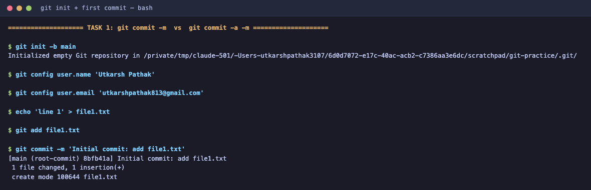
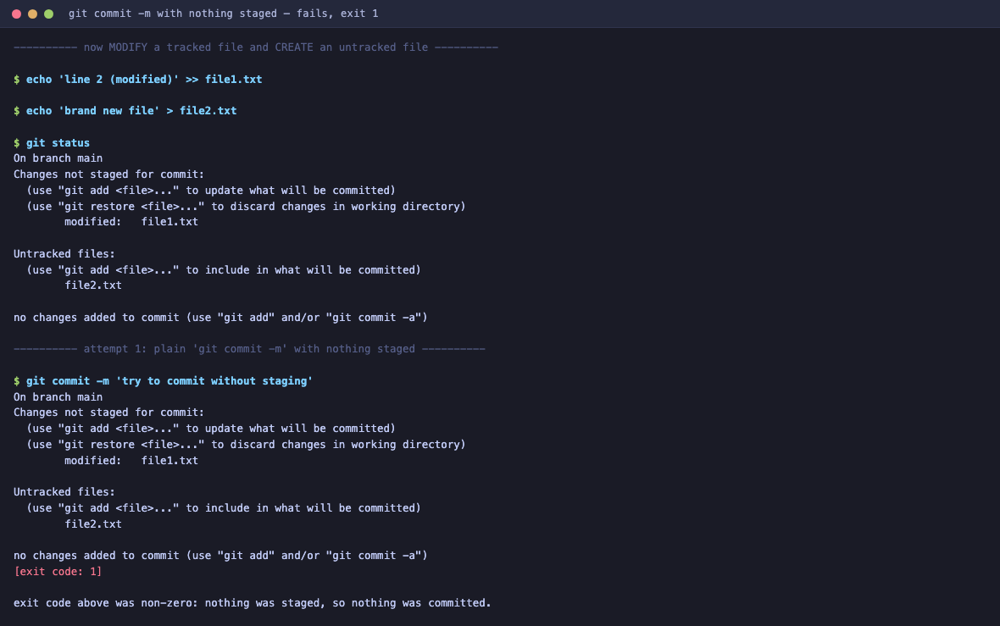
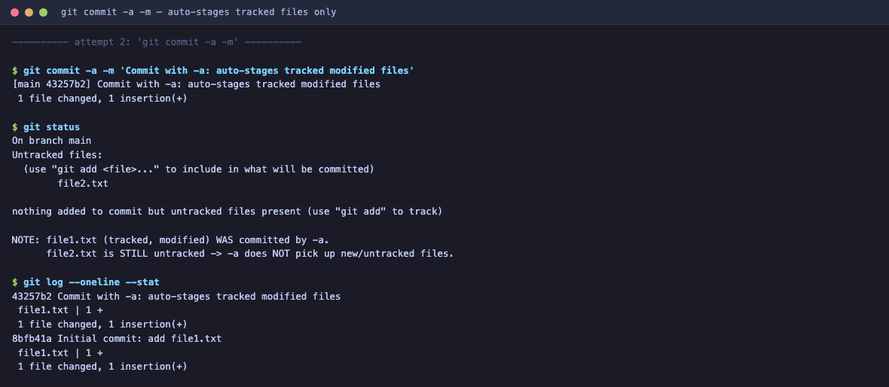
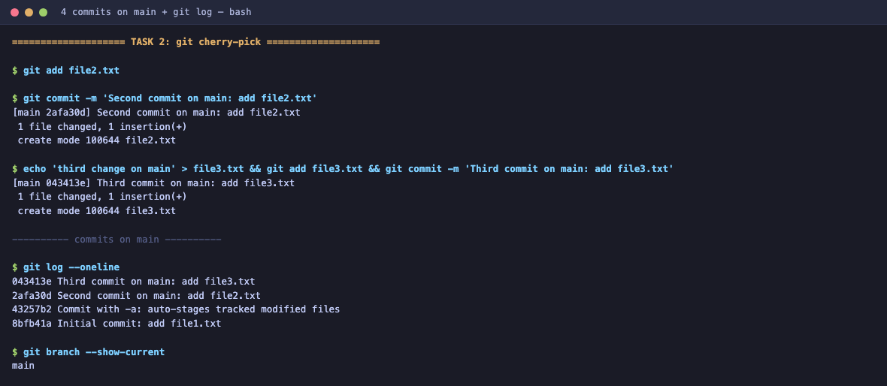
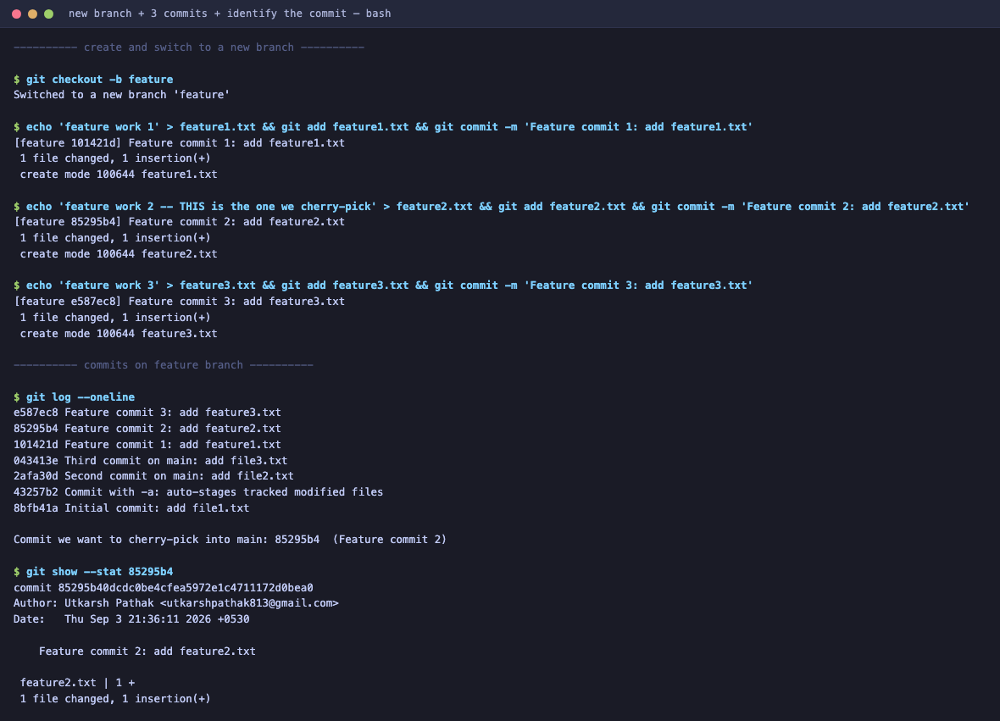
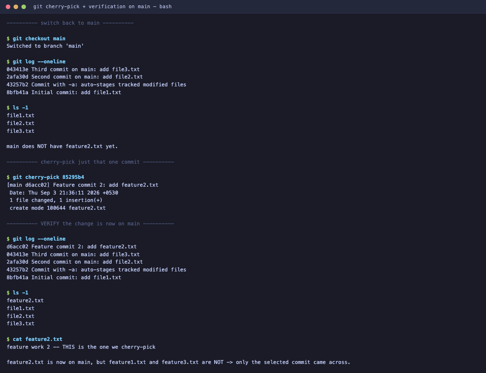
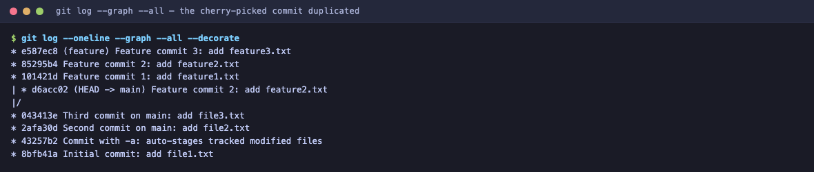

# Git & GitHub

**Name:** Utkarsh Pathak
**Enrollment No:** 24bcs10309

All output in this file was captured from an actual run on my machine (macOS, `git version 2.51.0`).

---

## Task 1: `git commit -a -m` vs `git commit -m`

- Practice `git commit -a -m "message"`.
- Understand the difference between `git commit -a -m` and `git commit -m`.
- Test both commands and observe the difference.

### The idea

`git commit` only ever commits what is in the **staging area** (the index).

- `git commit -m "msg"` — commits **only what you already staged** with `git add`. If you staged nothing, the commit fails.
- `git commit -a -m "msg"` — the `-a` means "all". Before committing, git automatically stages every **tracked** file that was modified or deleted, then commits.

The catch that most people miss: **`-a` does not stage untracked (brand new) files.** A file git has never seen before is invisible to `-a`. You still need `git add` for it.

### Setup

```bash
git init -b main
echo 'line 1' > file1.txt
git add file1.txt
git commit -m 'Initial commit: add file1.txt'
```

Output:

```
Initialized empty Git repository in .../git-practice/.git/
[main (root-commit) 8bfb41a] Initial commit: add file1.txt
 1 file changed, 1 insertion(+)
 create mode 100644 file1.txt
```



Now I modify a **tracked** file and create an **untracked** one, so both cases exist at the same time:

```bash
echo 'line 2 (modified)' >> file1.txt   # tracked file, modified
echo 'brand new file' > file2.txt       # untracked, brand new
git status
```

```
On branch main
Changes not staged for commit:
  (use "git add <file>..." to update what will be committed)
  (use "git restore <file>..." to discard changes in working directory)
	modified:   file1.txt

Untracked files:
  (use "git add <file>..." to include in what will be committed)
	file2.txt

no changes added to commit (use "git add" and/or "git commit -a")
```

### Attempt 1 — plain `git commit -m` with nothing staged

```bash
git commit -m 'try to commit without staging'
```

```
On branch main
Changes not staged for commit:
  (use "git add <file>..." to update what will be committed)
  (use "git restore <file>..." to discard changes in working directory)
	modified:   file1.txt

Untracked files:
  (use "git add <file>..." to include in what will be committed)
	file2.txt

no changes added to commit (use "git add" and/or "git commit -a")
[exit code: 1]
```



**Nothing was committed.** The command exited with code `1` because the staging area was empty. Git even hints at the fix in its own message: `use "git add" and/or "git commit -a"`.

### Attempt 2 — `git commit -a -m`

```bash
git commit -a -m 'Commit with -a: auto-stages tracked modified files'
```

```
[main 43257b2] Commit with -a: auto-stages tracked modified files
 1 file changed, 1 insertion(+)
```

It worked without any `git add`. Now check what is left over:

```bash
git status
```

```
On branch main
Untracked files:
  (use "git add <file>..." to include in what will be committed)
	file2.txt

nothing added to commit but untracked files present (use "git add" to track)
```

```bash
git log --oneline --stat
```

```
43257b2 Commit with -a: auto-stages tracked modified files
 file1.txt | 1 +
 1 file changed, 1 insertion(+)
8bfb41a Initial commit: add file1.txt
 file1.txt | 1 +
 1 file changed, 1 insertion(+)
```



### Explanation of what I observed

The commit made by `-a` contains **`file1.txt` only** — `1 file changed`. `file2.txt` is still sitting there untracked.

That is the whole difference in one run:

| | `git commit -m` | `git commit -a -m` |
|---|---|---|
| Commits staged changes | Yes | Yes |
| Auto-stages **modified** tracked files | No | Yes |
| Auto-stages **deleted** tracked files | No | Yes |
| Auto-stages **untracked / new** files | No | **No** |
| Behaviour when nothing is staged | Fails, exit code 1 | Still commits tracked modifications |

So `-a` is a shortcut for `git add -u && git commit`, not for `git add . && git commit`.

**Why this matters in practice:** `-a` is convenient for quick edits to files already in the repo, but it is risky as a habit. It sweeps up *every* modified tracked file, including ones you did not intend to include in this commit, and it silently leaves your new files out. When a commit should be a specific, reviewable unit of work, stage deliberately with `git add` and use plain `git commit -m`.

---

## Task 2: Git Cherry-Pick

- Create **2–4 commits** in the main branch.
- Use `git log` to view the commits.
- Create a new branch.
- Make **2–3 commits** in the new branch.
- Use `git log` to identify a specific commit.
- Cherry-pick one specific commit from the new branch into the main branch.
- Verify that the selected commit/change is now available in the main branch.

### What cherry-pick does

`git cherry-pick <commit>` takes the **diff introduced by one single commit** and replays it on top of your current branch as a **new commit with a new hash**. It is not a merge — no branch history is joined. You are picking one change out of a branch and leaving the rest behind.

### Step 1 — build up 4 commits on `main`

```bash
git add file2.txt
git commit -m 'Second commit on main: add file2.txt'
echo 'third change on main' > file3.txt && git add file3.txt && git commit -m 'Third commit on main: add file3.txt'
```

```
[main 2afa30d] Second commit on main: add file2.txt
 1 file changed, 1 insertion(+)
 create mode 100644 file2.txt
[main 043413e] Third commit on main: add file3.txt
 1 file changed, 1 insertion(+)
 create mode 100644 file3.txt
```

### Step 2 — view the commits on `main` with `git log`

```bash
git log --oneline
git branch --show-current
```

```
043413e Third commit on main: add file3.txt
2afa30d Second commit on main: add file2.txt
43257b2 Commit with -a: auto-stages tracked modified files
8bfb41a Initial commit: add file1.txt

main
```

Four commits on `main`.



### Step 3 — create a new branch and make 3 commits on it

```bash
git checkout -b feature
echo 'feature work 1' > feature1.txt && git add feature1.txt && git commit -m 'Feature commit 1: add feature1.txt'
echo 'feature work 2 -- THIS is the one we cherry-pick' > feature2.txt && git add feature2.txt && git commit -m 'Feature commit 2: add feature2.txt'
echo 'feature work 3' > feature3.txt && git add feature3.txt && git commit -m 'Feature commit 3: add feature3.txt'
```

```
Switched to a new branch 'feature'
[feature 101421d] Feature commit 1: add feature1.txt
 1 file changed, 1 insertion(+)
 create mode 100644 feature1.txt
[feature 85295b4] Feature commit 2: add feature2.txt
 1 file changed, 1 insertion(+)
 create mode 100644 feature2.txt
[feature e587ec8] Feature commit 3: add feature3.txt
 1 file changed, 1 insertion(+)
 create mode 100644 feature3.txt
```

### Step 4 — use `git log` to identify the specific commit

```bash
git log --oneline
```

```
e587ec8 Feature commit 3: add feature3.txt
85295b4 Feature commit 2: add feature2.txt
101421d Feature commit 1: add feature1.txt
043413e Third commit on main: add file3.txt
2afa30d Second commit on main: add file2.txt
43257b2 Commit with -a: auto-stages tracked modified files
8bfb41a Initial commit: add file1.txt
```

The commit I want is the middle one: **`85295b4` — "Feature commit 2"**. Picking the middle commit on purpose, because it proves the pick is selective — the commit before it and after it must stay behind.

```bash
git show --stat 85295b4
```

```
commit 85295b40dcdc0be4cfea5972e1c4711172d0bea0
Author: Utkarsh Pathak <utkarshpathak813@gmail.com>
Date:   Thu Sep 3 21:36:11 2026 +0530

    Feature commit 2: add feature2.txt

 feature2.txt | 1 +
 1 file changed, 1 insertion(+)
```



### Step 5 — switch back to `main` and confirm the change is not there yet

```bash
git checkout main
git log --oneline
ls -1
```

```
Switched to branch 'main'

043413e Third commit on main: add file3.txt
2afa30d Second commit on main: add file2.txt
43257b2 Commit with -a: auto-stages tracked modified files
8bfb41a Initial commit: add file1.txt

file1.txt
file2.txt
file3.txt
```

No `feature2.txt` on `main`. This is the "before" state.

### Step 6 — cherry-pick that one commit into `main`

```bash
git cherry-pick 85295b4
```

```
[main d6acc02] Feature commit 2: add feature2.txt
 Date: Thu Sep 3 21:36:11 2026 +0530
 1 file changed, 1 insertion(+)
 create mode 100644 feature2.txt
```

Note the hash in the output: **`d6acc02`**, not `85295b4`. Cherry-pick created a *new* commit that carries the same change. The original author date is preserved (git prints the `Date:` line to tell you so), but it is a different commit object on a different branch.

### Step 7 — verify the change is now available on `main`

```bash
git log --oneline
ls -1
cat feature2.txt
```

```
d6acc02 Feature commit 2: add feature2.txt
043413e Third commit on main: add file3.txt
2afa30d Second commit on main: add file2.txt
43257b2 Commit with -a: auto-stages tracked modified files
8bfb41a Initial commit: add file1.txt

feature2.txt
file1.txt
file2.txt
file3.txt

feature work 2 -- THIS is the one we cherry-pick
```

**Verified.** `feature2.txt` is on `main` with the correct contents, and `feature1.txt` / `feature3.txt` are **not** — exactly one commit came across.



### The commit graph, which shows it best

```bash
git log --oneline --graph --all --decorate
```

```
* e587ec8 (feature) Feature commit 3: add feature3.txt
* 85295b4 Feature commit 2: add feature2.txt
* 101421d Feature commit 1: add feature1.txt
| * d6acc02 (HEAD -> main) Feature commit 2: add feature2.txt
|/
* 043413e Third commit on main: add file3.txt
* 2afa30d Second commit on main: add file2.txt
* 43257b2 Commit with -a: auto-stages tracked modified files
* 8bfb41a Initial commit: add file1.txt
```



This graph is the clearest evidence of what happened. Both branches fork from `043413e`. The message "Feature commit 2" now appears **twice** — once as `85295b4` on `feature`, once as `d6acc02` on `main`. The branches were never merged; the change was copied.

### Explanation

- Cherry-pick copies a change, it does not move or merge it. The original commit stays on `feature` untouched.
- The new commit gets a **new hash**, because a commit hash is derived from its parent as well as its content. Different parent, different hash, even for an identical diff.
- It is selective. I took the middle of three commits and the surrounding two stayed put.
- If the commit's diff does not apply cleanly on the target branch, cherry-pick stops with a conflict and you resolve it, then `git cherry-pick --continue` (or `--abort` to back out). My pick applied cleanly because `feature2.txt` was a new file that `main` did not have.

**When you would actually use it:** pulling a single bug fix from a development branch into a release branch when you do not want the rest of that branch's work, or recovering one useful commit from a branch you are otherwise abandoning.
