# Kubernetes Services & Cluster DNS (Session 11)

**Name:** Utkarsh Pathak
**Enrollment No:** 24bcs10309

All output below was captured from a real run on my machine — Minikube `v1.39.0` (`docker`
driver), Kubernetes `v1.37.0`, macOS on Apple Silicon (`arm64`). The manifests are the ones from
the class repo, `session-11-kubernetes-services`. Raw transcripts are in [`lab/`](lab/).

A Service exists because Pod IPs are disposable. Every rollout in
[Session 10](../Session-10-K8s-Core-Objects/README.md) replaced every pod IP in the cluster —
a Service is the stable name and virtual IP that survives that.

---

## Task 1: ClusterIP — the default, internal only

- Deploy 3 replicas and put a ClusterIP Service in front of them
- Show the Service's virtual IP and the endpoints behind it
- Reach the Service by name, by IP and by FQDN
- Show that it load balances across all three pods

```bash
kubectl apply -f 01-clusterip/app-deployment.yaml
kubectl rollout status deployment/web-app-clusterip
kubectl get pods -l app=web-clusterip -o wide
```

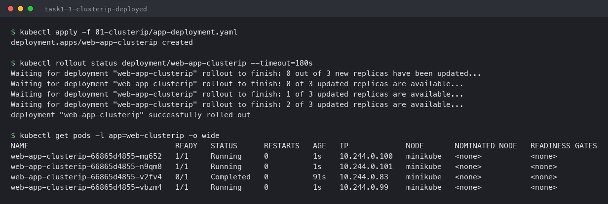

```bash
kubectl apply -f 01-clusterip/service.yaml
kubectl get svc web-service-clusterip
kubectl get endpoints web-service-clusterip
```

```
NAME                    TYPE        CLUSTER-IP       EXTERNAL-IP   PORT(S)    AGE
web-service-clusterip   ClusterIP   10.106.195.228   <none>        8080/TCP   0s

NAME                    ENDPOINTS                                        AGE
web-service-clusterip   10.244.0.100:80,10.244.0.101:80,10.244.0.99:80   0s
```

Two different things to keep apart here. `CLUSTER-IP 10.106.195.228` is a **virtual** IP — no
network interface anywhere holds it; `kube-proxy` writes iptables rules that rewrite traffic
destined for it. `ENDPOINTS` is the real list: the three pod IPs on port 80, maintained
automatically by matching the Service's selector against pod labels.

Also note the port translation — the Service listens on `8080` and forwards to `targetPort: 80`
on the pods, which is why the endpoints show `:80`.

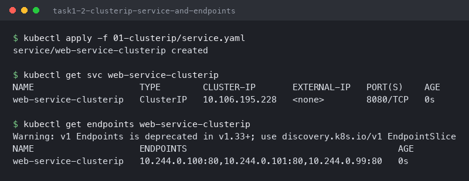

### Three ways to address the same Service

```bash
kubectl exec curl-client -- curl -s http://web-service-clusterip:8080
kubectl exec curl-client -- curl -s http://10.106.195.228:8080
kubectl exec curl-client -- curl -s http://web-service-clusterip.default.svc.cluster.local:8080
```

```
<title>Welcome to nginx!</title>
<title>Welcome to nginx!</title>
<title>Welcome to nginx!</title>
```

Short name, raw ClusterIP and full FQDN all land in the same place. The short name only works
from a pod in the *same namespace* — it relies on the DNS search path, which is unpacked in
Task 6. The FQDN works from anywhere in the cluster, which is why it is the form to use in
config that might move namespaces.

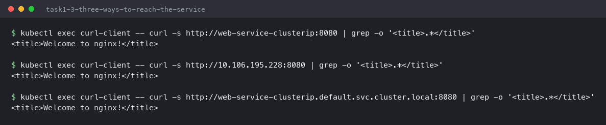

```bash
for i in $(seq 1 6); do kubectl exec curl-client -- curl -s -o /dev/null -w '%{http_code} ' http://web-service-clusterip:8080; done
kubectl get endpoints web-service-clusterip -o jsonpath='{range .subsets[*].addresses[*]}{.ip}{"\n"}{end}'
```

```
200 200 200 200 200 200

10.244.0.100
10.244.0.101
10.244.0.99
```

Six requests, six 200s, spread across the three endpoints. `ClusterIP` is unreachable from
outside the cluster by design — there is no route to `10.106.195.228` from my Mac, which is
exactly the point of the type.

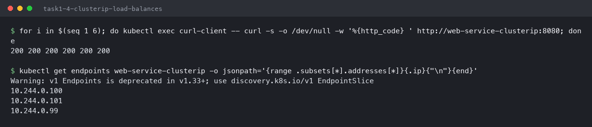

---

## Task 2: NodePort — reaching a Service from outside

- Expose the app on a fixed port on the node
- Reach it from the macOS host
- Show what happens when you use the node IP directly, as the class material does

```bash
kubectl apply -f 02-nodeport/service.yaml
kubectl get svc web-service-nodeport
kubectl get nodes -o wide
```

```
NAME                   TYPE       CLUSTER-IP     EXTERNAL-IP   PORT(S)        AGE
web-service-nodeport   NodePort   10.96.32.251   <none>        80:30080/TCP   0s

NAME       STATUS   ROLES           AGE    VERSION   INTERNAL-IP    EXTERNAL-IP
minikube   Ready    control-plane   2d3h   v1.37.0   192.168.49.2   <none>
```

`80:30080/TCP` is the giveaway: a NodePort is a **superset** of a ClusterIP. It still has a
cluster IP and still works internally; it additionally opens port 30080 on every node. The
allowed range is 30000–32767.

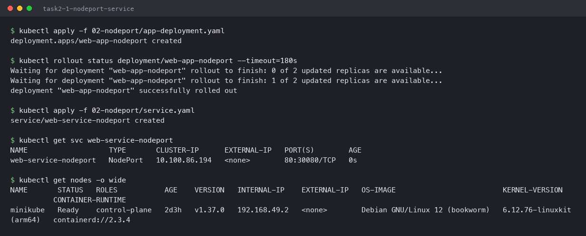

```bash
minikube service web-service-nodeport --url
curl -s http://127.0.0.1:52575 | grep -o '<title>.*</title>'
```

```
http://127.0.0.1:52575
HTTP 200 from http://127.0.0.1:52575/
<title>Welcome to nginx!</title>
```

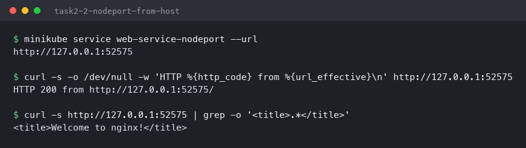

### Why the class command does not work here

The material says to use `curl http://$(minikube ip):30080`. On macOS with the Docker driver:

```bash
minikube ip
curl -s --max-time 5 http://$(minikube ip):30080
```

```
192.168.49.2

curl: (28) Connection timed out - node IP is not routable from the macOS host (docker driver)
```

`192.168.49.2` is an address on a Docker bridge network that exists **inside** the Linux VM
Docker Desktop runs. On native Linux that bridge is on the host itself and the curl succeeds; on
macOS there is no route to it. That is why `minikube service --url` exists — it opens a local
tunnel and hands back a `127.0.0.1` address.

Worth noting for anyone re-running this: on the Docker driver `minikube service --url` holds the
tunnel open in the foreground and does not exit, so in a script it has to be backgrounded and
killed afterwards rather than called inline.

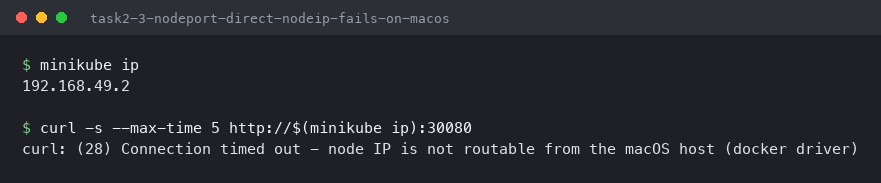

---

## Task 3: LoadBalancer — and why it stays pending locally

- Create a LoadBalancer Service and read its EXTERNAL-IP
- Explain why it never gets one on a local cluster

```bash
kubectl apply -f 03-loadbalancer/service.yaml
kubectl get svc web-service-loadbalancer
kubectl describe svc web-service-loadbalancer | grep -E 'Type|NodePort|Endpoints'
```

```
NAME                       TYPE           CLUSTER-IP     EXTERNAL-IP   PORT(S)        AGE
web-service-loadbalancer   LoadBalancer   10.98.17.206   <pending>     80:32743/TCP   8s

Type:                     LoadBalancer
NodePort:                 http  32743/TCP
Endpoints:                10.244.0.106:80,10.244.0.105:80,10.244.0.107:80
```

`EXTERNAL-IP <pending>` is the correct result, not a failure. `LoadBalancer` does not implement
a load balancer — it asks the **cloud provider** to provision one and write its address back
into this field. On AWS that produces an ELB hostname, on GCP an external IP. Minikube has no
cloud controller, so the request is never fulfilled and the field waits forever.

The stacking is visible in the same output: this Service has a ClusterIP *and* a NodePort
(`32743`) *and* is waiting on an external LB. Each type builds on the one before it.

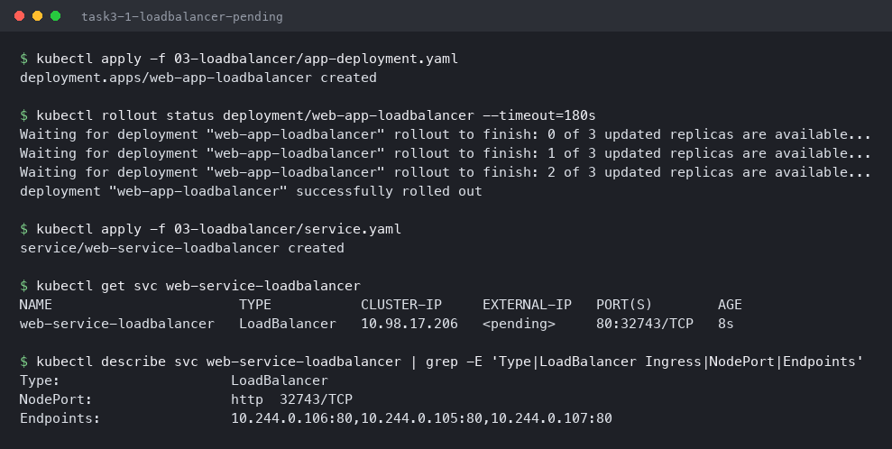

```bash
minikube service web-service-loadbalancer --url
curl -s -o /dev/null -w 'HTTP %{http_code}\n' http://127.0.0.1:52597
```

```
http://127.0.0.1:52597
HTTP 200
```

It still serves traffic, through the NodePort underneath. `minikube tunnel` would populate
`EXTERNAL-IP` with `127.0.0.1` by faking a cloud LB, but it needs sudo and its own terminal, and
`<pending>` is the more honest thing to show for a local cluster.

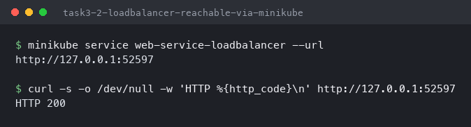

---

## Task 4: ExternalName — a DNS alias with no pods

- Create a Service that points at an address outside the cluster
- Show that it resolves as a CNAME
- Send real traffic through it

```bash
kubectl apply -f 04-externalname/service.yaml
kubectl get svc external-database-service
```

```
NAME                        TYPE           CLUSTER-IP   EXTERNAL-IP      PORT(S)   AGE
external-database-service   ExternalName   <none>       api.github.com   <none>    0s
```

No cluster IP, no ports, no selector, no endpoints — this Service creates **nothing** in the
data path. It is a CoreDNS record and that is all.

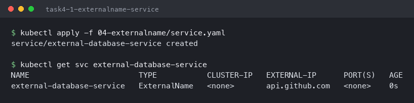

```bash
kubectl exec dns-test-client -- nslookup external-database-service
```

```
external-database-service.default.svc.cluster.local	canonical name = api.github.com
Name:	api.github.com
Address: 20.207.73.85
```

CoreDNS returns a **CNAME**, and the client then resolves the real name itself. The use case is
indirection: application config points at `database-service`, and moving from an external
managed database to an in-cluster one is a Service change instead of a config change and redeploy.

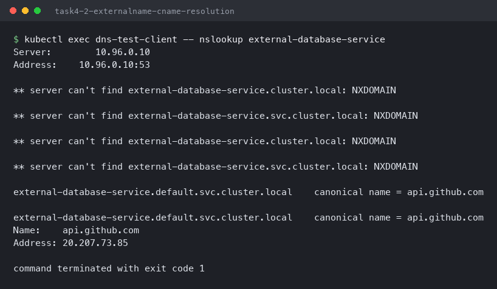

### Sending traffic through it — and the TLS catch

```bash
kubectl exec dns-test-client -- curl -s -H 'Host: api.github.com' https://external-database-service
```

```
command terminated with exit code 60
```

Exit code 60 is a certificate failure. DNS resolution worked fine, but TLS was negotiated
against the name `external-database-service`, and GitHub's certificate is issued for
`api.github.com` — so verification fails. The `Host:` header does not help, because certificate
validation happens during the TLS handshake, before any HTTP header is sent.

```bash
kubectl exec dns-test-client -- curl -sk -o /dev/null -w 'HTTP %{http_code}' https://external-database-service
kubectl exec dns-test-client -- curl -s -o /dev/null -w 'HTTP %{http_code}' http://external-database-service
```

```
HTTP 400
HTTP 301
```

The plain HTTP request is the proof: **301**, GitHub's redirect to HTTPS. There is no certificate
to verify over HTTP, so the request completes and the answer comes from GitHub's real servers —
the CNAME genuinely carried traffic out of the cluster. With `-k` the handshake completes but
GitHub returns 400, because the SNI name it received is not one of its own hostnames.

The practical lesson: `ExternalName` works cleanly for plain TCP and internal services, but
pointing it at a **TLS endpoint** breaks certificate validation unless the target accepts the
alias as a valid name.

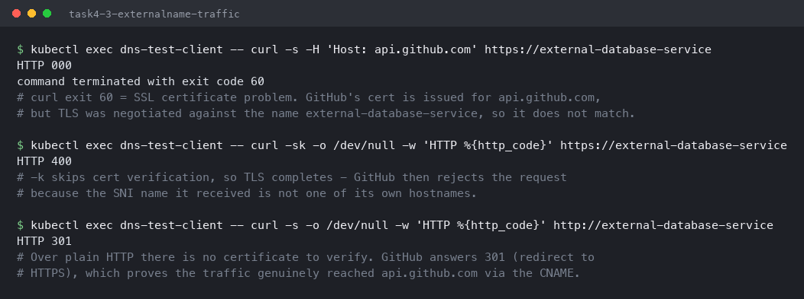

---

## Task 5: Headless Service — DNS straight to the pods

- Create a Service with `clusterIP: None`
- Back it with a StatefulSet
- Show DNS returning every pod IP instead of one virtual IP
- Address a single pod by its own stable DNS name

```bash
kubectl apply -f 05-headless/service.yaml
kubectl get svc web-service-headless
```

```
NAME                   TYPE        CLUSTER-IP   EXTERNAL-IP   PORT(S)   AGE
web-service-headless   ClusterIP   None         <none>        80/TCP    0s
```

`CLUSTER-IP: None` — no virtual IP, so no load balancing and no `kube-proxy` rules at all.

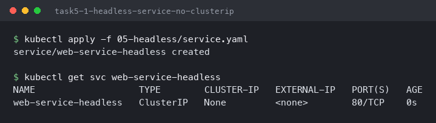

```bash
kubectl apply -f 05-headless/app-statefulset.yaml
kubectl get pods -l app=web-headless -o wide
```

```
NAME             READY   STATUS    RESTARTS   AGE   IP             NODE
web-stateful-0   1/1     Running   0          2s    10.244.0.114   minikube
web-stateful-1   1/1     Running   0          1s    10.244.0.115   minikube
web-stateful-2   1/1     Running   0          1s    10.244.0.116   minikube
```

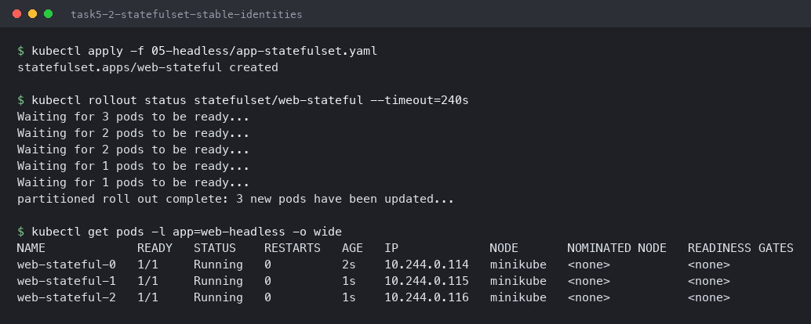

### DNS returns all of them

```bash
kubectl exec headless-dns-client -- nslookup web-service-headless
```

```
Name:	web-service-headless.default.svc.cluster.local
Address: 10.244.0.116
Name:	web-service-headless.default.svc.cluster.local
Address: 10.244.0.114
Name:	web-service-headless.default.svc.cluster.local
Address: 10.244.0.115
```

**Three A records for one name.** A normal ClusterIP Service answers with a single virtual IP
and hides the pods; a headless Service hands the client the full list and lets it decide. That
is what clustered software needs — a database replica has to connect to a *specific* peer, not
to whichever one a load balancer picks.

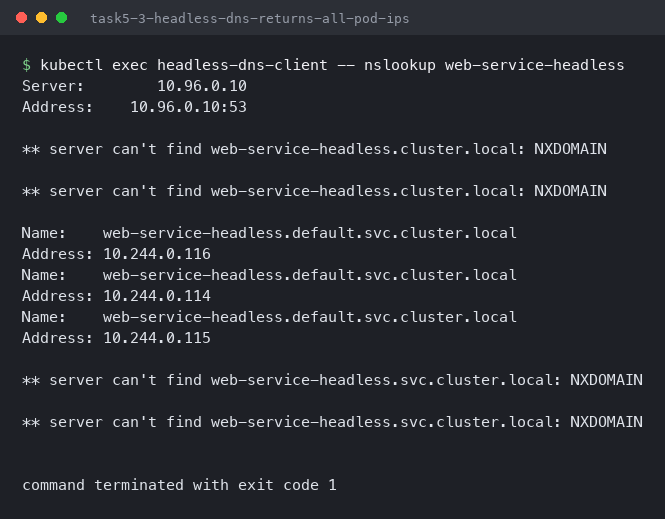

### Addressing one specific pod

```bash
kubectl exec headless-dns-client -- nslookup web-stateful-0.web-service-headless.default.svc.cluster.local
kubectl exec headless-dns-client -- curl -s -o /dev/null -w 'HTTP %{http_code} from web-stateful-0\n' http://web-stateful-0.web-service-headless
```

```
Name:	web-stateful-0.web-service-headless.default.svc.cluster.local
Address: 10.244.0.114

HTTP 200 from web-stateful-0
```

`web-stateful-0.web-service-headless` resolves to exactly one pod and nothing else. The pod's IP
will change when it is rescheduled — but the **name will not**, because the StatefulSet
guarantees the ordinal. This pairing of a StatefulSet with a headless Service is how a
Kafka/etcd/MySQL cluster finds its own members.

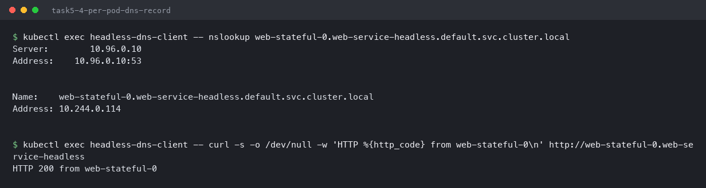

---

## Task 6: CoreDNS and how a short name resolves

- Show the CoreDNS pod and the DNS Service
- Read a pod's `/etc/resolv.conf`
- Watch the search-domain walk in a real lookup

```bash
kubectl get pods -n kube-system -l k8s-app=kube-dns
kubectl get svc -n kube-system kube-dns
```

```
NAME                       READY   STATUS    RESTARTS        AGE
coredns-559f6c778d-lwmtz   1/1     Running   2 (7m41s ago)   2d3h

NAME       TYPE        CLUSTER-IP   EXTERNAL-IP   PORT(S)                  AGE
kube-dns   ClusterIP   10.96.0.10   <none>        53/UDP,53/TCP,9153/TCP   2d3h
```

Cluster DNS is itself just a Deployment behind a ClusterIP Service — `10.96.0.10` is a virtual
IP exactly like the one in Task 1.

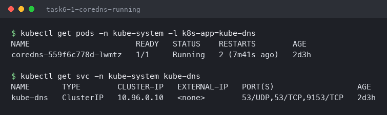

```bash
kubectl exec curl-client -- cat /etc/resolv.conf
```

```
search default.svc.cluster.local svc.cluster.local cluster.local
nameserver 10.96.0.10
options ndots:5
```

The kubelet writes this into every pod. `nameserver` points at CoreDNS, and `search` is what
makes bare service names work.

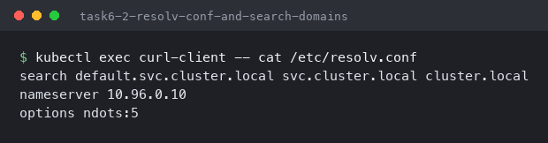

### The search walk, visible in the output

```bash
kubectl exec curl-client -- nslookup web-service-clusterip
```

```
** server can't find web-service-clusterip.cluster.local: NXDOMAIN
** server can't find web-service-clusterip.svc.cluster.local: NXDOMAIN

Name:	web-service-clusterip.default.svc.cluster.local
Address: 10.106.195.228
```

This is the most useful thing in the session. Two `NXDOMAIN` responses appear *before* the
answer — and they are not errors. `ndots:5` tells the resolver that any name with fewer than 5
dots should be tried against each search domain first, so `web-service-clusterip` is queried as
`.cluster.local`, then `.svc.cluster.local`, then `.default.svc.cluster.local`, which hits.

Two practical consequences: one short-name lookup costs several DNS queries, which is a real
source of DNS load in big clusters; and `NXDOMAIN` lines in application logs are usually the
search walk working normally rather than a broken cluster. Using the full FQDN skips the walk
entirely.

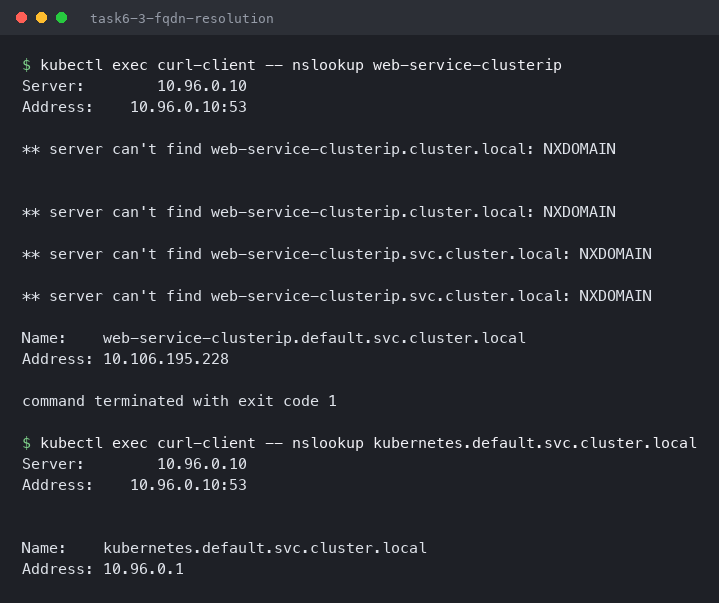

---

## Task 7: Endpoint triage — a Service that selects nothing

- Apply a Service whose selector does not match the running pods
- Diagnose it from `get endpoints`

```bash
kubectl apply -f deployment/backend-deployment.yaml
kubectl apply -f troubleshooting/empty-endpoints.yaml
kubectl get svc broken-backend-service
kubectl get endpoints broken-backend-service
```

```
NAME                     TYPE        CLUSTER-IP      EXTERNAL-IP   PORT(S)   AGE
broken-backend-service   ClusterIP   10.108.226.79   <none>        80/TCP    0s

NAME                     ENDPOINTS   AGE
broken-backend-service   <none>      0s
```

The Service was created successfully and has a perfectly good ClusterIP. Nothing warned me.
But `ENDPOINTS: <none>` means every request to it fails with connection refused, while
`kubectl get svc` continues to look completely healthy — which is what makes this failure
confusing in practice.

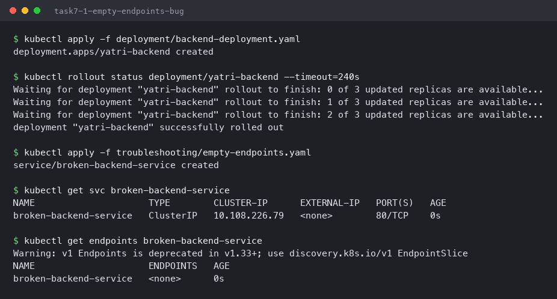

```bash
kubectl describe svc broken-backend-service | grep -E 'Selector|Endpoints'
kubectl get pods -l app=yatri-backend --show-labels
kubectl get pods -l app=wrong-backend-name
```

```
Selector:                 app=wrong-backend-name
Endpoints:

NAME                            READY   STATUS    RESTARTS   AGE   LABELS
yatri-backend-dc5888c55-c5bcw   1/1     Running   0          1s    app=yatri-backend,pod-template-hash=dc5888c55,tier=api
yatri-backend-dc5888c55-cgk7j   1/1     Running   0          1s    app=yatri-backend,pod-template-hash=dc5888c55,tier=api
yatri-backend-dc5888c55-pc5rm   1/1     Running   0          1s    app=yatri-backend,pod-template-hash=dc5888c55,tier=api

No resources found in default namespace.
```

There is the whole diagnosis in three commands. The Service selects `app=wrong-backend-name`;
the pods are labelled `app=yatri-backend`; querying the Service's own selector returns nothing.

Unlike the Deployment selector mismatch in
[Session 10, Task 7](../Session-10-K8s-Core-Objects/README.md) — which the API server rejected
outright — this one is **accepted**, because a Service selector matching nothing is legal. It
has to be: the Service often exists before the pods do. That is exactly why `kubectl get
endpoints` is the first command to run when a Service is not answering.

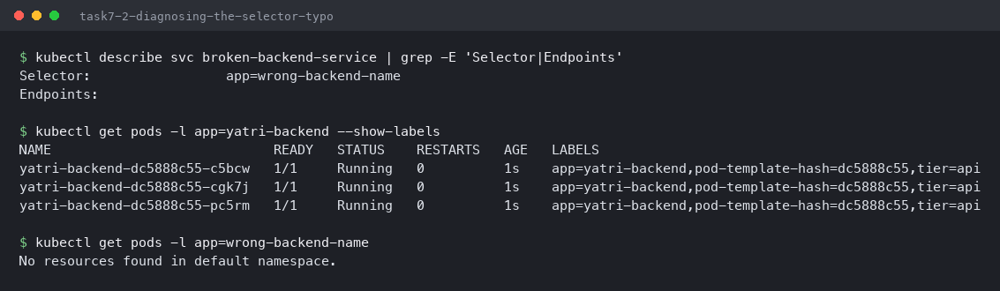

---

## What I took away

| Type | Creates | Reachable from | Use for |
|---|---|---|---|
| `ClusterIP` | Virtual IP + endpoints | Inside cluster only | Service-to-service traffic (default) |
| `NodePort` | ClusterIP + port on every node | Node IP:30000–32767 | Dev access, or behind an external LB |
| `LoadBalancer` | NodePort + cloud LB request | Public internet (on a cloud) | Production external entry point |
| `ExternalName` | A CNAME record, nothing else | N/A — it is DNS only | Aliasing a service outside the cluster |
| Headless | DNS records per pod, no VIP | Inside cluster only | StatefulSets, peer discovery |

The first four are cumulative, which was not obvious from the diagrams — a `LoadBalancer`
Service really does contain a NodePort and a ClusterIP, visible in its own `describe` output.
Headless is the one that is genuinely different: it opts out of the virtual IP entirely.

The `NXDOMAIN` lines in the search walk were the most useful surprise. I would have read those
as a broken lookup in a log file, when they are the normal cost of using a short name under
`ndots:5`.

Two results also would not have matched the class notes if I had not run them: `EXTERNAL-IP`
stays `<pending>` forever on a local cluster because there is no cloud controller to answer, and
`curl http://$(minikube ip):30080` cannot work from macOS because that IP lives inside Docker
Desktop's VM.
