# Ingress, ConfigMaps & Secrets (Session 12)

**Name:** Utkarsh Pathak
**Enrollment No:** 24bcs10309

All output below was captured from a real run on my machine — Minikube `v1.39.0` (`docker`
driver), Kubernetes `v1.37.0`, `ingress-nginx` controller `v1.15.1`, macOS on Apple Silicon
(`arm64`). The manifests are the ones from the class repo,
`session-12-ingress-configmaps-secrets`. Raw transcripts are in [`lab/`](lab/).

This session is about the two things the previous ones left out: getting configuration into a
container without baking it into the image, and getting HTTP traffic into the cluster through a
single entry point instead of one NodePort per service.

---

## Task 1: ConfigMap — configuration out of the image

- Create a ConfigMap of non-sensitive settings
- List it, describe it, and read a single key back

```bash
kubectl apply -f 01-configmap/app-config.yaml
kubectl get configmap yatri-app-config
```

```
NAME               DATA   AGE
yatri-app-config   5      9h
```

`DATA 5` is the number of keys, not bytes. The reason this object exists at all: without it, the
only ways to change `LOG_LEVEL` are to rebuild the image or hard-code the value into the
Deployment — meaning `production` and `staging` would need different images of identical code.

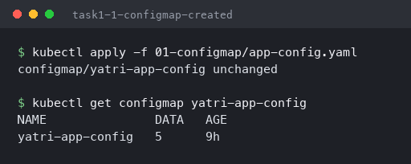

```bash
kubectl describe configmap yatri-app-config
```

```
Data
====
DEFAULT_CURRENCY:
----
INR

ENVIRONMENT:
----
production

LOG_LEVEL:
----
INFO

MAX_BOOKING_DAYS:
----
30

PORT:
----
5000
```

Everything is in plain text, which is the whole distinction from a Secret in Task 2 — `describe`
prints a ConfigMap's values in full and deliberately refuses to do the same for a Secret.

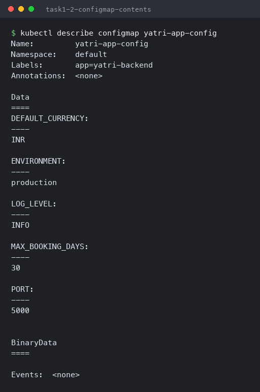

```bash
kubectl get configmap yatri-app-config -o jsonpath='{.data.LOG_LEVEL}'
kubectl get configmap yatri-app-config -o jsonpath='{.data.DEFAULT_CURRENCY}'
```

```
INFO
INR
```

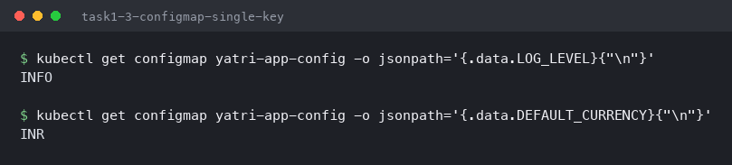

---

## Task 2: Secret — and the base64 trap

- Base64-encode three credentials
- Create the Secret and show that its values are masked
- Decode a value back
- Show the trailing-newline bug that silently breaks passwords

```bash
echo -n 'yatri_admin' | base64
echo -n 'secretpassword' | base64
echo -n 'yatri_production_db' | base64
```

```
eWF0cmlfYWRtaW4=
c2VjcmV0cGFzc3dvcmQ=
eWF0cmlfcHJvZHVjdGlvbl9kYg==
```

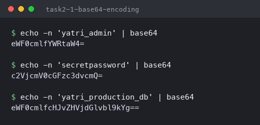

```bash
kubectl apply -f 02-secret/db-secret.yaml
kubectl get secret yatri-db-secret
kubectl describe secret yatri-db-secret
```

```
NAME              TYPE     DATA   AGE
yatri-db-secret   Opaque   3      0s

Type:  Opaque

Data
====
POSTGRES_DB:        19 bytes
POSTGRES_PASSWORD:  14 bytes
POSTGRES_USER:      11 bytes
```

`describe` gives **byte counts instead of values** — the one visible behavioural difference from
a ConfigMap. It is worth being clear about what this does and does not buy you: base64 is
encoding, not encryption. Anyone who can `get secret` can decode it in one command, and by
default Secrets are stored unencrypted in etcd. What they actually provide is that values do not
appear in `describe` output, logs or `kubectl get -o wide`, plus a separate RBAC surface so you
can grant ConfigMap access without granting Secret access.

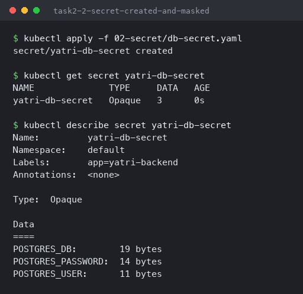

```bash
kubectl get secret yatri-db-secret -o jsonpath='{.data.POSTGRES_PASSWORD}'
kubectl get secret yatri-db-secret -o jsonpath='{.data.POSTGRES_PASSWORD}' | base64 --decode
```

```
c2VjcmV0cGFzc3dvcmQ=
secretpassword
```

One pipe from "masked" to plaintext — which is the point about base64 not being a security
boundary.

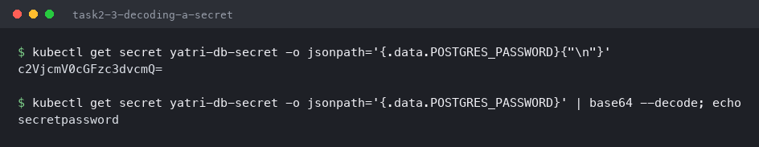

### The `echo` vs `echo -n` trap

This is the most valuable thing in the session, because it fails *silently*:

```bash
echo 'secretpassword' | base64
echo -n 'secretpassword' | base64
```

```
c2VjcmV0cGFzc3dvcmQK
c2VjcmV0cGFzc3dvcmQ=
```

Two different strings. `echo` appends a newline; `echo -n` does not. Decoding both and looking
at the actual bytes:

```bash
echo 'secretpassword' | base64 -d | xxd
echo -n 'secretpassword' | base64 -d | xxd
```

```
00000000: 7365 6372 6574 7061 7373 776f 7264 0a    secretpassword.
00000000: 7365 6372 6574 7061 7373 776f 7264       secretpassword
```

There it is — a trailing **`0a`** byte, an invisible newline welded onto the end of the password.
The Secret is created successfully, the pod starts normally, nothing logs a warning, and then
the database rejects every login because the password is `secretpassword\n` and not
`secretpassword`. Hours get lost to this, because every layer reports success and the only
visible symptom is an authentication failure that looks like a wrong password.

`kubectl create secret generic --from-literal=` avoids it entirely by doing the encoding itself.

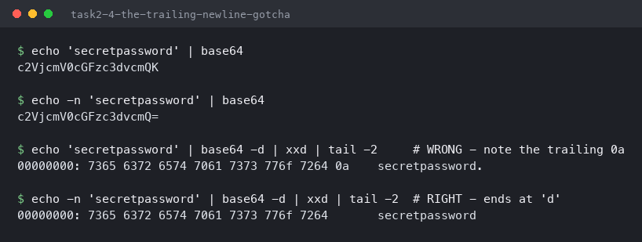

---

## Task 3: Ingress — one entry point instead of many

- Confirm the ingress controller is running
- Create an Ingress with host and path-based routing rules
- Read what the controller made of them

An Ingress object is only a set of rules. Without a **controller** watching for those objects and
reconfiguring a real proxy, it does nothing at all.

```bash
minikube addons enable ingress
kubectl get pods -n ingress-nginx
kubectl get svc -n ingress-nginx ingress-nginx-controller
```

```
NAME                                       READY   STATUS      RESTARTS   AGE
ingress-nginx-admission-create-jktk4       0/1     Completed   0          16m
ingress-nginx-admission-patch-l4cbw        0/1     Completed   0          16m
ingress-nginx-controller-d7cd8c989-m6dcp   1/1     Running     0          16m

NAME                       TYPE       CLUSTER-IP       EXTERNAL-IP   PORT(S)                      AGE
ingress-nginx-controller   NodePort   10.111.241.145   <none>        80:31994/TCP,443:30107/TCP   16m
```

The controller is an ordinary Deployment behind an ordinary NodePort Service — the same
primitives from [Session 11](../Session-11-Kubernetes-Services/README.md). All an Ingress does
is reprogram this one nginx instead of creating more Services.

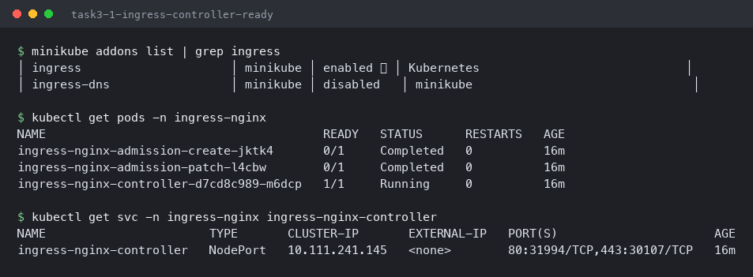

```bash
kubectl apply -f 03-ingress/ingress-routes.yaml
kubectl get ingress yatri-ingress
kubectl describe ingress yatri-ingress
```

```
NAME            CLASS   HOSTS         ADDRESS        PORTS   AGE
yatri-ingress   nginx   yatri.local   192.168.49.2   80      5s

Rules:
  Host         Path  Backends
  ----         ----  --------
  yatri.local
               /api(/|$)(.*)   yatri-backend-service:80 (<error: services "yatri-backend-service" not found>)
               /               yatri-frontend-service:80 (<error: services "yatri-frontend-service" not found>)
Annotations:   nginx.ingress.kubernetes.io/ssl-redirect: false
               nginx.ingress.kubernetes.io/use-regex: true
```

I applied the Ingress before deploying the apps, which turned out to be informative:
**`<error: services ... not found>`**. The Ingress was accepted and the controller synced it
anyway — an Ingress pointing at a non-existent Service is valid, and only shows up as a 503 at
request time. Same principle as the empty-endpoints Service in
[Session 11, Task 7](../Session-11-Kubernetes-Services/README.md): Kubernetes lets you wire
things up in any order, so "created successfully" is not the same as "working".

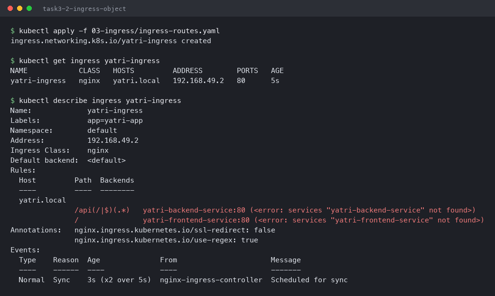

---

## Task 4: All three together

- Deploy a frontend and a backend that read from the ConfigMap and the Secret
- Put both behind one Ingress on `yatri.local`
- Prove `/` and `/api/` route to different services
- Prove the config and credentials actually reached the container

```bash
minikube status
kubectl config current-context
kubectl wait --namespace ingress-nginx --for=condition=ready pod \
  --selector=app.kubernetes.io/component=controller --timeout=180s
```

```
minikube
type: Control Plane
host: Running
kubelet: Running
apiserver: Running

minikube
pod/ingress-nginx-controller-d7cd8c989-m6dcp condition met
```

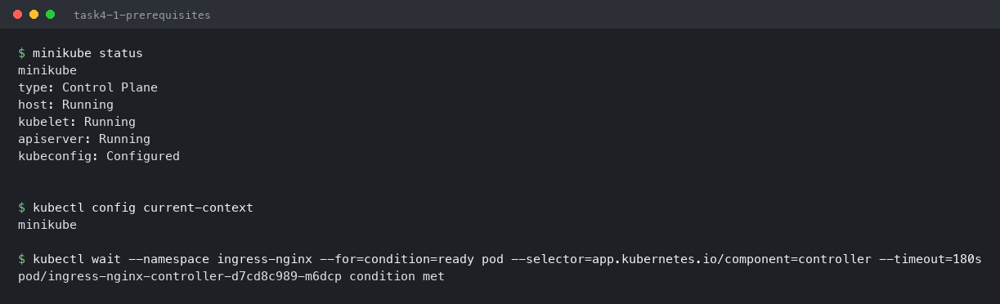

```bash
kubectl apply -f 04-full-demo/configmap.yaml
kubectl apply -f 04-full-demo/secret.yaml
kubectl apply -f 04-full-demo/frontend.yaml
kubectl apply -f 04-full-demo/backend.yaml
kubectl rollout status deployment/yatri-backend --timeout=240s
```

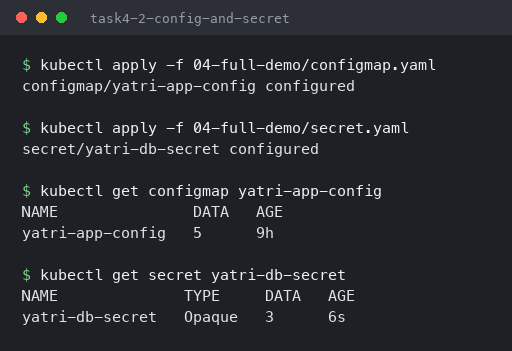

The backend consumes both objects in two different ways — `envFrom.configMapRef` pulls in every
ConfigMap key at once, while each Secret value is mapped individually with
`valueFrom.secretKeyRef`:

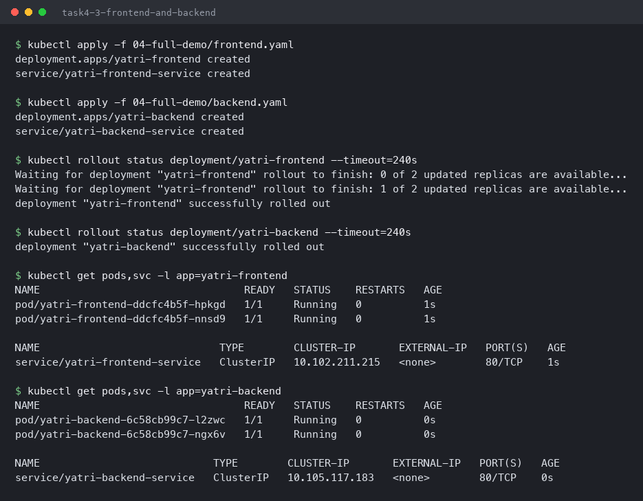

```bash
kubectl apply -f 04-full-demo/ingress.yaml
kubectl describe ingress yatri-ingress
```

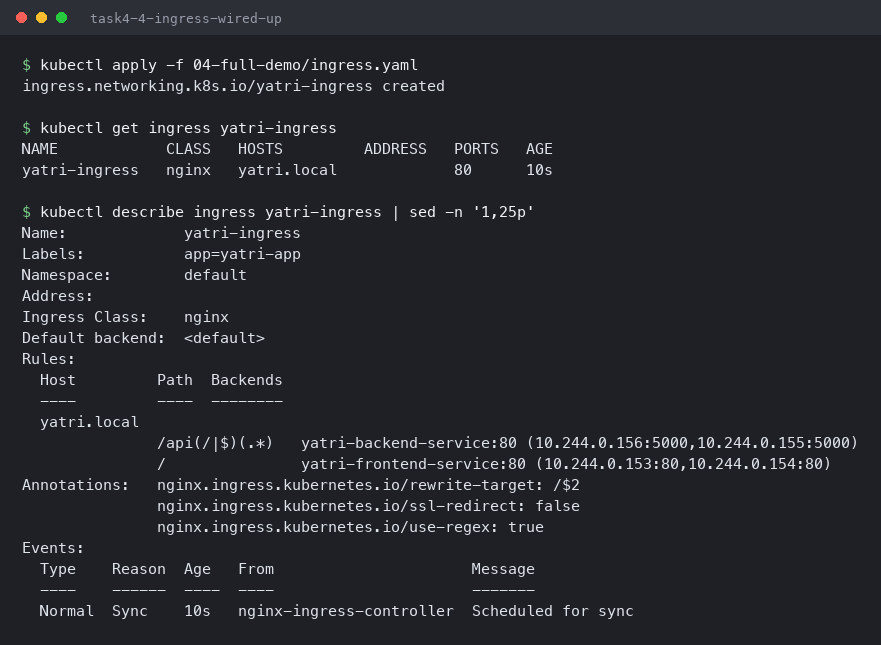

### Reaching `yatri.local` without editing `/etc/hosts`

The class material adds a hosts entry with `sudo tee -a /etc/hosts`. That needs a password and
permanently edits a system file, and on the Docker driver `minikube ip` is not routable from
macOS anyway (shown in [Session 11, Task 2](../Session-11-Kubernetes-Services/README.md)). Port-
forwarding the controller and sending the hostname as a header proves the same routing without
either problem:

```bash
kubectl port-forward -n ingress-nginx svc/ingress-nginx-controller 18080:80 &
curl -s -H 'Host: yatri.local' http://localhost:18080/
```

```
<!DOCTYPE html>
<html>
<head>
<title>Welcome to nginx!</title>
...
<h1>Welcome to nginx!</h1>
```

The `/` path served the **frontend** nginx pod.

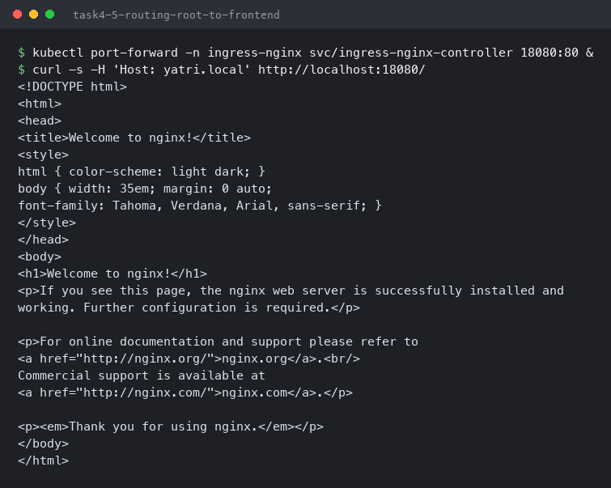

```bash
curl -s -H 'Host: yatri.local' http://localhost:18080/api/
```

```
Yatri Backend API
=================
ENVIRONMENT     : production
LOG_LEVEL       : INFO
DEFAULT_CURRENCY: INR
POSTGRES_USER   : yatri_admin
POSTGRES_DB     : yatri_production_db
```

This one response is the whole session. **Same host, same port, different path — a completely
different pod answered.** And what it printed did not come from its image: `production`, `INFO`
and `INR` came from the ConfigMap, `yatri_admin` and `yatri_production_db` from the Secret.

The `rewrite-target: /$2` annotation is doing quiet but essential work here. The path pattern
`/api(/|$)(.*)` captures whatever follows `/api` as group 2, and the rewrite forwards only that
to the backend — so the backend sees `/` and does not need to know it is mounted under `/api`.
Without it the backend would receive `/api/` and return a 404.

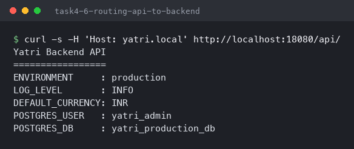

```bash
kubectl exec deploy/yatri-backend -- env | grep -E 'ENVIRONMENT|LOG_LEVEL|APP_PORT|DEFAULT_CURRENCY|MAX_BOOKING_DAYS' | sort
kubectl exec deploy/yatri-backend -- env | grep POSTGRES | sort
```

```
APP_PORT=5000
DEFAULT_CURRENCY=INR
ENVIRONMENT=production
LOG_LEVEL=INFO
MAX_BOOKING_DAYS=30

POSTGRES_DB=yatri_production_db
POSTGRES_PASSWORD=secretpassword
POSTGRES_USER=yatri_admin
```

Inside the container both look identical — plain environment variables, with the Secret's
password fully readable. The separation is entirely about *who can read the object through the
API*, not about how the value is stored in the process. Anyone who can `kubectl exec` into the
pod can read the password, which is worth knowing before treating Secrets as a security control.

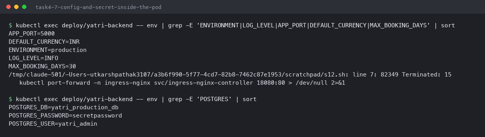

### What happens when the ConfigMap disappears

```bash
kubectl delete configmap yatri-app-config
kubectl rollout restart deployment/yatri-backend
kubectl get pods -l app=yatri-backend
```

```
NAME                             READY   STATUS                       RESTARTS   AGE
yatri-backend-6c58cb99c7-l2zwc   1/1     Running                      0          6m29s
yatri-backend-6c58cb99c7-ngx6v   1/1     Running                      0          6m29s
yatri-backend-f65c8c945-f2bsw    0/1     CreateContainerConfigError   0          26s

  Warning  Failed  kubelet  spec.containers{backend}: Error: configmap "yatri-app-config" not found
```

Two behaviours in one listing. The **existing** pods keep running and keep serving, because
environment variables are resolved once at container start and copied into the process. The
**new** pod cannot be created at all — `CreateContainerConfigError`, with the reason named
exactly.

The practical consequence is a delayed failure: delete a ConfigMap in production and nothing
breaks, until the next rollout or node eviction, at which point pods start failing for a change
made hours earlier. It also means editing a ConfigMap does **not** update running pods — env
vars need a restart to pick up new values (a mounted volume would update, but only after a
kubelet sync delay).

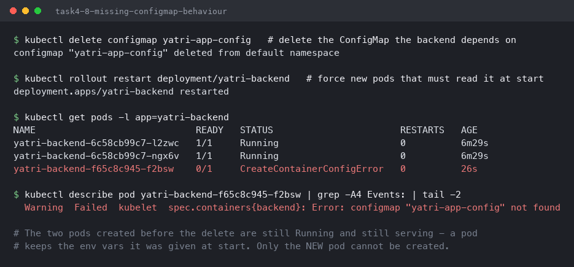

---

## What I took away

| | ConfigMap | Secret |
|---|---|---|
| Stored as | Plain text | base64 (not encrypted) |
| `describe` shows | Full values | Byte counts only |
| Protects against | Nothing — it is not for secrets | Casual exposure in output and logs; separate RBAC |
| Use for | Log levels, feature flags, URLs, ports | Passwords, API keys, tokens, certificates |

The trailing-newline trap is the thing I will actually carry forward. `echo` versus `echo -n`
produces a Secret that is accepted by the API, mounts cleanly, starts the pod without a warning,
and then fails authentication for a reason nothing reports — and `xxd` is the only way to see
the `0a` that caused it.

The other lesson was how tolerant Kubernetes is of things being wired up in the wrong order. An
Ingress pointing at Services that do not exist was accepted and synced; a Service selecting no
pods was accepted in Session 11; a deleted ConfigMap left running pods untouched. "Applied
successfully" consistently means "the object is valid", never "the thing works" — which is why
`describe` and `get endpoints` matter more than the output of `apply`.
