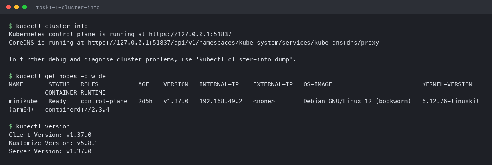
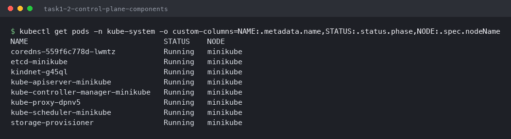
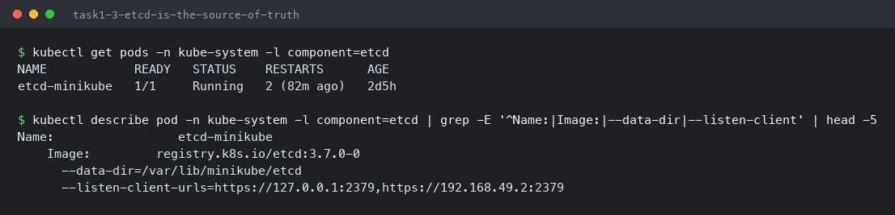
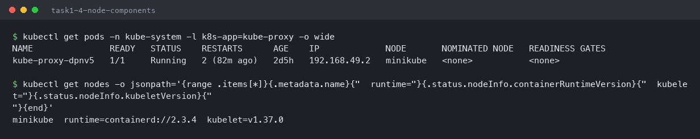
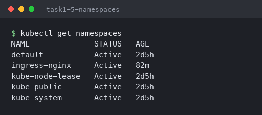
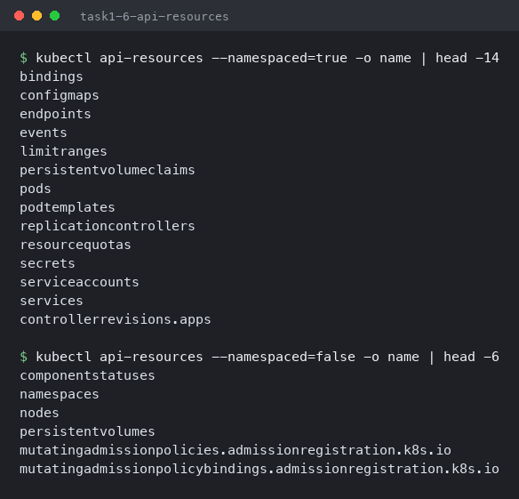

# Kubernetes Fundamentals

**Name:** Utkarsh Pathak
**Enrollment No:** 24bcs10309

Run on Minikube `v1.39.0` (`docker` driver), Kubernetes `v1.37.0`, macOS Apple Silicon (`arm64`).

---

## Why Kubernetes over Docker Swarm

| | Docker Swarm | Kubernetes |
|---|---|---|
| Auto-scaling | Manual only | HPA / VPA / Cluster Autoscaler |
| Health checks | Restart on exit | Liveness, readiness, startup probes |
| Deployment strategies | Rolling only | Rolling, recreate, blue-green, canary |
| Routing | Routing mesh | Services + Ingress + network policies |
| Storage | Basic volumes | PersistentVolumes with dynamic provisioning |
| Ecosystem | Small, slow development | Helm, Prometheus, Istio, ArgoCD, CNCF |

---

## The cluster

```bash
kubectl cluster-info
kubectl get nodes -o wide
kubectl version
```

```
Kubernetes control plane is running at https://127.0.0.1:51837
CoreDNS is running at https://127.0.0.1:51837/api/v1/namespaces/kube-system/services/kube-dns:dns/proxy

NAME       STATUS   ROLES           AGE    VERSION   INTERNAL-IP    CONTAINER-RUNTIME
minikube   Ready    control-plane   2d5h   v1.37.0   192.168.49.2   containerd://2.3.4
```

One node doing both jobs — `ROLES: control-plane`, but workloads run here too because Minikube
removes the usual taint. Runtime is **containerd**, not Docker: Kubernetes talks to any runtime
through the CRI.



## Control plane components

```bash
kubectl get pods -n kube-system
```

```
NAME                               STATUS    NODE
coredns-559f6c778d-lwmtz           Running   minikube
etcd-minikube                      Running   minikube
kube-apiserver-minikube            Running   minikube
kube-controller-manager-minikube   Running   minikube
kube-scheduler-minikube            Running   minikube
kube-proxy-...                     Running   minikube
```

The control plane is not special software on the host — it is **pods running on the cluster
itself**.

| Component | Job |
|---|---|
| `kube-apiserver` | Entry point. Every `kubectl` call goes through it |
| `etcd` | Key-value store holding all cluster state — the source of truth |
| `kube-scheduler` | Picks a node for each new Pod |
| `kube-controller-manager` | Runs the controllers that reconcile desired vs actual state |
| `kubelet` | Agent on each node; starts containers and reports health |
| `kube-proxy` | Programs network rules so Service IPs reach Pods |





## Node components

```bash
kubectl get pods -n kube-system -l k8s-app=kube-proxy -o wide
kubectl get nodes -o jsonpath='{...containerRuntimeVersion}{...kubeletVersion}'
```



## Namespaces

```bash
kubectl get namespaces
```

Namespaces are virtual clusters inside one physical cluster. `default` is where my work went;
`kube-system` holds the cluster's own components.



## Namespaced vs cluster-scoped objects

```bash
kubectl api-resources --namespaced=true -o name | head
kubectl api-resources --namespaced=false -o name | head
```

Pods, Services, Deployments and ConfigMaps live **inside** a namespace. Nodes,
PersistentVolumes and Namespaces themselves are **cluster-wide** — which is why two teams can
both have a `backend` Service, but not two nodes with the same name.



---

## How a `kubectl apply` actually flows

1. `kubectl` sends the manifest to **kube-apiserver**, which validates it.
2. The API server writes the desired state to **etcd**.
3. The **controller manager** sees a Deployment with no ReplicaSet and creates one; the
   ReplicaSet controller creates Pods.
4. The **scheduler** assigns each Pod to a node.
5. That node's **kubelet** pulls the image and starts the container via containerd.
6. **kube-proxy** updates network rules so the Pod is reachable through its Service.

Nothing in that chain is a direct command — every step is a controller noticing a difference
between desired and actual state and closing it. That loop is why deleting a pod in
[Kubernetes_Pods_Rs_Deployment](../Kubernetes_Pods_Rs_Deployment/README.md) gets it recreated in
seconds.

## The core objects

| Object | What it adds |
|---|---|
| Pod | Smallest unit — containers sharing network and storage |
| ReplicaSet | Keeps N identical Pods alive |
| Deployment | Versioned rollouts and rollback over ReplicaSets |
| DaemonSet | One Pod per node |
| StatefulSet | Stable names, ordered start, per-Pod storage |
| Service | Stable IP and DNS in front of changing Pod IPs |
| Ingress | HTTP routing into the cluster |
| ConfigMap / Secret | Configuration kept out of the image |

Each of these is demonstrated with real output in the other three assignments:
[Pods, ReplicaSet & Deployment](../Kubernetes_Pods_Rs_Deployment/README.md) ·
[Networking & Services](../Kubernetes_Networking_and_Services/README.md) ·
[Ingress, ConfigMaps & Secrets](../Kubernetes_Ingress_Configmaps_Secrets/README.md)
