# Kubernetes Core Objects, Pod Lifecycle & Deployment Strategies (Session 10)

**Name:** Utkarsh Pathak
**Enrollment No:** 24bcs10309

All output below was captured from a real run on my machine — Minikube `v1.39.0` (`docker`
driver), Kubernetes `v1.37.0`, macOS on Apple Silicon (`arm64`). The manifests are the ones from
the class repo, `session10-k8s-core-objects`. The full raw transcripts are in [`lab/`](lab/).

One thing worth saying up front: the class material reaches the app with
`curl http://$(minikube ip):30010`. That does not work on macOS with the Docker driver — the
node lives on an internal bridge the host cannot route to. So every in-cluster test below runs
from a small `curlimages/curl` pod inside the cluster, and the one place a host-side URL is
actually the point uses `minikube service --url`. The failure itself is shown in
[Session 11, Task 2](../Kubernetes_Networking_and_Services/README.md).

---

## Task 1: The Pod lifecycle

- Apply the 12 lifecycle manifests, one per situation
- Identify the phase and the container state for each
- Trigger `Pending`, `CrashLoopBackOff` and `ImagePullBackOff` deliberately and diagnose them
- Show the difference readiness, liveness and startup probes make
- Watch a graceful termination take its full grace period

### The five phases are not the STATUS column

`kubectl get pods` shows a *friendly* STATUS that mixes together the Pod phase and the container
state. There are only five real phases — `Pending`, `Running`, `Succeeded`, `Failed`, `Unknown` —
and `CrashLoopBackOff`, `ImagePullBackOff` and `Completed` are none of them. All twelve pods at
once:

```bash
kubectl apply -f pod-lifecycle/
kubectl get pods -o wide
```

```
NAME                        READY   STATUS             RESTARTS      AGE   IP            NODE
lifecycle-crashloop         0/1     Error              4 (93s ago)   2m31s 10.244.0.8    minikube
lifecycle-failed            0/1     Error              0             2m31s 10.244.0.7    minikube
lifecycle-image-error       0/1     ImagePullBackOff   0             2m31s 10.244.0.9    minikube
lifecycle-init              1/1     Running            0             2m31s 10.244.0.13   minikube
lifecycle-liveness          1/1     Running            2 (30s ago)   2m31s 10.244.0.11   minikube
lifecycle-multi-container   2/2     Running            0             2m31s 10.244.0.25   minikube
lifecycle-pending           0/1     Pending            0             2m31s <none>        <none>
lifecycle-readiness         1/1     Running            0             2m31s 10.244.0.10   minikube
lifecycle-running           1/1     Running            0             2m31s 10.244.0.23   minikube
lifecycle-startup           1/1     Running            0             2m31s 10.244.0.12   minikube
lifecycle-succeeded         0/1     Completed          0             2m31s 10.244.0.6    minikube
lifecycle-termination       1/1     Running            0             2m31s 10.244.0.24   minikube
```

Two columns are doing the real work here. `READY` is `0/1` for everything that is not serving —
including `lifecycle-succeeded`, which finished *successfully*. `RESTARTS` separates the two
failure modes: `lifecycle-crashloop` is on restart 4, `lifecycle-failed` has never restarted,
because its pod has `restartPolicy: Never`.

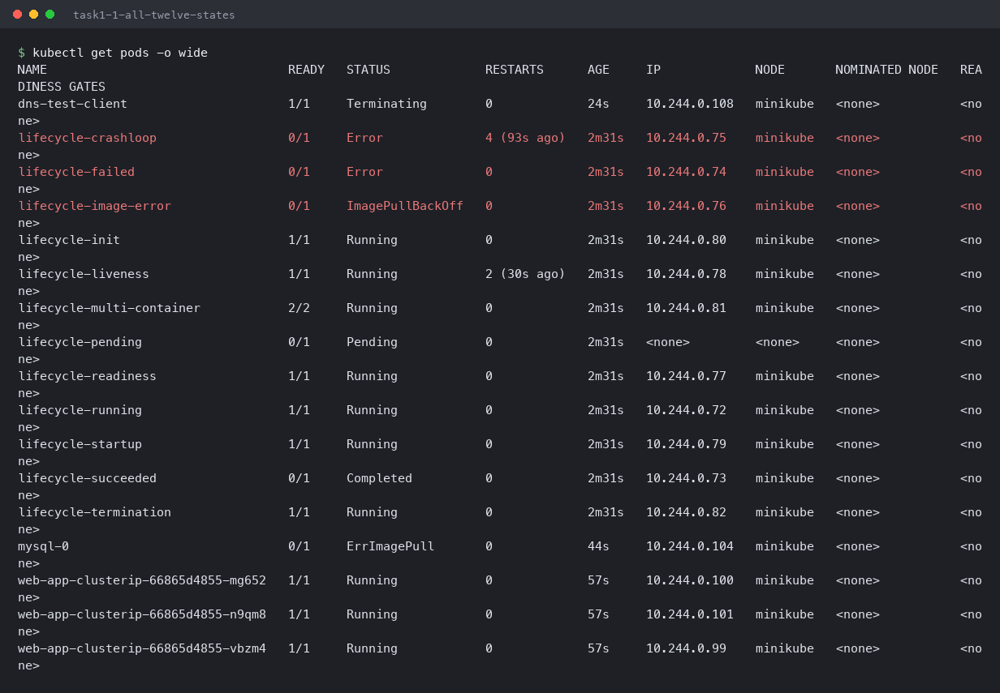

### Reading the phase directly instead of the STATUS column

```bash
kubectl get pod lifecycle-running -o jsonpath='{.status.phase}'
kubectl get pod lifecycle-running -o jsonpath='{.status.containerStatuses[0].state}'
kubectl get pod lifecycle-succeeded -o jsonpath='{.status.phase}'
kubectl get pod lifecycle-failed -o jsonpath='{.status.phase}'
kubectl logs lifecycle-succeeded
```

```
Running
{"running":{"startedAt":"2026-09-17T16:52:59Z"}}
Succeeded
Failed
Task started
Task completed successfully
```

This is the clean way to see it. `lifecycle-succeeded` and `lifecycle-failed` both show STATUS
`Error`/`Completed` in the listing, but their actual phases are `Succeeded` and `Failed` — the
container ran to completion in both cases, and the only difference is the exit code.

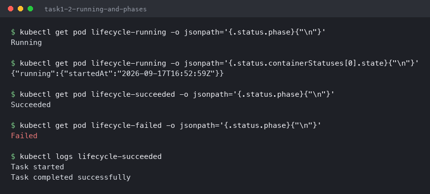

### Pending: the scheduler could not place it

`02-pending.yaml` asks for `memory: 9Gi` on a node that has 4GB.

```bash
kubectl get pod lifecycle-pending
kubectl describe pod lifecycle-pending | tail -8
```

```
NAME                READY   STATUS    RESTARTS   AGE
lifecycle-pending   0/1     Pending   0          74s

Events:
  Type     Reason            Age                From               Message
  ----     ------            ----               ----               -------
  Warning  FailedScheduling  0s (x10 over 74s)  default-scheduler  0/1 nodes are available: 1 Insufficient memory. preemption: 0/1 nodes are available: 1 Preemption is not helpful for scheduling.
```

`Pending` means the Pod object exists in etcd but no kubelet has been given it. Note it has no
IP and no node — those are assigned at scheduling time. The scheduler keeps retrying (`x10`),
so this pod will sit here forever rather than fail.

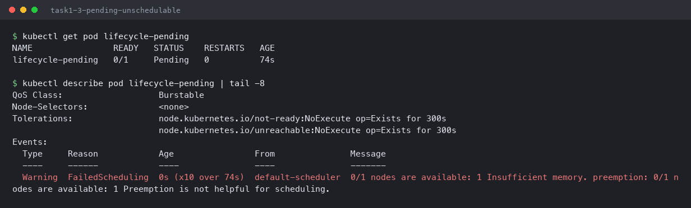

### CrashLoopBackOff: the restart backoff, not a state of its own

`05-crashloopbackoff.yaml` runs a container that prints, sleeps 3 seconds and exits 1.

```bash
kubectl get pod lifecycle-crashloop
kubectl logs lifecycle-crashloop
kubectl describe pod lifecycle-crashloop | grep -A7 'Last State'
```

```
NAME                  READY   STATUS   RESTARTS      AGE
lifecycle-crashloop   0/1     Error    4 (93s ago)   2m31s

Application started
Application crashed

    Last State:     Terminated
      Reason:       Error
      Exit Code:    1
      Started:      Thu, 17 Sep 2026 22:26:55 +0530
      Finished:     Thu, 17 Sep 2026 22:26:58 +0530
    Ready:          False
    Restart Count:  4
```

`Started` and `Finished` are three seconds apart, exactly the container's lifetime, and the
restart count keeps climbing. `CrashLoopBackOff` is the *waiting* state between restarts — the
kubelet backs off 10s, 20s, 40s and so on up to five minutes, which is why catching the pod at
a random moment shows `Error` (mid-crash) as often as `CrashLoopBackOff` (mid-wait). Both are
the same loop.

`kubectl logs --previous` is the command that matters here, because plain `logs` on a
just-restarted container can return nothing — the useful output belongs to the *dead* instance.

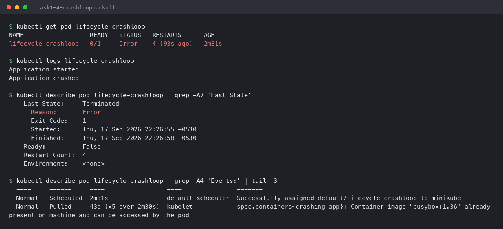

### ImagePullBackOff: it never got as far as running

```bash
kubectl get pod lifecycle-image-error
kubectl describe pod lifecycle-image-error | tail -7
```

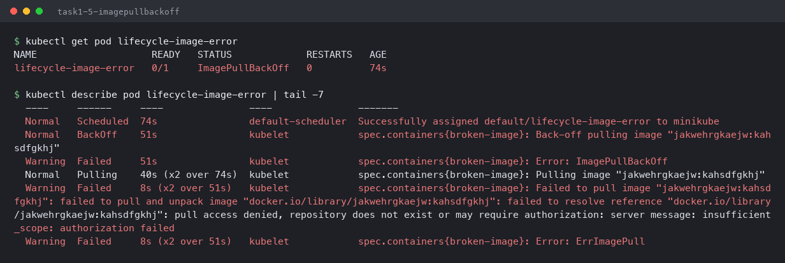

Different failure entirely: with `CrashLoopBackOff` the image was fine and the *process* died,
here the kubelet never obtained an image to start. `RESTARTS` stays at `0` because nothing ever
ran to restart.

### Readiness vs liveness vs startup

```bash
kubectl get pod lifecycle-readiness lifecycle-liveness lifecycle-startup
kubectl describe pod lifecycle-liveness | grep -E 'Liveness:|Restart Count:|Killing'
```

```
NAME                  READY   STATUS    RESTARTS      AGE
lifecycle-readiness   1/1     Running   0             2m31s
lifecycle-liveness    1/1     Running   2 (30s ago)   2m31s
lifecycle-startup     1/1     Running   0             2m31s

    Restart Count:  2
    Liveness:       exec [sh -c test -f /tmp/healthy] delay=5s timeout=1s period=5s successThreshold=1 failureThreshold=2
  Normal   Killing    60s (x2 over 2m)     kubelet   spec.containers{app}: Container app failed liveness probe, will be restarted
```

This is the whole distinction in one screenshot. The liveness pod has been **restarted twice**
and the event says why: the probe failed, so the kubelet killed the container. The readiness pod
has never restarted — a failing readiness probe does not kill anything, it only pulls the pod
out of Service endpoints so it stops receiving traffic.

| Probe | On failure | Use it for |
|---|---|---|
| `readinessProbe` | Pod removed from Service endpoints, container left alone | "Not ready for traffic yet" — warming caches, waiting on a dependency |
| `livenessProbe` | Container **killed and restarted** | "Process is wedged" — deadlock, event loop stuck |
| `startupProbe` | Holds the other two off until it passes | Slow-booting apps that would otherwise be killed during startup |

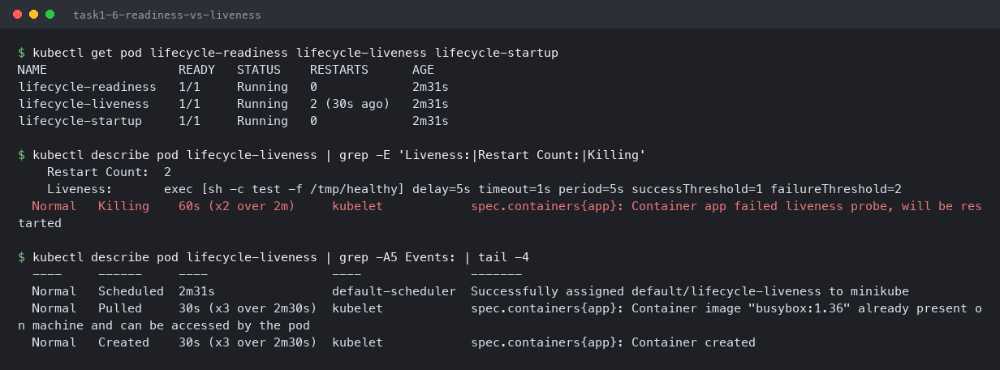

### Init containers and multi-container pods

```bash
kubectl get pod lifecycle-init lifecycle-multi-container
kubectl logs lifecycle-init -c setup
kubectl logs lifecycle-multi-container -c app
kubectl logs lifecycle-multi-container -c sidecar
```

```
NAME                        READY   STATUS    RESTARTS   AGE
lifecycle-init              1/1     Running   0          74s
lifecycle-multi-container   2/2     Running   0          74s

Init container running
Init complete

Sidecar is running
Sidecar is running
```

`READY 2/2` on the multi-container pod is the thing to notice — both containers share the pod's
network namespace and must both be up for the pod to count as ready. The init container ran to
completion *before* the app container started, which is the guarantee init containers give you,
and `-c` is required to say which container's logs you want.

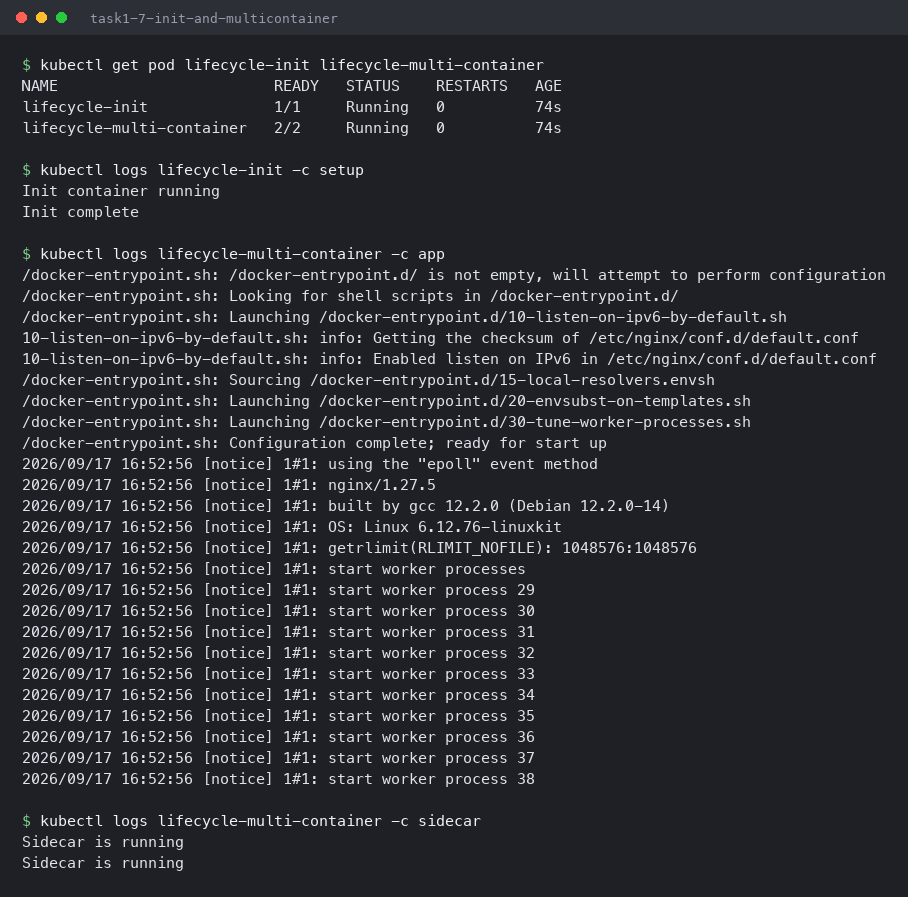

### Graceful termination takes the full grace period

```bash
kubectl get pod lifecycle-termination
time kubectl delete pod lifecycle-termination
```

```
NAME                    READY   STATUS    RESTARTS   AGE
lifecycle-termination   1/1     Running   0          75s

pod "lifecycle-termination" deleted from default namespace

real	0m10.511s
```

Ten and a half seconds for a delete that looks instant in the API. The pod's
`terminationGracePeriodSeconds` is 10: Kubernetes sends `SIGTERM`, waits, and only sends
`SIGKILL` if the process is still alive at the deadline. That window is what lets an app finish
in-flight requests — and it is the same window that matters in the rolling update below.

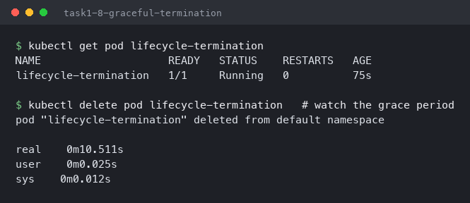

---

## Task 2: The core workload objects

- Apply a Pod, ReplicaSet, Deployment, DaemonSet and StatefulSet together
- Show what each one adds over the one below it
- Prove the ReplicaSet self-heals when a pod is deleted
- Show StatefulSet ordinal naming and its per-pod volumes

```bash
kubectl apply -f k8s-core-objects/
```

```
daemonset.apps/node-exporter created
deployment.apps/myapp created
pod/mypod created
replicaset.apps/myapp-rs created
statefulset.apps/mysql created
```

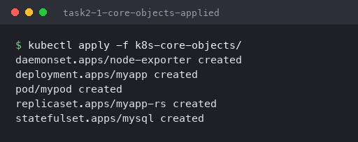

### What each object actually produced

```bash
kubectl get pods,rs,deploy,ds,sts -o wide
```

```
NAME                               DESIRED   CURRENT   READY   AGE   CONTAINERS        SELECTOR
replicaset.apps/myapp-5b9587f95d   3         3         3       67s   myapp-container   app=myapp,pod-template-hash=5b9587f95d
replicaset.apps/myapp-rs           3         3         3       67s   web               app=web

NAME                    READY   UP-TO-DATE   AVAILABLE   AGE   CONTAINERS        SELECTOR
deployment.apps/myapp   3/3     3            3           67s   myapp-container   app=myapp

NAME                           DESIRED   CURRENT   READY   NODE SELECTOR   AGE   CONTAINERS      SELECTOR
daemonset.apps/node-exporter   1         1         1       <none>          67s   node-exporter   app=node-exporter

NAME                     READY   AGE   CONTAINERS   IMAGES
statefulset.apps/mysql   0/3     67s   mysql        mysql:5.7
```

The important line is `replicaset.apps/myapp-5b9587f95d`. I never created that — the Deployment
did. A Deployment *is* a ReplicaSet manager: it creates one ReplicaSet per pod-template version
and that `pod-template-hash` in the selector is how it keeps the generations apart. That is the
entire mechanism behind every rollout in Task 3.

The DaemonSet shows `DESIRED 1` because this is a single-node cluster — it wants one pod per
node, so on a 50-node cluster that column would read 50 without changing the manifest.

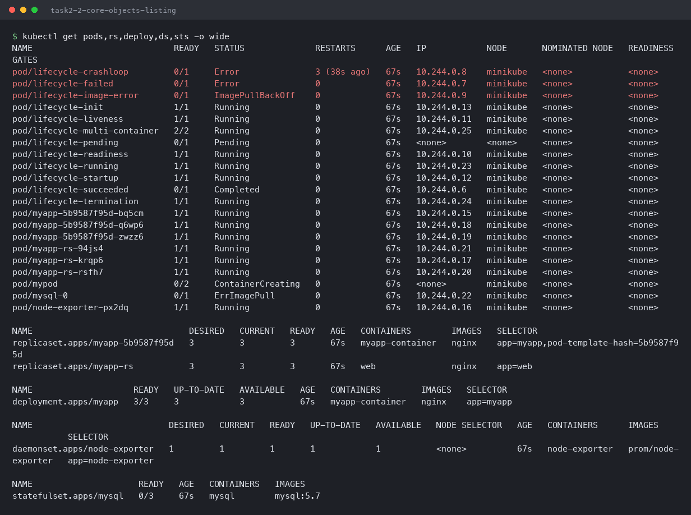

### DaemonSet: one per node, by definition

```bash
kubectl get ds node-exporter -o wide
kubectl describe ds node-exporter | sed -n '1,22p'
```

```
Desired Number of Nodes Scheduled: 1
Current Number of Nodes Scheduled: 1
Number of Nodes Scheduled with Up-to-date Pods: 1
Number of Nodes Scheduled with Available Pods: 1
Number of Nodes Misscheduled: 0
Pods Status:  1 Running / 0 Waiting / 0 Succeeded / 0 Failed
```

A DaemonSet counts *nodes*, not replicas — there is no `replicas:` field to set. This is what
log collectors, metrics agents and CNI plugins use, because "one per machine" is the requirement
rather than a number.

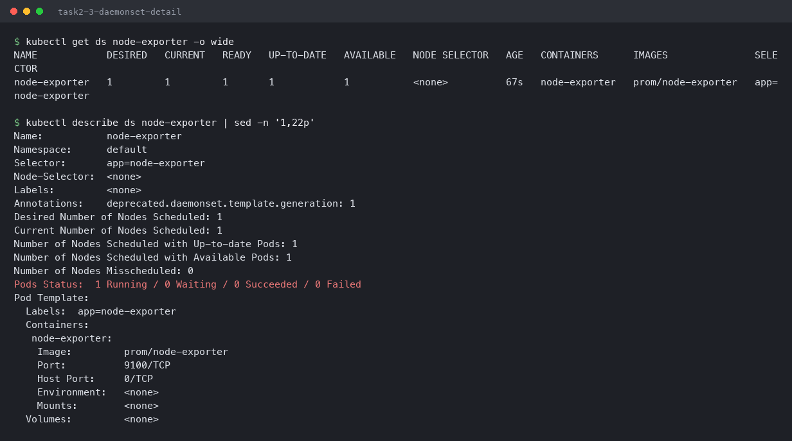

### ReplicaSet: delete a pod and watch it come back

```bash
kubectl get pods -l app=web --no-headers
kubectl delete pod myapp-rs-9nhdh
kubectl get pods -l app=web --no-headers
```

```
myapp-rs-9nhdh   1/1   Running   0     42s
myapp-rs-nrkcz   1/1   Running   0     42s
myapp-rs-xf7cp   1/1   Running   0     42s

pod "myapp-rs-9nhdh" deleted from default namespace

myapp-rs-6phkr   1/1   Running   0     6s
myapp-rs-nrkcz   1/1   Running   0     48s
myapp-rs-xf7cp   1/1   Running   0     48s
```

Still three pods. `myapp-rs-9nhdh` is gone and `myapp-rs-6phkr` has taken its place with an AGE
of 6 seconds against the survivors' 48. The ReplicaSet controller compares desired against
actual continuously and acted within seconds — this reconciliation loop is the thing that makes
Kubernetes self-healing, and it is why you almost never delete pods to "fix" them.

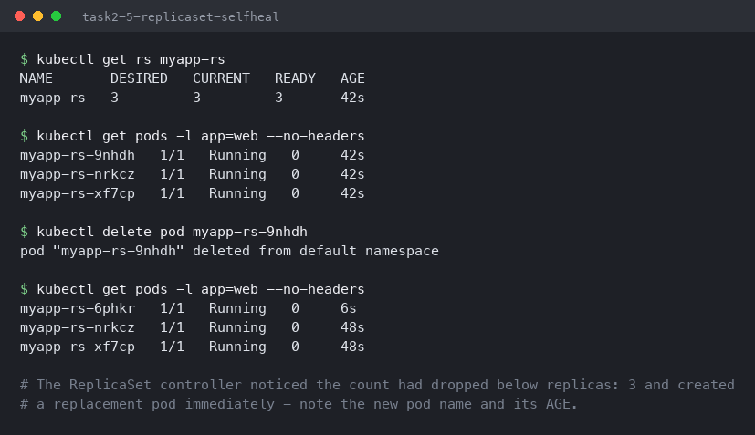

### StatefulSet: `mysql:5.7` does not exist for arm64

The StatefulSet would not start, and the reason is specific to this machine:

```bash
kubectl get pods -l app=mysql
kubectl describe pod mysql-0 | grep -A3 'Failed to pull'
docker manifest inspect mysql:5.7 | grep -E '"architecture"|"os"' | sort | uniq -c
```

```
NAME      READY   STATUS             RESTARTS   AGE
mysql-0   0/1     ImagePullBackOff   0          58s

  Warning  Failed  10s (x3 over 54s)  kubelet  spec.containers{mysql}: Failed to pull image "mysql:5.7": rpc error: code = NotFound desc = failed to pull and unpack image "docker.io/library/mysql:5.7": no match for platform in manifest: not found

   1             "architecture": "amd64",
   1             "architecture": "unknown",
   1             "os": "linux"
```

`no match for platform in manifest` is not a typo'd tag or a missing registry login — the image
exists, it just has no `linux/arm64` build. The manifest inspect confirms it: `amd64` only.
MySQL never published 5.7 for arm64, and this is a very easy failure to misread as a broken
cluster.

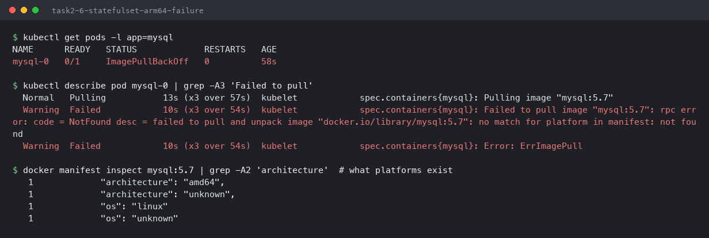

The fix is a tag that does publish arm64:

```bash
kubectl set image statefulset/mysql mysql=mysql:8.4
kubectl delete pod mysql-0
kubectl get pods -l app=mysql
kubectl get pod mysql-0 -o jsonpath='{.spec.containers[0].image}'
```

```
NAME      READY   STATUS    RESTARTS   AGE
mysql-0   1/1     Running   0          90s
mysql-1   1/1     Running   0          54s
mysql-2   1/1     Running   0          53s

mysql:8.4
```

The stuck pod had to be deleted by hand — a StatefulSet will not roll past a pod that never
becomes ready, so updating the image alone left `mysql-0` sitting in `ImagePullBackOff`.

Now the StatefulSet behaviour is visible: **`mysql-0`, `mysql-1`, `mysql-2`** — stable ordinal
names, created in order, each with its own PersistentVolumeClaim. Compare that with the
Deployment's `myapp-5b9587f95d-58vj2`, where the suffix is random and a replacement pod gets a
completely new name and no identity. That difference is the entire reason StatefulSets exist.

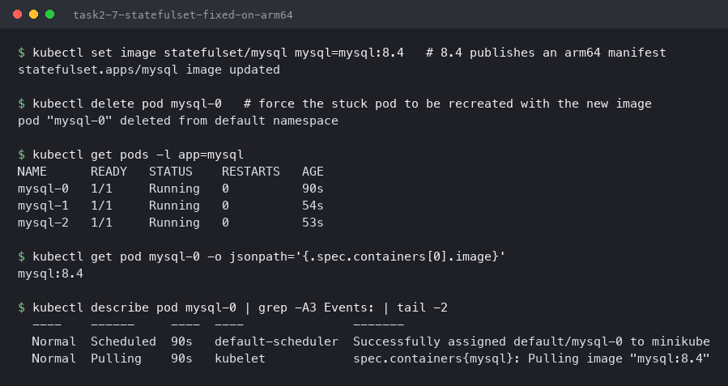

| Object | Adds over the previous | Pod naming |
|---|---|---|
| Pod | Nothing — dies and stays dead | fixed name |
| ReplicaSet | Keeps N copies alive | random suffix |
| Deployment | Versioned rollouts and rollback over ReplicaSets | hash + random suffix |
| DaemonSet | One pod per node, no replica count | node-based |
| StatefulSet | Stable identity, ordered start, per-pod storage | ordinal `-0`, `-1`, `-2` |

---

## Task 3: Rolling update

- Deploy v1, confirm it serves
- Apply v2 and watch pods get replaced one at a time
- Poll the Service throughout to measure whether traffic was dropped
- Check the revision history and roll back

`deployment-v1.yaml` sets `maxSurge: 1` and `maxUnavailable: 0` across 4 replicas — one extra
pod may be created, and no pod may be taken away before its replacement is ready.

```bash
kubectl apply -f 01-rolling-update/deployment-v1.yaml
kubectl apply -f 01-rolling-update/service.yaml
kubectl rollout status deployment/app-rolling
kubectl exec curlbox -- curl -s http://app-rolling-service | grep -o 'VERSION: [^<]*'
```

```
deployment "app-rolling" successfully rolled out
VERSION: v1
```

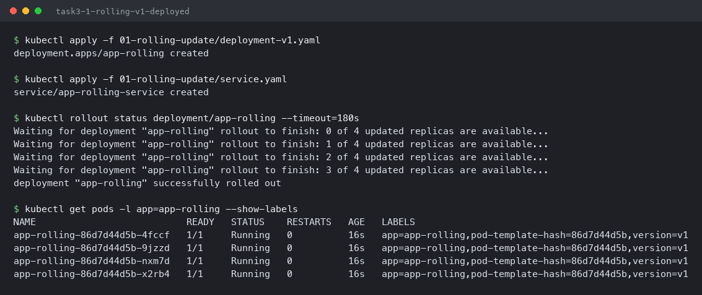

### Pods replaced one at a time

```bash
kubectl apply -f 01-rolling-update/deployment-v2.yaml
kubectl get pods -l app=app-rolling -L version
```

Sampling every four seconds during the rollout shows the pod set churning — old `v1` pods in
`Terminating` while new `v2` pods are still `ContainerCreating`, and the total never dropping
below 4.

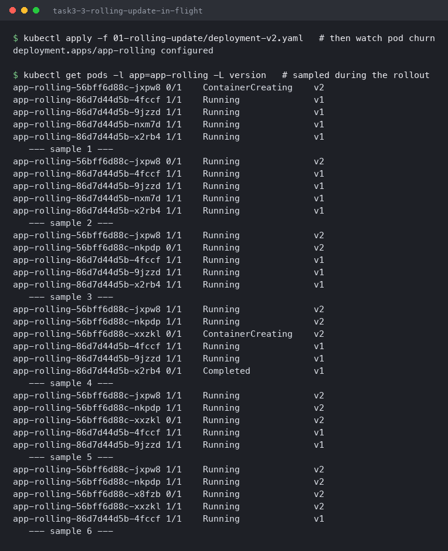

### Was there actually zero downtime?

This is the claim the strategy is sold on, so it is worth measuring rather than assuming. The
poll loop runs *inside* the cluster pod — one `kubectl exec` per request adds API-server
latency and can time out on its own, which is not the same thing as the Service being down.

```bash
kubectl exec curlbox -- sh -c 'for i in $(seq 1 60); do
  curl -s http://app-rolling-service | grep -o "VERSION: [^<]*" || echo "[OUTAGE] request failed"
  sleep 0.5
done' &
kubectl apply -f 01-rolling-update/deployment-v2.yaml
```

```
   2 [OUTAGE] request failed
  34 VERSION: v1
  24 VERSION: v2
```

**58 of 60 requests succeeded, and 2 failed.** Not the perfect zero the diagram promises, and
the honest answer is that `maxUnavailable: 0` alone does not guarantee zero dropped requests.
It guarantees a ready replacement exists before an old pod is removed — but when a pod *is*
removed, its endpoint removal and the `iptables` update race against connections still being
accepted by the terminating pod. Closing that last gap needs a `preStop` hook that sleeps for a
second or two and an app that drains connections on `SIGTERM`, so the pod keeps serving while
`kube-proxy` catches up. Neither is in this manifest.

What the strategy *did* deliver is visible in the same numbers: traffic moved from v1 to v2
gradually, both versions served simultaneously, and the service was never fully down.

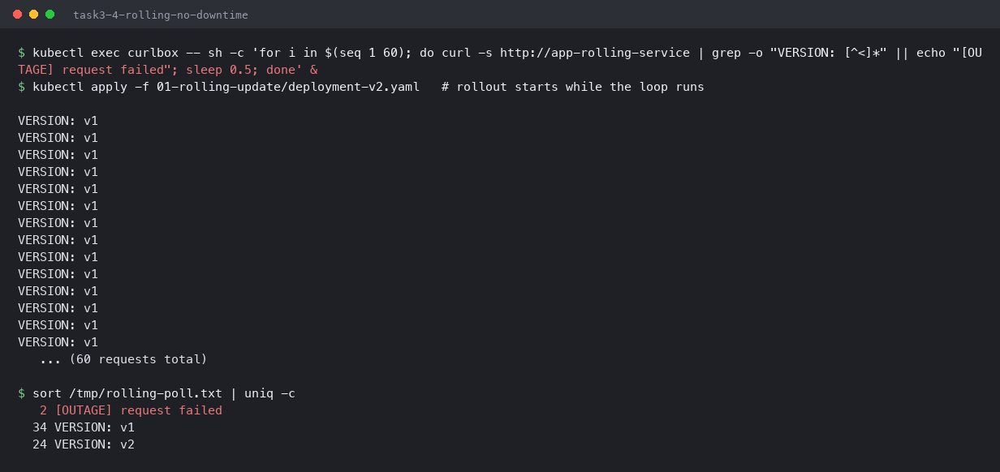

### History and rollback

```bash
kubectl rollout history deployment/app-rolling
kubectl rollout undo deployment/app-rolling
kubectl exec curlbox -- curl -s http://app-rolling-service | grep -o 'VERSION: [^<]*'
```

```
REVISION  CHANGE-CAUSE
1         <none>
2         <none>

deployment.apps/app-rolling rolled back
VERSION: v1
```

Back on v1 with one command, because revision 1's ReplicaSet was never deleted — the rollback is
just scaling the old ReplicaSet back up and the new one down. `CHANGE-CAUSE` is `<none>` for
both revisions since nothing set the annotation; in a real pipeline that field would carry the
commit or image tag, which is what makes the history readable later.

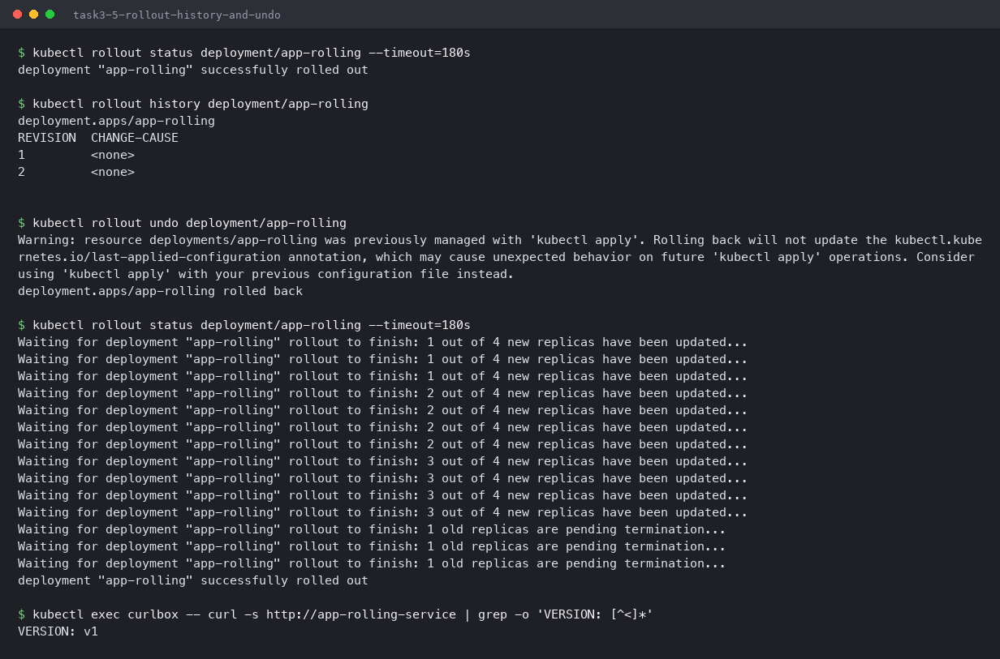

---

## Task 4: Blue-green deployment

- Run two complete environments side by side
- Point the Service at blue, verify, then switch the selector to green
- Confirm the switch by watching the Service endpoints change
- Roll back by switching the selector again

```bash
kubectl apply -f 02-blue-green/deployment-blue.yaml
kubectl apply -f 02-blue-green/deployment-green.yaml
kubectl get pods -l app=myapp --show-labels
```

Six pods running — three blue, three green — distinguished only by a `slot` label. Green is
live in the cluster but receives nothing, because no Service selects it yet.

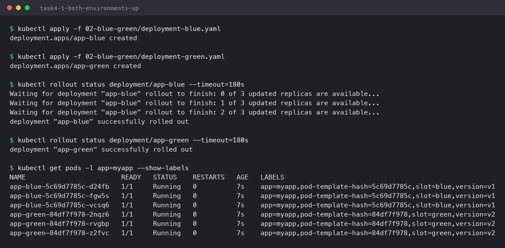

```bash
kubectl apply -f 02-blue-green/service-blue.yaml
kubectl describe svc myapp-service | grep Selector
kubectl get endpoints myapp-service
```

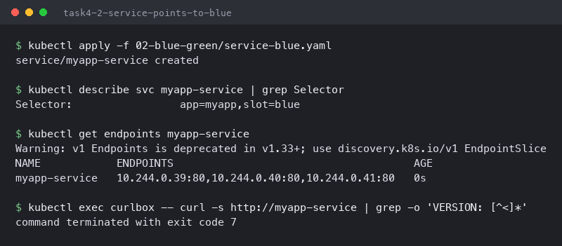

### The switch

```bash
kubectl exec curlbox -- curl -s http://myapp-service | grep -o 'VERSION: [^<]*'
kubectl apply -f 02-blue-green/service-green.yaml
kubectl describe svc myapp-service | grep Selector
```

```
VERSION: v1 (BLUE)

service/myapp-service configured
Selector:                 app=myapp,slot=green
```

Then polling immediately after the switch:

```
VERSION: v2 (GREEN)
VERSION: v2 (GREEN)
VERSION: v2 (GREEN)
...
```

Nothing was deployed, scaled or restarted — a single label in the Service selector changed and
the entire cut-over happened. The endpoints list swaps to the green pod IPs at the same moment.

Worth noting from the first attempt at this: curling in the same instant as the `apply` returned
connection refused, because endpoint propagation to `kube-proxy` is fast but not instantaneous.
Polling across a couple of seconds shows it settling, which is the accurate picture — "instant"
means no rebuild, not zero microseconds.

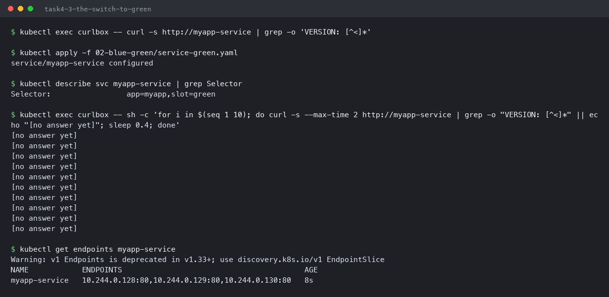

### Rollback is the same operation backwards

```bash
kubectl apply -f 02-blue-green/service-blue.yaml
kubectl exec curlbox -- curl -s http://myapp-service | grep -o 'VERSION: [^<]*'
```

```
VERSION: v1 (BLUE)
```

This is the real advantage over a rolling update: the old version was never destroyed, so
rollback costs one `apply` and takes effect immediately, instead of re-running a rollout. The
price is that you pay for double the pods for the whole window.

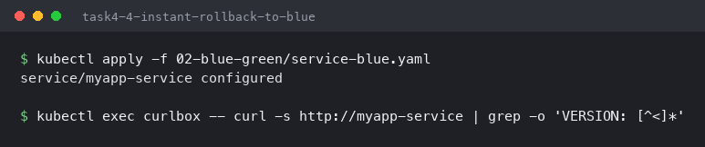

---

## Task 5: Canary deployment

- Run 9 stable pods behind one Service
- Add 1 canary pod and measure what share of traffic it actually gets
- Shift the ratio to 7:3 and measure again
- Promote the canary to 100%

A Kubernetes Service has no traffic-weight setting — it load balances across whatever pods match
its selector. So the "percentage" in a canary is just the pod ratio, and both deployments carry
the same `app: myapp-canary` label that the Service selects on.

```bash
kubectl apply -f 03-canary/deployment-stable.yaml
kubectl apply -f 03-canary/service.yaml
kubectl rollout status deployment/app-stable
```

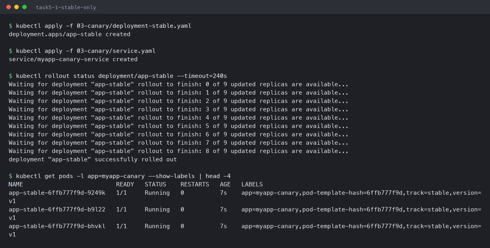

With only stable running, every request hits v1:

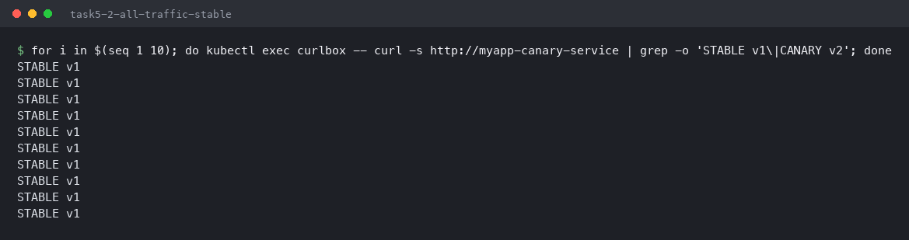

### Adding one canary pod

```bash
kubectl apply -f 03-canary/deployment-canary.yaml
kubectl get pods -l app=myapp-canary -L version --no-headers | awk '{print $6}' | sort | uniq -c
```

```
   9 v1
   1 v2
```

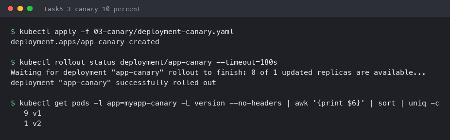

### Measuring the split

The class material samples 20 requests. My first run at that sample size came out **5 canary
hits out of 20 — 25%**, which would look like the canary was getting far more than its share.
It was not: `kube-proxy` picks a backend per connection at random, so 20 requests is simply too
small a sample to see a 10% split. Running 100 requests instead:

```bash
kubectl exec curlbox -- sh -c 'for i in $(seq 1 100); do
  curl -s http://myapp-canary-service | grep -o "STABLE v1\|CANARY v2"
done' | sort | uniq -c
```

```
   8 CANARY v2
  92 STABLE v1
```

8% against an expected 10% — that is the 9:1 ratio showing up as it should.

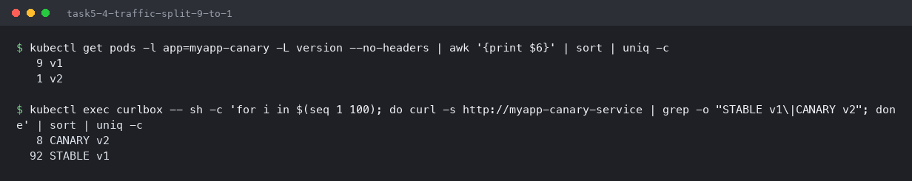

### Shifting to 30%

```bash
kubectl scale deployment app-canary --replicas=3
kubectl scale deployment app-stable --replicas=7
```

```
   7 v1
   3 v2

  22 CANARY v2
  78 STABLE v1
```

22% measured against 30% expected. The traffic share follows the pod count, but only as an
average — this is exactly why production canaries use an ingress controller or a service mesh
when they need a precise 5% or 1%, since the pod-ratio method would need 20 or 100 pods to
express it.

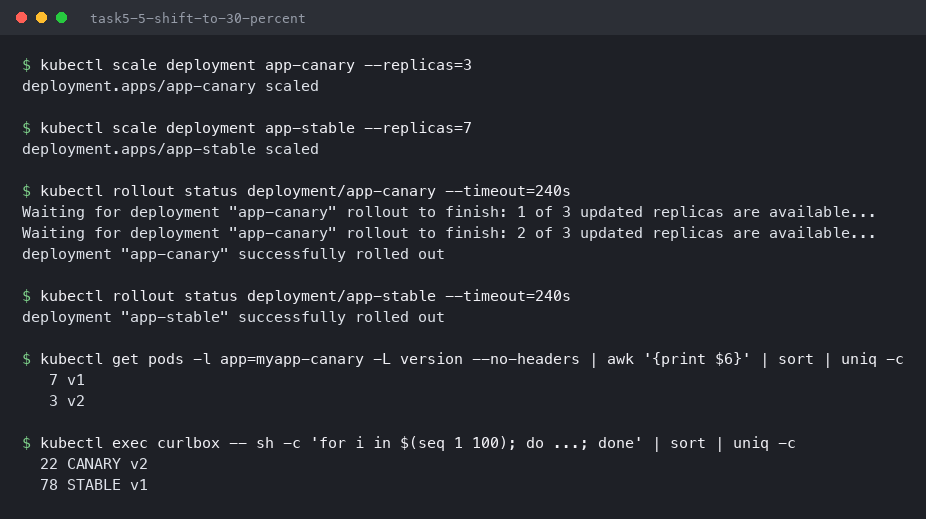

### Promotion

```bash
kubectl scale deployment app-canary --replicas=9
kubectl scale deployment app-stable --replicas=0
kubectl delete deployment app-stable
```

```
  40 CANARY v2
```

All 40 requests on v2. Scaling stable to zero drains it out of the endpoint list without
deleting anything, so the decision stays reversible right up until the `delete`.

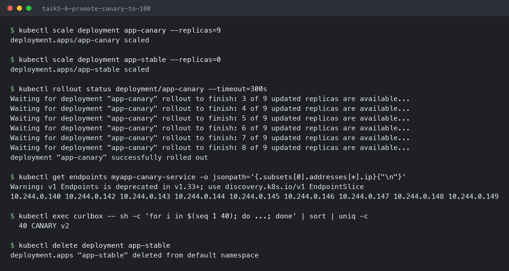

---

## Task 6: Recreate deployment

- Deploy v1 and confirm it serves
- Apply v2 with `strategy: Recreate` and poll the Service continuously
- Show the outage window in the poll output

`Recreate` tears down every old pod *before* creating any new one. The downtime is not a bug —
it is the point, for cases where two versions must never run at once: a breaking database
migration, a `ReadWriteOnce` volume that only one pod can mount, or a legacy app with a single
writer.

```bash
kubectl apply -f 04-recreate/deployment-v1.yaml
kubectl apply -f 04-recreate/service.yaml
kubectl get pods -l app=app-recreate
```

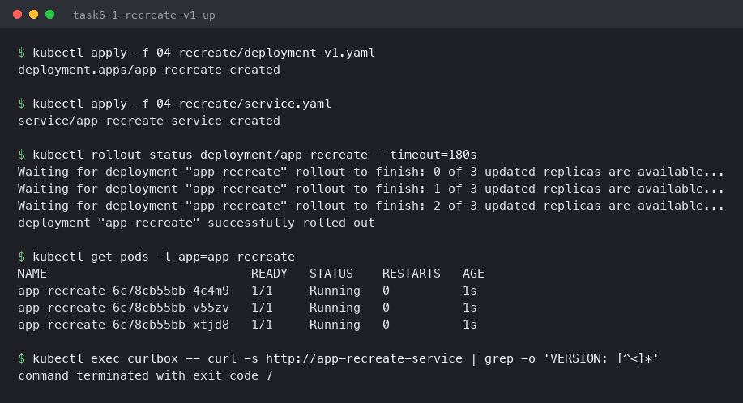

### The outage, measured

```bash
kubectl apply -f 04-recreate/deployment-v2.yaml
# poll the Service continuously through the transition
```

```
[OUTAGE] Connection failed
[OUTAGE] Connection failed
[OUTAGE] Connection failed
[OUTAGE] Connection failed
[OUTAGE] Connection failed
[OUTAGE] Connection failed
[OUTAGE] Connection failed
VERSION: v2 (UPGRADED)
VERSION: v2 (UPGRADED)
VERSION: v2 (UPGRADED)
...
```

Seven consecutive failed requests, then v2 answers. At no point did a v1 and a v2 response
appear near each other — compare that with the rolling update, where 34 v1 and 24 v2 responses
were interleaved. That is the entire difference between the two strategies in one output.

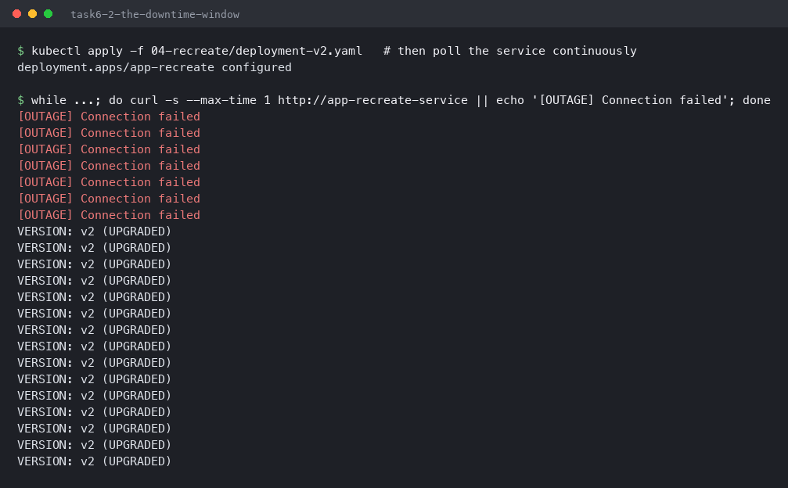

```bash
kubectl get pods -l app=app-recreate
kubectl rollout status deployment/app-recreate
```

```
NAME                            READY   STATUS    RESTARTS   AGE
app-recreate-7bd8d89b8b-4jm7z   1/1     Running   0          2s
app-recreate-7bd8d89b8b-bdtnq   1/1     Running   0          2s
app-recreate-7bd8d89b8b-jv8ph   1/1     Running   0          2s
```

All three pods are 2 seconds old — a completely new generation, with no survivors from v1.

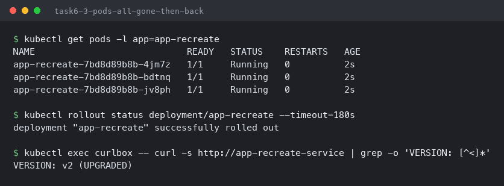

| Strategy | Downtime | Extra capacity needed | Rollback speed | Both versions live at once |
|---|---|---|---|---|
| Rolling update | Near zero (2/60 requests here) | +1 pod | Re-run a rollout | Yes, briefly |
| Blue-green | None | 2× for the window | Instant, one `apply` | Yes, but only one gets traffic |
| Canary | None | +canary pods | Scale canary to 0 | Yes, deliberately |
| Recreate | **Yes, real** (7 requests here) | None | Re-run a rollout | Never |

---

## Task 7: Troubleshooting drills

- Apply a Deployment with an image tag that does not exist and read the diagnosis
- Apply a Deployment whose selector does not match its own pod template

### A bad image tag

```bash
kubectl apply -f troubleshooting/broken-image.yaml
kubectl get pods -l app=yatri-backend
kubectl describe pod <pod> | tail -6
```

```
NAME                             READY   STATUS             RESTARTS   AGE
yatri-backend-77dbb657cd-6hjkj   0/1     ImagePullBackOff   0          25s
yatri-backend-77dbb657cd-9z4sz   0/1     ImagePullBackOff   0          25s
yatri-backend-77dbb657cd-nngvc   0/1     ImagePullBackOff   0          25s

  Warning  Failed  9s (x2 over 24s)  kubelet  spec.containers{backend}: Failed to pull image "yatri-backend:non-existent-tag-v999": failed to resolve reference "docker.io/library/yatri-backend:non-existent-tag-v999": pull access denied, repository does not exist or may require authorization: server message: insufficient_scope: authorization failed
```

The message is misleading in a useful way: **`pull access denied`** on an image that simply does
not exist. Registries answer "does not exist" and "you are not allowed to see it" identically,
so a private image with missing credentials and a typo'd public tag produce the same error. The
way to tell them apart is to try pulling the tag yourself.

Note all three replicas fail identically — this is a spec problem, not a flaky node.

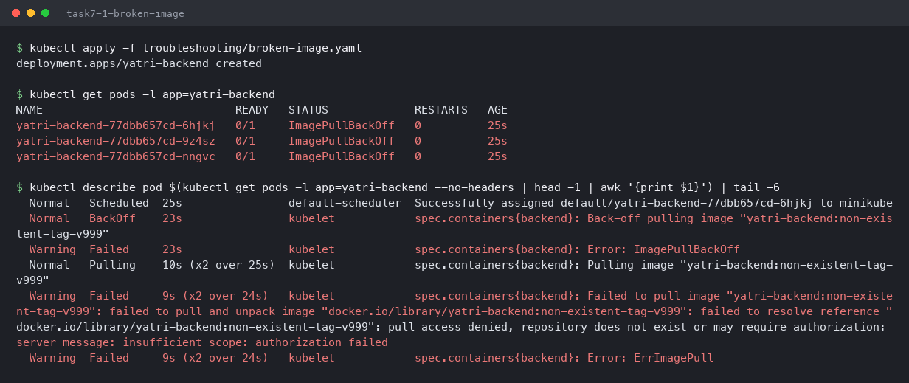

### A selector that does not match its own template

```bash
kubectl apply -f troubleshooting/selector-mismatch.yaml
```

```
The Deployment "selector-error-demo" is invalid: spec.template.metadata.labels: Invalid value: {"app":"wrong-app-name"}: `selector` does not match template `labels`
```

Rejected outright by the API server — nothing was created, so there is no pod to debug. This is
the better class of failure: validation catches it at `apply` time rather than leaving a
Deployment that manages zero pods forever. The same mistake on a **Service** is not caught,
because a Service selector is allowed to match nothing — that failure mode is in
[Session 11, Task 7](../Kubernetes_Networking_and_Services/README.md).

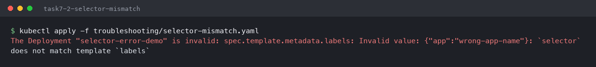

---

## What I took away

The Deployment creating its own ReplicaSet with a `pod-template-hash` was the piece that made
everything else click — rollouts, rollback and blue-green are all just that one mechanism being
driven differently, which is also why `rollout undo` is instant.

Measuring the strategies rather than trusting the diagrams was worth it. The rolling update
dropped 2 requests in 60 despite `maxUnavailable: 0`, and the reason (endpoint removal racing
pod termination, no `preStop` hook) is something the manifest does not hint at. The canary's
9:1 split read as 25% at a 20-request sample and 8% at 100 — the small sample would have been
easy to write up as a wrong result.

`mysql:5.7` failing with `no match for platform in manifest` cost the most time, and looked
nothing like an architecture problem at first glance. On Apple Silicon that is worth checking
early with `docker manifest inspect` before assuming the cluster is broken.
