# Linux Fundamentals

**Name:** Utkarsh Pathak
**Enrollment No:** 24bcs10309

---

## How this was run

macOS has no `adduser`, `useradd` or `journalctl`, so I ran these in an Ubuntu 24.04 container with
systemd as PID 1 — otherwise `journalctl` has no journal to read.

```bash
docker build -t linux-lab:24.04 lab/
docker run -d --name linux-lab --hostname devops-lab \
  --privileged --cgroupns=host -v /sys/fs/cgroup:/sys/fs/cgroup:rw \
  --tmpfs /run --tmpfs /run/lock linux-lab:24.04
```

Dockerfile, scripts and full transcripts: [`lab/`](lab/)

---

## Task 1: Soft Link & Hard Link

- Learn the difference between soft links and hard links.
- Learn the commands to create both.
- Practice creating and deleting soft and hard links.
- Prepare for this as an interview question.

### The concept

Every file on a Linux filesystem is really two separate things:

1. An **inode** — the actual metadata and pointers to the data blocks on disk.
2. A **directory entry** — a name that points to an inode.

A filename is not the file. It is a pointer to an inode. That single fact explains both link types:

- A **hard link** is an additional directory entry pointing at the **same inode**. It is not a copy and it is not a shortcut — it is another equally valid name for the same file. The inode keeps a *link count*, and the data is only freed when that count reaches zero.
- A **soft link** (symbolic link) is its own separate file, with its own inode, whose *contents* are a text path to another file. Resolving it is a second lookup. If the target moves or is deleted, the link still exists but points at nothing.

### Commands to create both

```bash
ln -s <target> <link_name>    # soft / symbolic link
ln    <target> <link_name>    # hard link
```

### Creating them

```bash
echo 'This is the original file content.' > original.txt
ln -s original.txt soft.txt     # soft link
ln    original.txt hard.txt     # hard link
ls -li
```

```
total 8
824827 -rw-r--r-- 2 root root 35 Sep  3 16:09 hard.txt
824827 -rw-r--r-- 2 root root 35 Sep  3 16:09 original.txt
824828 lrwxrwxrwx 1 root root 12 Sep  3 16:09 soft.txt -> original.txt
```

This one block of output shows the whole difference. Reading it carefully:

- `-i` prints the inode number in the first column. `original.txt` and `hard.txt` are both **824827** — literally the same file. `soft.txt` has its own inode, **824828**.
- The second column is the **link count**. It is `2` for the hard-linked pair, because two names now point at that inode. It is `1` for the soft link.
- `soft.txt` has type `l` (`lrwxrwxrwx`) and `ls` prints `-> original.txt`. Its size is **12 bytes**, which is exactly the length of the string `original.txt` — the link's content *is* the path.

Confirming with `stat`:

```bash
stat -c '%n -> inode=%i links=%h size=%s type=%F' original.txt hard.txt soft.txt
```

```
original.txt -> inode=824827 links=2 size=35 type=regular file
hard.txt -> inode=824827 links=2 size=35 type=regular file
soft.txt -> inode=824828 links=1 size=12 type=symbolic link
```

```bash
readlink soft.txt
file original.txt soft.txt hard.txt
```

```
original.txt

original.txt: ASCII text
soft.txt:     symbolic link to original.txt
hard.txt:     ASCII text
```

Note `file` reports `hard.txt` as plain `ASCII text`, not as a link. There is no way to tell "which one was the original" — because there is no original. Both names are equal.

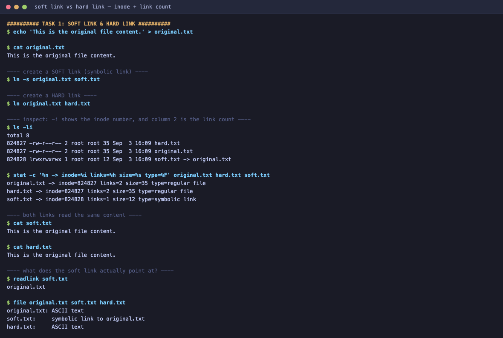

### Writing through a link

```bash
echo 'appended via hard link' >> hard.txt
cat original.txt
```

```
This is the original file content.
appended via hard link
```

Writing via `hard.txt` changed what `original.txt` shows, because they are one file.

### Deleting the target — the key difference

```bash
rm original.txt
ls -li
```

```
total 4
824827 -rw-r--r-- 1 root root 58 Sep  3 16:09 hard.txt
824828 lrwxrwxrwx 1 root root 12 Sep  3 16:09 soft.txt -> original.txt
```

The link count on inode 824827 dropped from **2 to 1**. The data was not deleted, because a name still points to it.

```bash
cat soft.txt
```

```
cat: soft.txt: No such file or directory
[exit code: 1]
```

The soft link is now **dangling**. It still exists as a file, and `ls` still shows it, but following it fails — its stored path no longer resolves.

```bash
cat hard.txt
stat -c '%n -> inode=%i links=%h' hard.txt
```

```
This is the original file content.
appended via hard link

hard.txt -> inode=824827 links=1
```

The hard link still has every byte, including the line appended earlier. Deleting `original.txt` removed a *name*, not the file.

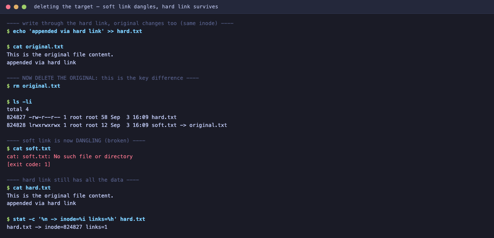

### Directories

```bash
mkdir mydir
ln -s mydir dirlink      # soft link to a directory: allowed
ls -ld dirlink
ln mydir dirhard         # hard link to a directory: refused
```

```
lrwxrwxrwx 1 root root 5 Sep  3 16:09 dirlink -> mydir

ln: mydir: hard link not allowed for directory
[exit code: 1]
```

Hard links to directories are forbidden because they would let you build a cycle in the directory tree, which would break tree traversal and reference counting. Soft links can point at directories freely, which is why they are what you normally reach for.

### Deleting links

```bash
rm soft.txt          # works on any link
unlink dirlink       # explicitly removes one link
ls -li
```

```
total 8
824827 -rw-r--r-- 1 root root   58 Sep  3 16:09 hard.txt
824829 drwxr-xr-x 2 root root 4096 Sep  3 16:09 mydir
```

Important detail: `rm` on a symlink removes **the link**, not the target. But `rm softlink/` with a trailing slash, or `rm -r` on a symlink to a directory, can behave differently — so it is worth being deliberate.

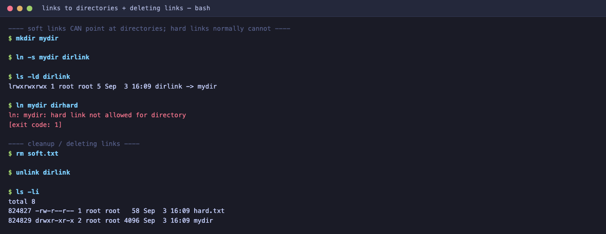

### Interview summary

| | Hard link | Soft link (symbolic) |
|---|---|---|
| Command | `ln target name` | `ln -s target name` |
| Points to | The **inode** | A **path string** |
| Own inode | No, shares the target's | Yes, separate |
| Shows in `ls -l` as | Normal file `-` | Link `l`, with `-> target` |
| Increments link count | Yes | No |
| Survives deleting the target | **Yes**, data stays | **No**, becomes dangling |
| Can cross filesystems | **No** | **Yes** |
| Can link a directory | **No** | **Yes** |
| Size | Same as the file | Length of the target path |

The two most likely follow-up questions:

- *Why can't a hard link cross filesystems?* Because inode numbers are only unique **within** a filesystem. A directory entry on one filesystem cannot meaningfully reference an inode number belonging to another.
- *What happens if you delete the file a soft link points to?* The link survives as a dangling link. And if a new file is later created at that same path, the link silently starts resolving to that new file — which is a real source of bugs.

---

## Task 2: adduser vs useradd

- Learn the difference between `adduser` and `useradd`.
- Understand which command is preferred on Ubuntu/Linux and why.
- Create a test user using the recommended command.

### They are not two versions of the same tool

```bash
which adduser useradd
file /usr/sbin/adduser
file /usr/sbin/useradd
```

```
/usr/sbin/adduser
/usr/sbin/useradd

/usr/sbin/adduser: Perl script text executable
/usr/sbin/useradd: ELF 64-bit LSB pie executable, ARM aarch64, version 1 (SYSV), dynamically linked, ...
```

This output is the clearest way to see what is actually going on:

- `useradd` is a **compiled binary**. It is the low-level tool from the `shadow-utils` package, and it does exactly what you tell it and nothing more.
- `adduser` is a **Perl script**. It is a Debian/Ubuntu-specific, higher-level wrapper that calls `useradd` underneath and applies sensible policy.

So `adduser` is not a competitor to `useradd` — it is a friendly front-end for it.

### `useradd` without `-m`: no home directory

```bash
useradd nohomeuser
grep nohomeuser /etc/passwd
ls -la /home
```

```
nohomeuser:x:1001:1001::/home/nohomeuser:/bin/sh

total 12
drwxr-xr-x 3 root   root   4096 Aug 10 14:55 .
drwxr-xr-x 1 root   root   4096 Sep  3 16:09 ..
drwxr-x--- 2 ubuntu ubuntu 4096 Aug 10 14:55 ubuntu
```

The account exists and `/etc/passwd` even records `/home/nohomeuser` as its home — but **the directory was never created**. This is the classic `useradd` trap: the user can log in and land in a directory that does not exist. Note also the default shell is `/bin/sh`, not bash.

### `useradd -m`: home directory created

```bash
useradd -m -s /bin/bash useradduser
grep useradduser /etc/passwd
ls -la /home
passwd -S useradduser
```

```
useradduser:x:1002:1002::/home/useradduser:/bin/bash

drwxr-x--- 2 useradduser useradduser 4096 Sep  3 16:09 useradduser

useradduser L 2026-09-03 0 99999 7 -1
```

Now the home directory exists, and `-s /bin/bash` gave it a usable shell. But `passwd -S` reports **`L`** — the account is **locked**, with no password set. It cannot log in until you separately run `passwd useradduser`.

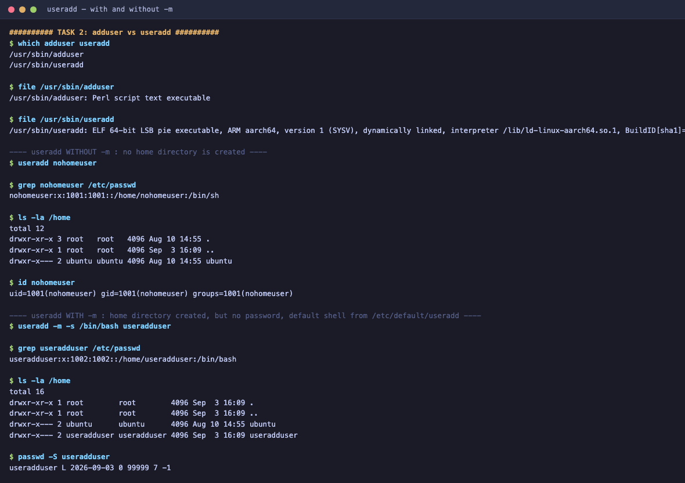

### `adduser`: the recommended way

`adduser` is normally **interactive** — it prompts for the password and for the GECOS fields (full name, room, phone). To run it non-interactively for this transcript I passed `--disabled-password --gecos ''`:

```bash
adduser --disabled-password --gecos '' testuser
```

```
info: Adding user `testuser' ...
info: Selecting UID/GID from range 1000 to 59999 ...
info: Adding new group `testuser' (1003) ...
info: Adding new user `testuser' (1003) with group `testuser (1003)' ...
info: Creating home directory `/home/testuser' ...
info: Copying files from `/etc/skel' ...
info: Adding new user `testuser' to supplemental / extra groups `users' ...
info: Adding user `testuser' to group `users' ...
```

Every one of those lines is a step it did **for** me that `useradd` would have needed a flag for. Interactively, run plainly as `sudo adduser testuser`, it would additionally prompt:

```
New password:
Retype new password:
Full Name []:
Room Number []:
Work Phone []:
Home Phone []:
Other []:
Is the information correct? [Y/n]
```

Verifying the result:

```bash
grep testuser /etc/passwd
ls -la /home/testuser
id testuser
groups testuser
```

```
testuser:x:1003:1003:,,,:/home/testuser:/bin/bash

total 20
drwxr-x--- 2 testuser testuser 4096 Sep  3 16:09 .
drwxr-xr-x 1 root     root     4096 Sep  3 16:09 ..
-rw-r--r-- 1 testuser testuser  220 Sep  3 16:09 .bash_logout
-rw-r--r-- 1 testuser testuser 3771 Sep  3 16:09 .bashrc
-rw-r--r-- 1 testuser testuser  807 Sep  3 16:09 .profile

uid=1003(testuser) gid=1003(testuser) groups=1003(testuser),100(users)

testuser : testuser users
```

Things `adduser` did that `useradd` did not:

- created `/home/testuser`
- **copied the skeleton files** from `/etc/skel` (`.bashrc`, `.profile`, `.bash_logout`) so the shell is properly configured
- set the shell to `/bin/bash`
- added the user to the supplementary `users` group
- picked the UID from Debian's configured range for human accounts

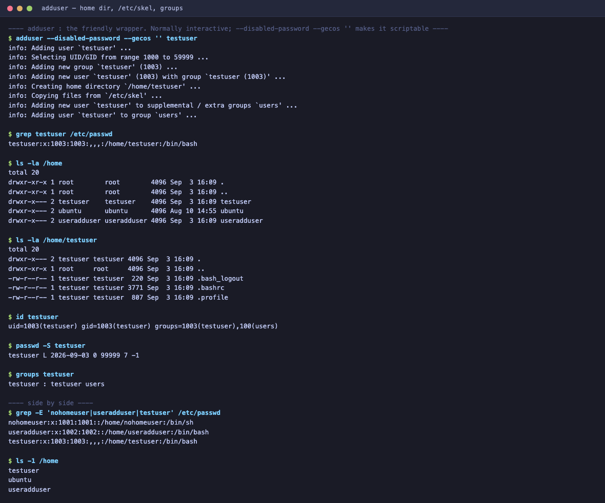

### Side by side

```bash
grep -E 'nohomeuser|useradduser|testuser' /etc/passwd
```

```
nohomeuser:x:1001:1001::/home/nohomeuser:/bin/sh
useradduser:x:1002:1002::/home/useradduser:/bin/bash
testuser:x:1003:1003:,,,:/home/testuser:/bin/bash
```

The GECOS field (between the home dir and the 4th colon) is empty for both `useradd` accounts, but `,,,` for the `adduser` one — placeholders for the full-name/room/phone fields it manages.

### Which is preferred on Ubuntu, and why

**`adduser`**, for creating human user accounts by hand.

Not because `useradd` is broken, but because `adduser` applies Debian/Ubuntu's own policy by default — home directory, `/etc/skel`, correct UID range, group membership, password prompt. With `useradd` you must remember every one of those flags, and forgetting `-m` silently produces a half-working account.

The honest caveat: **`useradd` is preferred in scripts and automation.** `adduser` is interactive by design and its output format is not a stable interface, whereas `useradd` is POSIX-ish, predictable, and available on every distribution — `adduser` is Debian-family only, so it will not exist on RHEL/CentOS/Alpine. Ansible's `user` module, for instance, uses `useradd` underneath.

Rule of thumb: **at a terminal, `adduser`; in a script, `useradd` with explicit flags.**

### Deleting users

The two commands pair up the same way:

```bash
userdel -r useradduser              # low-level, -r removes the home dir
deluser --remove-home nohomeuser    # the Debian wrapper
```

```
userdel: useradduser mail spool (/var/mail/useradduser) not found

info: Looking for files to backup/remove ...
info: Removing crontab ...
info: Removing user `nohomeuser' ...
```

`deluser` also cleaned up the user's crontab, which `userdel` left alone. One practical note: `deluser --remove-home` needs the `perl` package installed, and fails with an explicit error if it is missing.

---

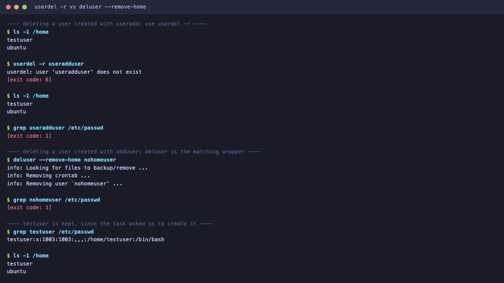


## Task 3: journalctl

- Learn what `journalctl` is used for.
- Learn how to view system and service logs using `journalctl`.
- Practice checking logs for a specific service.

### What it is

`journalctl` is the query tool for the **systemd journal**. On a systemd machine, logs are not just plain text in `/var/log` — `systemd-journald` collects stdout/stderr of every service, kernel messages, and structured metadata into an indexed binary journal. `journalctl` is how you read and filter it.

Why that matters: because the journal is structured, you can filter by unit, priority, boot, or time **without** grepping across a pile of different log files with different formats.

```bash
journalctl --version | head -2
journalctl --disk-usage
```

```
systemd 255 (255.4-1ubuntu8.17)
+PAM +AUDIT +SELINUX +APPARMOR +IMA +SMACK +SECCOMP +GCRYPT ...

Archived and active journals take up 8.0M in the file system.
```

### Viewing system logs

```bash
journalctl -n 15 --no-pager
```

```
Sep 03 16:09:23 devops-lab adduser[156]: Adding user `testuser' ...
Sep 03 16:09:23 devops-lab groupadd[160]: group added to /etc/group: name=testuser, GID=1003
Sep 03 16:09:23 devops-lab groupadd[160]: new group: name=testuser, GID=1003
Sep 03 16:09:23 devops-lab useradd[167]: new user: name=testuser, UID=1003, GID=1003, home=/home/testuser, shell=/bin/bash, from=none
Sep 03 16:09:23 devops-lab adduser[156]: Creating home directory `/home/testuser' ...
Sep 03 16:09:23 devops-lab chfn[180]: changed user 'testuser' information
Sep 03 16:09:23 devops-lab gpasswd[188]: members of group users set by root to testuser
```

Worth pointing out: these are the log entries produced by **Task 2 above**. You can see `adduser` calling `groupadd` and `useradd` underneath — the journal independently confirms that `adduser` is a wrapper.

`-n 15` shows the last 15 entries. `--no-pager` stops it opening `less`, which is what you want when scripting or capturing output.

Other common forms:

```bash
journalctl -b            # only this boot
journalctl -k            # kernel messages only (like dmesg)
journalctl -f            # follow live, like tail -f
```

```bash
journalctl -k --no-pager | head -5
```

```
Sep 03 16:08:46 devops-lab kernel: Booting Linux on physical CPU 0x0000000000 [0x610f0000]
Sep 03 16:08:46 devops-lab kernel: Linux version 6.12.76-linuxkit (root@buildkitsandbox) (gcc (Alpine 15.2.0) 15.2.0, GNU ld (GNU Binutils) 2.45.1) #1 SMP Fri May 29 10:00:01 UTC 2026
Sep 03 16:08:46 devops-lab kernel: OF: reserved mem: Reserved memory: No reserved-memory node in the DT
Sep 03 16:08:46 devops-lab kernel: Zone ranges:
Sep 03 16:08:46 devops-lab kernel:   DMA      [mem 0x0000000070000000-0x00000000ffffffff]
```

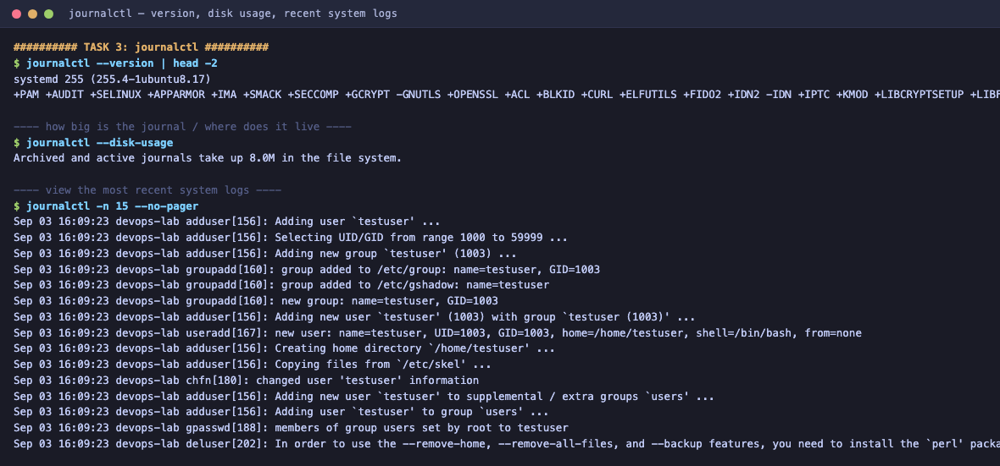

### Checking logs for a specific service — `-u`

This is the flag worth actually remembering. `-u <unit>` restricts output to one systemd unit.

```bash
systemctl status ssh --no-pager | head -12
```

```
● ssh.service - OpenBSD Secure Shell server
     Loaded: loaded (/usr/lib/systemd/system/ssh.service; enabled; preset: enabled)
     Active: active (running) since Thu 2026-09-03 16:08:46 UTC; 36s ago
TriggeredBy: ● ssh.socket
       Docs: man:sshd(8)
    Process: 67 ExecStartPre=/usr/sbin/sshd -t (code=exited, status=0/SUCCESS)
   Main PID: 71 (sshd)
      Tasks: 1 (limit: 9520)
     Memory: 1.1M (peak: 1.7M)
```

```bash
journalctl -u ssh --no-pager
```

```
Sep 03 16:08:46 devops-lab systemd[1]: Starting ssh.service - OpenBSD Secure Shell server...
Sep 03 16:08:46 devops-lab sshd[71]: Server listening on 0.0.0.0 port 22.
Sep 03 16:08:46 devops-lab sshd[71]: Server listening on :: port 22.
Sep 03 16:08:46 devops-lab systemd[1]: Started ssh.service - OpenBSD Secure Shell server.
```

Only ssh, out of the whole system journal. Notice it interleaves messages from **systemd** (starting/started) and from **sshd itself** (listening on port 22) — journald captured the daemon's own stdout automatically, with no logging configuration.

Now doing it with a service I control, and restarting it to watch new entries land:

```bash
systemctl start nginx
systemctl is-active nginx
systemctl restart nginx
journalctl -u nginx --no-pager -n 10
```

```
active

Sep 03 16:08:46 devops-lab systemd[1]: Starting nginx.service - A high performance web server and a reverse proxy server...
Sep 03 16:08:46 devops-lab systemd[1]: Started nginx.service - A high performance web server and a reverse proxy server.
Sep 03 16:09:23 devops-lab systemd[1]: Stopping nginx.service - A high performance web server and a reverse proxy server...
Sep 03 16:09:23 devops-lab systemd[1]: nginx.service: Deactivated successfully.
Sep 03 16:09:23 devops-lab systemd[1]: Stopped nginx.service - A high performance web server and a reverse proxy server.
Sep 03 16:09:23 devops-lab systemd[1]: Starting nginx.service - A high performance web server and a reverse proxy server...
Sep 03 16:09:23 devops-lab systemd[1]: Started nginx.service - A high performance web server and a reverse proxy server.
```

The full stop → deactivate → start cycle of the restart, in order. This is exactly the workflow for debugging a service that will not come up: `systemctl status` for the current state, `journalctl -u <service>` for *why*.

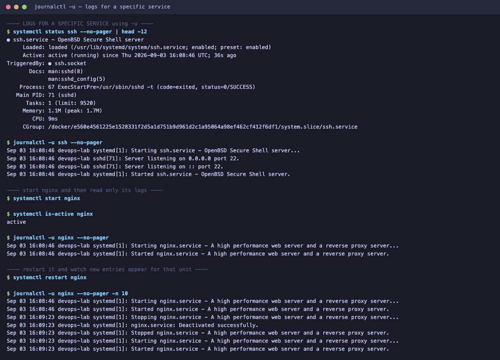

### Filtering, which is the real value

```bash
journalctl -p err --no-pager | head -10
```

```
Sep 03 16:09:23 devops-lab deluser[202]: In order to use the --remove-home, --remove-all-files, and --backup features, you need to install the `perl' package. To accomplish that, run apt-get install perl.
```

`-p err` shows only priority `error` and worse. Out of an 8 MB journal, one line — and it happens to be the genuine failure I hit in Task 2, surfaced instantly. That is the argument for structured logs in one sentence.

```bash
journalctl --since '10 minutes ago' --no-pager | head -3
```

```
Sep 03 16:08:46 devops-lab kernel: Booting Linux on physical CPU 0x0000000000 [0x610f0000]
Sep 03 16:08:46 devops-lab kernel: Linux version 6.12.76-linuxkit ...
```

`--since` / `--until` accept both absolute timestamps and human phrases like `"10 minutes ago"`, `yesterday`, `"2026-09-03 16:00"`.

```bash
journalctl --field _SYSTEMD_UNIT | head -10
```

```
ssh.service
cron.service
systemd-sysctl.service
init.scope
systemd-journald.service
```

Which units have logged anything at all — useful when you do not know the exact unit name.

Because the journal is structured, it can emit machine-readable output:

```bash
journalctl -u nginx -n 1 -o json-pretty --no-pager | head -12
```

```
{
	"_TRANSPORT" : "journal",
	"JOB_TYPE" : "start",
	"__REALTIME_TIMESTAMP" : "1788451763349327",
	"_CAP_EFFECTIVE" : "1ffffffffff",
	"TID" : "1",
	"_SYSTEMD_UNIT" : "init.scope",
	"_CMDLINE" : "/sbin/init",
	"_SYSTEMD_SLICE" : "-.slice",
	"PRIORITY" : "6",
	"_MACHINE_ID" : "41ffed55bb57447c8b1589a697f02b94",
	"_BOOT_ID" : "ac78e12524bf483a946c49d09178471b",
```

All that metadata is attached to every entry automatically. It is what makes the filtering above possible, and it is what a plain text log file cannot give you.

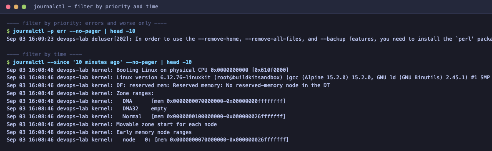

### Flags worth memorising

| Command | What it does |
|---|---|
| `journalctl` | everything, oldest first, in a pager |
| `journalctl -n 20` | last 20 entries |
| `journalctl -f` | follow live |
| `journalctl -u nginx` | one service only |
| `journalctl -u nginx -f` | follow one service live |
| `journalctl -b` | this boot only |
| `journalctl -b -1` | the **previous** boot — how you debug a crash |
| `journalctl -k` | kernel messages |
| `journalctl -p err` | errors and worse |
| `journalctl --since "1 hour ago"` | time window |
| `journalctl --disk-usage` | how much space the journal uses |
| `journalctl --vacuum-time=7d` | delete entries older than 7 days |
| `journalctl -o json-pretty` | structured output |

One practical gotcha: by default many distributions keep the journal in `/run/log/journal`, which is **tmpfs and lost on reboot**. To make `journalctl -b -1` work you need persistent storage — `Storage=persistent` in `/etc/systemd/journald.conf` plus `/var/log/journal` existing. That is exactly what the lab `Dockerfile` sets up, which is why the boot logs above are readable at all.

---

## Task 4: Linux Command Cheat Sheet

- Review the Linux command cheat sheet.
- Practice the important commands covered in the cheat sheet.
- Understand the purpose and basic usage of each command.

I worked through the cheat sheet by category. Full transcript: [`lab/cheat_sheet_output.txt`](lab/cheat_sheet_output.txt). Representative output below.

### Navigation and directories

```bash
pwd
mkdir -p project/src project/docs     # -p creates parent dirs as needed
tree project
```

```
/root/cheatsheet

project
├── docs
└── src

3 directories, 0 files
```

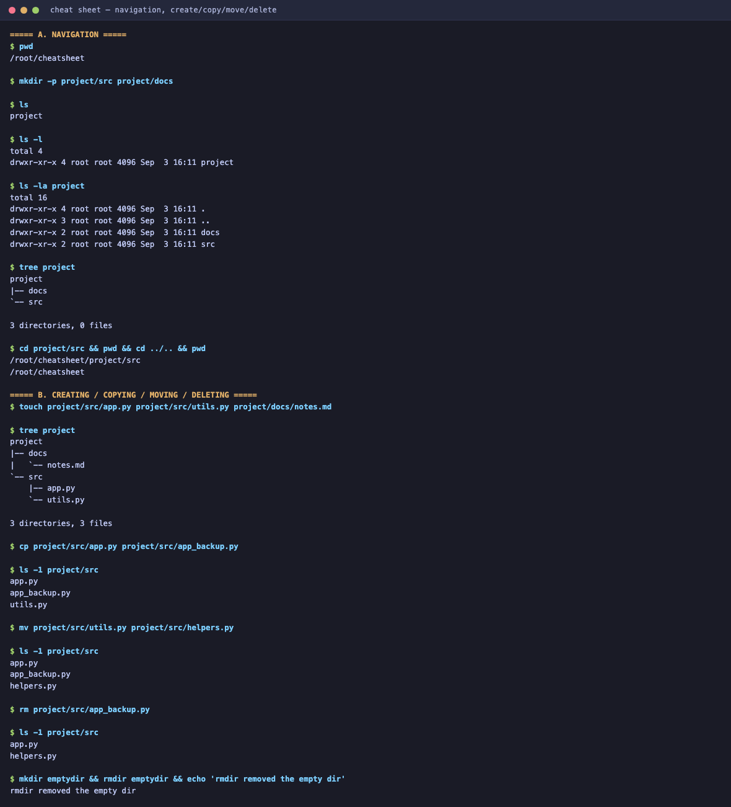

### Creating, copying, moving, deleting

```bash
touch project/src/app.py project/src/utils.py project/docs/notes.md
cp project/src/app.py project/src/app_backup.py
mv project/src/utils.py project/src/helpers.py
rm project/src/app_backup.py
ls -1 project/src
```

```
app.py
helpers.py
```

`mv` does double duty as both rename and move — there is no separate `rename` command. `rmdir` only removes *empty* directories; `rm -r` is what removes a tree.

### Reading files

```bash
printf 'alpha 10\nbravo 25\ncharlie 5\ndelta 25\necho 40\n' > data.txt
cat -n data.txt
head -2 data.txt
tail -2 data.txt
wc data.txt
```

```
     1	alpha 10
     2	bravo 25
     3	charlie 5
     4	delta 25
     5	echo 40

alpha 10
bravo 25

delta 25
echo 40

 5 10 45 data.txt
```

`wc` with no flag prints three numbers: **lines, words, bytes**.

### Searching and filtering

```bash
grep -n '25' data.txt      # -n = show line numbers
grep -c '25' data.txt      # -c = count matching lines
grep -i 'ALPHA' data.txt   # -i = case insensitive
grep -v '25' data.txt      # -v = INVERT, show non-matching
```

```
2:bravo 25
4:delta 25

2

alpha 10

alpha 10
charlie 5
echo 40
```

```bash
find . -type f -name '*.py'
find . -type d
```

```
./project/src/app.py
./project/src/helpers.py

.
./project
./project/src
./project/docs
```

`grep` searches *inside* files; `find` searches *for* files by name, type, size, or age. Easy to mix up.

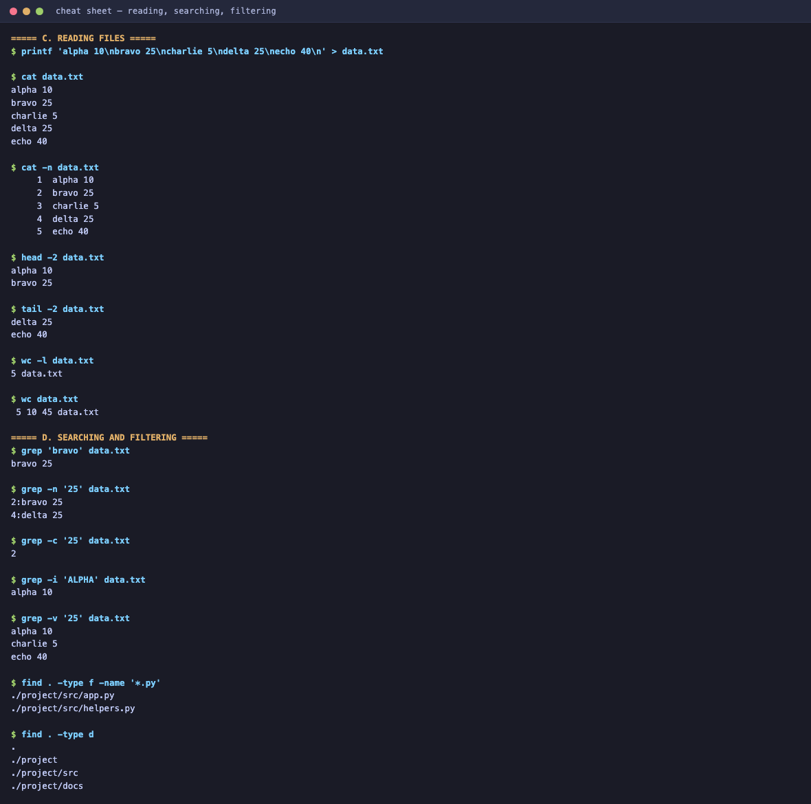

### Text processing

```bash
sort -k2 -n data.txt                        # sort by 2nd field, numerically
cut -d' ' -f2 data.txt | sort -n | uniq -c   # count occurrences
awk '{sum += $2} END {print "total =", sum}' data.txt
sed 's/bravo/BRAVO/' data.txt
```

```
charlie 5
alpha 10
bravo 25
delta 25
echo 40

      1 5
      1 10
      2 25
      1 40

total = 105

alpha 10
BRAVO 25
charlie 5
delta 25
echo 40
```

Two things I had to get right here: `sort -n` is **numeric** sort (without it, `10` sorts before `5` because it compares as text), and **`uniq -c` only collapses adjacent duplicates**, so it is almost always preceded by `sort`.

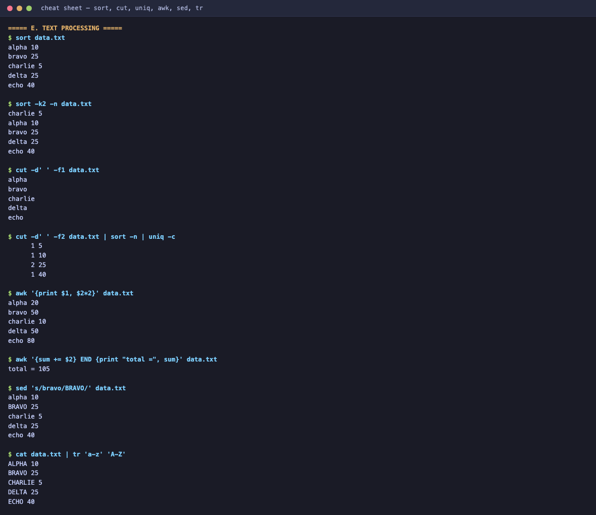

### Permissions and ownership

```bash
ls -l script.sh
chmod +x script.sh
ls -l script.sh
./script.sh
```

```
-rw-r--r-- 1 root root 20 Sep  3 16:11 script.sh
-rwxr-xr-x 1 root root 20 Sep  3 16:11 script.sh
hi
```

The `x` bits appeared and the script became runnable. Numeric mode does the same thing:

```bash
chmod 644 script.sh && ls -l script.sh    # rw-r--r--
chmod 755 script.sh && ls -l script.sh    # rwxr-xr-x
chown testuser:testuser data.txt && ls -l data.txt
```

```
-rw-r--r-- 1 root root 20 Sep  3 16:11 script.sh
-rwxr-xr-x 1 root root 20 Sep  3 16:11 script.sh
-rw-r--r-- 1 testuser testuser 45 Sep  3 16:11 data.txt
```

Reading the mode: three groups of three — **owner, group, other** — each `r`(4) `w`(2) `x`(1). So `755` = owner `rwx`, group `r-x`, other `r-x`. `644` = owner `rw-`, everyone else read-only. `chmod` changes permissions, `chown` changes who owns it.

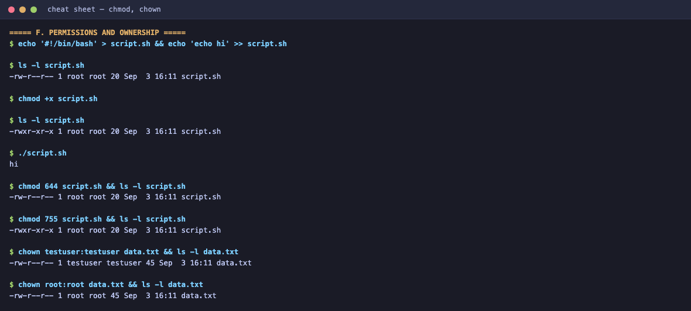

### Processes

```bash
ps aux | head -6
```

```
USER         PID %CPU %MEM    VSZ   RSS TTY      STAT START   TIME COMMAND
root           1  0.0  0.1  20500 11152 ?        Ss   16:08   0:00 /sbin/init
root          30  0.0  0.1  33704 11244 ?        S<s  16:08   0:00 /usr/lib/systemd/systemd-journald
root          65  0.0  0.0   4164  2372 ?        Ss   16:08   0:00 /usr/sbin/cron -f -P
root          71  0.0  0.0  12116  7344 ?        Ss   16:08   0:00 sshd: /usr/sbin/sshd -D [listener] 0 of 10-100 startups
root         223  0.0  0.0  10452  1572 ?        Ss   16:09   0:00 nginx: master process /usr/sbin/nginx
```

PID 1 is `/sbin/init` (systemd), confirming systemd really is running as PID 1 here.

Full lifecycle of finding and killing a process:

```bash
sleep 300 &                              # start in background
ps aux | grep 'sleep 300' | grep -v grep
pgrep -a sleep
pkill -f 'sleep 300'
pgrep -a sleep
```

```
started background sleep with PID 655

root         655  0.0  0.0   2272  1276 ?        S    16:11   0:00 sleep 300

655 sleep 300

killed it

(no output = process gone)
```

The `| grep -v grep` is there because the `grep` process itself matches the pattern. `pgrep`/`pkill` avoid that problem entirely, which is why they are the better habit.

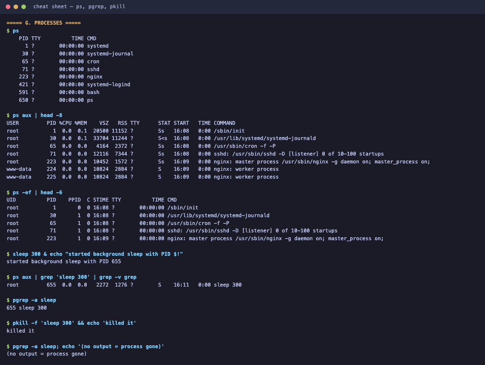

### Disk and memory

```bash
df -h                          # -h = human readable sizes
du -sh /root/cheatsheet        # -s = summary total
du -h --max-depth=1 /root/cheatsheet
free -h
```

```
Filesystem      Size  Used Avail Use% Mounted on
overlay         453G   39G  391G  10% /
tmpfs            64M     0   64M   0% /dev
shm              64M     0   64M   0% /dev/shm
tmpfs           3.9G   48K  3.9G   1% /run

24K	/root/cheatsheet

12K	/root/cheatsheet/project
24K	/root/cheatsheet

               total        used        free      shared  buff/cache   available
Mem:           7.8Gi       793Mi       2.6Gi       624Ki       4.6Gi       7.0Gi
Swap:          1.0Gi          0B       1.0Gi
```

`df` = free space **per filesystem**. `du` = space **used by files/directories**. When "the disk is full", `df` tells you which filesystem and `du` tells you what filled it.

On `free`: the number that matters is **`available` (7.0Gi)**, not `free` (2.6Gi). The 4.6Gi in `buff/cache` is disk cache the kernel will hand back on demand — it is not lost memory.

### System information

```bash
uname -a
uname -r
uptime
date '+%Y-%m-%d %H:%M:%S'
which ls grep awk
```

```
Linux devops-lab 6.12.76-linuxkit #1 SMP Fri May 29 10:00:01 UTC 2026 aarch64 aarch64 aarch64 GNU/Linux

6.12.76-linuxkit

 16:11:19 up 8 min,  0 user,  load average: 0.09, 0.34, 0.19

2026-09-03 16:11:19

/usr/bin/ls
/usr/bin/grep
/usr/bin/awk
```

`load average` is three numbers — 1, 5 and 15 minute averages of runnable processes. Compare against the CPU count: a load of 4.0 is fine on 10 cores and badly overloaded on 2.

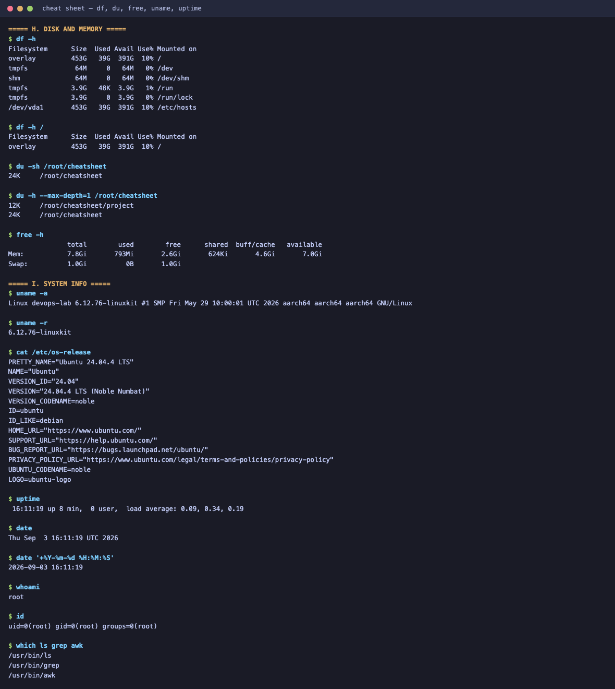

### Archives and compression

```bash
tar -czf project.tar.gz project    # c=create z=gzip f=file
tar -tzf project.tar.gz            # t=list contents
tar -xzf project.tar.gz -C extracted
```

`tar` bundles many files into one; `gzip` compresses a single file. `-z` makes `tar` do both in one step. Always list an unfamiliar archive with `-t` before extracting, so it does not spray files into your current directory.

### Redirection and pipes

```bash
echo 'written with >' > out.txt      # > overwrites (or creates)
echo 'appended with >>' >> out.txt   # >> appends
ls /nonexistent 2> err.txt           # 2> captures stderr only
ls /root /nonexistent > both.txt 2>&1  # 2>&1 merges stderr into stdout
cat data.txt | grep 25 | wc -l
```

```
written with >
written with >
appended with >>

ls: cannot access '/nonexistent': No such file or directory

2
```

The distinction that matters: `>` is **destructive** — it truncates the file immediately, before the command even runs. `>>` appends. And stdout (`1`) and stderr (`2`) are separate streams, which is why an error can still appear on your terminal even when you redirected "the output".

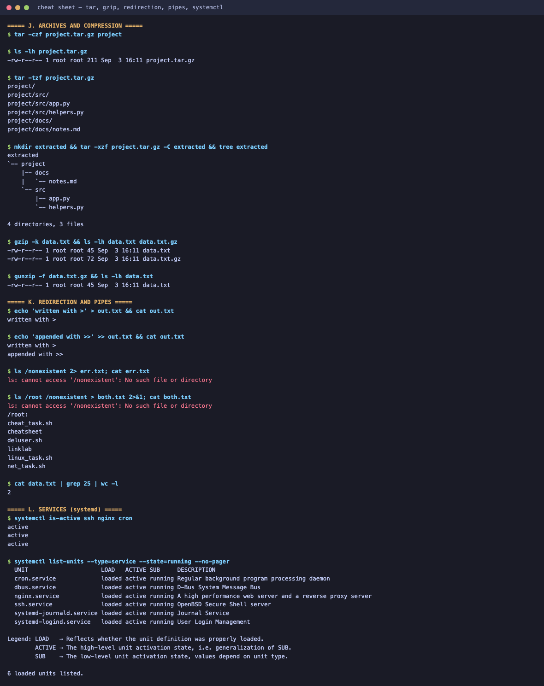

### Services

```bash
systemctl is-active ssh nginx cron
systemctl list-units --type=service --state=running --no-pager
```

```
active
active
active
```

| Command | Purpose |
|---|---|
| `systemctl status <svc>` | current state and recent log lines |
| `systemctl start/stop/restart <svc>` | control it now |
| `systemctl enable/disable <svc>` | control whether it starts at boot |
| `systemctl is-active <svc>` | script-friendly check |

`enable` and `start` are independent: `start` affects now, `enable` affects next boot. Forgetting `enable` is why a service works until the machine reboots.
